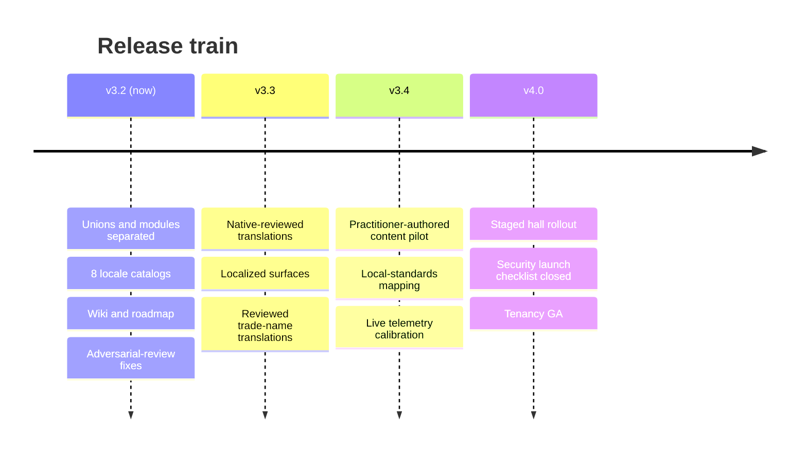

# SmartCiti.X : Trade Craft Academy — roadmap

*powered by AGI Corp*

This roadmap is versioned with the bundle it describes. Every figure in it is
the pack's own (111 halls, 11,000,000 addressable modules, 25,875 authored
objects, 8 districts, 8 locales), and the figures lint holds this file to the
same numbers as every other surface. Dates are planning targets, not
commitments; **exit criteria are the commitments**, and each one is a check a
harness can run rather than a sentence a reader has to trust.

---

## v3.2 — shipped in this release

The consolidation release: one repository, one version, one truth per fact.

| Delivered | Where |
|---|---|
| Union roster separated from the module registry, with a cross-pack verifier | `unions/`, `pack/`, `unions/verify.mjs` |
| Locale catalogs in 8 languages with structural-parity and pack-agreement checks | `i18n/` |
| The languages surface, direction-aware (Arabic renders RTL) | `web/trade_craft_languages.html` |
| Wiki generated from the registries — a page per map, a page per district | `wiki/` |
| Spec v3.2 adopted: §23 adversarial review findings, §24 texture and environment packages | `SmartCitiX_TradeCraft_Academy_Spec.md` |
| Version unified to Adaptive Stack v3.2 / pack 3.2.0 across every surface | manifest, README, generated pages |
| Ten-campus network — three district campuses (Treasure Island–SF, Oakland, New Orleans) plus seven regional-chapter **hub** campuses with no home district of their own (Houston, Chicago, Seattle, Pittsburgh, Denver, Miami, Detroit) — real or AUTHORED WGS84 anchors, recomputed great-circle distances for all forty-five campus pairs, Mapbox-ready GeoJSON | `unions/`, `geo/` |
| Recovered station curriculum rebranded onto halls, skills and rooms, machine-gradable | `stations/`, `archive/` |
| §24 realized: 22 floor finishes resolved hazard-first, per-room conditions merged more-demanding-wins, provenance-tagged (RECORDED/DERIVED/SCHEMATIC) | `surfaces/` |
| The interactive layered map, the **network geomap** (a real WGS84 map, vendored MapLibre GL, on-request USGS orthoimagery and live parcel/footprint fetches), the four-level 3D environment (network → campus → hall → walk) with live condition readouts, and the **network dashboard** reading every platform figure live from its own registry | `web/` |
| Seven operable training simulators — tower-crane lift, excavator trench cut, forklift yard run, weld bead bench, scaffold bay build, rigging signal call, load chart judgment — each with a five-point pre-shift walkaround, a declared cockpit (dash, synthesized audio, haptics, seat view) and a per-region scenario; schematic physics, deterministic rubrics, bound to real skills | `sims/` |
| The toolroom registry — one crib per district, twelve schematic hand tools each, plus the deterministic crib drill | `tools/` |
| The schools flipped-classroom pack — the model, four grade bands, proposed district partnerships (public-record names only, every one PROPOSED), 21 live flipped units — with an in-app 🎓 Schools panel bidirectionally linked to every hall it names | `schools/` |
| The humanoid avatar locker — 18 sections / 284 options, a crew look stamping all 111 halls, 17 one-tap character presets, 19 costumes, the original **SmartCiti.X TradeApes** (111, one per hall), 8 emotes — cosmetic only, none graded | `avatars/` |
| The city-records GIS contract (real parcel/footprint authorities, licences and bounded queries) for the three district campuses, plus on-demand real USGS 3DEP elevation lookups — no record copied into the repo, fetched live in the learner's own browser | `parcels/` |
| The metaverse-interchange layer — glTF 2.0 export/import of the avatar and any hall, a complete VRM-compatible humanoid bone skeleton with a driven (not decorative) walk/idle/head-track, WebXR entry | `meta/` |
| Nine scripted advisors — eight room- or green-bound guides plus **the Operator**, who lives inside a simulator's own yard and resolves against whichever seat is actually running — a closed 34-question list, no model, no network, changes no score | `agents/` |
| Generated sky, six weather states, browser-generated ground recipes (zero third-party texture files) and 101 ambient animals across all ten campuses | `world/` |
| The in-world signage system — 13 kinds over 10 shapes, shape-carries-category / colour-carries-provenance / type-carries-rank, view-direction-and-distance scored with one field-of-vision focus target | `labels/` |
| The device-local robotic-training-data recorder (three episode kinds, strictly downstream of a score already final) plus **TRACE**, its off-by-default per-second gauge sampler — cross-linked with `orbis/` in both directions | `training/` |
| The Orbis synthetic-training-video prompt contract for all 111 union modules, plus two real, separately-runnable companion apps — no key shipped, no network reached from this bundle's own build | `orbis/` |
| The 10-world network-roadmap tracker itself: 10 built campuses + 0 candidate metros — the ten-campus target is now fully met, and the registry still carries the actual checklist every one of them cleared to get there | `roadmap/` |
| Path defects of the packaged layout fixed (builders resolve by walking up) | `web/build_page.py`, `web/build_map.py`, `console/build_slice.py` |
| Stale second truths removed (duplicate slice builder, 33-hall-era map data) | — |

---

## v3.3 — trust the words

**Theme:** everything a person reads in their own language is reviewed by a
person who speaks it. The catalogs ship today as *machine-drafted, pending
native review*, and they say so; this release removes that caveat honestly
rather than deleting the label.

### Workstreams

1. **Native review of the 7 non-source catalogs.** One reviewer per locale,
   journey-level trade vocabulary where it exists (the German *Geselle*
   ladder, the French *compagnon* tradition). The `translation_status` field
   moves to `reviewed` only with a named reviewer in the commit.
2. **Reviewed trade-name translations.** The 111 hall names stay in English
   today by design (`i18n/README.md`). This workstream produces per-locale
   hall-name catalogs with the same parity tests, unlocked locale by locale —
   a locale ships hall names only when all 111 are reviewed.
3. **Localized surfaces.** The landing page and campus-map chrome render from
   the catalogs; the map mirrors correctly under RTL. The console UI strings
   externalize into the catalogs (the control plane stays English-internal —
   telemetry keys are protocol, not prose).
4. **Wiki localization.** The wiki builder gains a `--locale` mode; district
   pages render per locale from the same registries.

### Exit criteria

- `i18n/test.mjs` gains a rule: a catalog claiming `reviewed` status names
  its reviewer; a hall-name catalog is complete or absent, never partial.
- Landing, map and languages pages carry zero hard-coded English strings
  (a grep-shaped lint, like the brand lint).
- RTL rendering asserted by the layout harness, not eyeballed (§23's lesson:
  a rendering claim needs a rendering check).

---

## v3.4 — content goes real

**Theme:** replace *unverified general practice* with practitioner-authored
content, hall by hall, and let the label retreat only where the work landed.

### Workstreams

1. **Flagship authoring pilot.** The four console-slice halls first —
   Ironworkers, Electrical Workers, Welding Trades, Crane Operators. Journey-
   level practitioners author against the existing skeleton (levels, strands,
   tiers); the manifest's honesty block becomes per-hall, so a verified hall
   stops carrying the caveat and an unverified one keeps it. The masonry
   family has a head start: the recovered pre-rebrand yard curriculum
   (`archive/bac_yard_stations.json`, 25 machine-gradable stations — see
   `wiki/Upgrade-Candidates.md`) seeds `bricklayers` and its neighbouring
   halls once practitioners have reviewed it. A coverage check (2026-09-13)
   found only 11 of 111 halls carry any yard station today, all from that
   one recovered set — Energy & Utilities and Transport & Mobility hold
   zero, with no surveyed candidate source for either yet (`wiki/
   Upgrade-Candidates.md` §6); a future wave of this workstream should name
   a flagship hall in each.
2. **Local-standards mapping (§24.3).** The texture and environment values
   ship as general good practice with the absence of code references
   asserted. This workstream adds a jurisdiction overlay format: a deployment
   names its jurisdiction, and every illuminance/ACH/PPE value resolves
   against the local standard or fails loudly — never silently defaults
   (§23.1's one-sentence pattern: a default value is a policy decision).
3. **Calibration from live telemetry.** The dial and gates run today against
   simulated learners (ACP-14/15). Shadow-mode deployment feeds the parity
   monitor (ACP-08) real cohorts; item difficulty recalibrates from evidence
   with the audit trail the bus already writes.
4. **Adversarial review cadence.** §23.5's conclusion operationalized: an
   independent adversarial pass on every minor release, findings filed as
   spec sections, not just fixes.

### Exit criteria

- ≥1 hall's content signed off by named journey-level practitioners; the
  per-hall honesty flag verified by `pack/verify.mjs`.
- A jurisdiction overlay validates end-to-end for one real jurisdiction with
  every value sourced or explicitly waived.
- Parity monitor green over real cohorts — with the §23.1 fix proven: it can
  never report green over zero cohorts.

---

## v4.0 — the campus opens

**Theme:** staged, observable, reversible rollout — the ops pack's lanes and
gates doing their job on real halls.

### Workstreams

1. **Staged hall rollout.** Waves per `ops/rollout.mjs` lanes: flagship 4 →
   the 33 founding halls → the full 111. Each wave holds its dwell window
   (no `Infinity` defaults — §23.1), passes its stop conditions, and can
   roll back without data loss.
2. **Security launch checklist.** Every open item in `SECURITY.md` closed or
   explicitly accepted by name; deny-by-default authz, tenant isolation and
   rate limiting re-verified against the §23.1 fail-open classes.
3. **Tenancy GA.** Multi-tenant deployments with the erasure and retention
   guarantees the privacy pack asserts; per-tenant locale defaults.
4. **VR sim modality pilot.** The browser simulator layer (`sims/` — seven
   machines now: tower-crane lift, excavator trench cut, forklift yard run,
   weld bead bench, scaffold bay build, rigging signal call and load chart
   judgment, all deterministic-rubric and skill-bound) is the shipped
   precursor; this milestone ports it to headsets and widens the roster
   further (boom lift, overhead crane), and the interiors and §24 packages
   remain the sim environments' source of truth. Simulator results stay
   formative until the assessment gates' unaided verification contract
   says otherwise.

### Exit criteria

- Rollout lanes complete for wave 1 with audit evidence; cost governor live
  and provably unable to throttle the control plane.
- Security checklist at zero open unaccepted items.
- One VR sim module running against a §24 environment package end to end.

---

## Standing rules, every release

These are not phase work; they are the floor.

- **`verify_all.sh` exits zero** on every commit to `main` — all suites, the
  brand lint, the figures lint, the console and wiki staleness guards.
- **A new surface that states a figure** joins the figures lint's walk the
  day it lands.
- **A default is a policy decision** (§23.1). Any new `??`, `?? Infinity`,
  or optional check defaults to *closed*, and a test exercises the path
  where the input is absent.
- **One truth per fact.** A second copy of a roster, a source list, a count
  or a string catalog is a defect even while the copies still agree.

---

*This roadmap lives beside the code it schedules. Edit it in the same PR as
the work it describes, and keep its figures the pack's.*
