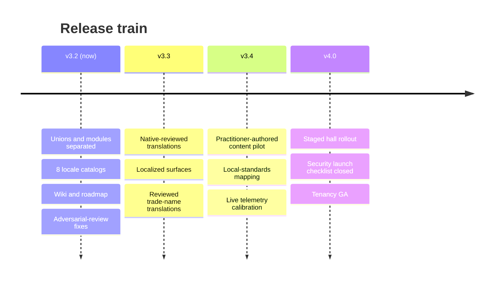

# SmartCiti.X : Trade Craft Academy — roadmap

*powered by AGI Corp*

This roadmap is versioned with the bundle it describes. Every figure in it is
the pack's own (111 halls, 11,000,000 addressable modules, 25,875 authored
objects, 8 districts, 8 locales), and the figures lint holds this file to the
same numbers as every other surface. Dates are planning targets, not
commitments; **exit criteria are the commitments**, and each one is a check a
harness can run rather than a sentence a reader has to trust.

---

## v3.2 — shipped in this release

The consolidation release: one repository, one version, one truth per fact.

| Delivered | Where |
|---|---|
| Union roster separated from the module registry, with a cross-pack verifier | `unions/`, `pack/`, `unions/verify.mjs` |
| Locale catalogs in 8 languages with structural-parity and pack-agreement checks | `i18n/` |
| The languages surface, direction-aware (Arabic renders RTL) | `web/trade_craft_languages.html` |
| Wiki generated from the registries — a page per map, a page per district | `wiki/` |
| Spec v3.2 adopted: §23 adversarial review findings, §24 texture and environment packages | `SmartCitiX_TradeCraft_Academy_Spec.md` |
| Version unified to Adaptive Stack v3.2 / pack 3.2.0 across every surface | manifest, README, generated pages |
| Ten-campus network — three district campuses (Treasure Island–SF, Oakland, New Orleans) plus seven regional-chapter **hub** campuses with no home district of their own (Houston, Chicago, Seattle, Pittsburgh, Denver, Miami, Detroit) — real or AUTHORED WGS84 anchors, recomputed great-circle distances for all forty-five campus pairs, Mapbox-ready GeoJSON | `unions/`, `geo/` |
| Recovered station curriculum rebranded onto halls, skills and rooms, machine-gradable | `stations/`, `archive/` |
| §24 realized: 22 floor finishes resolved hazard-first, per-room conditions merged more-demanding-wins, provenance-tagged (RECORDED/DERIVED/SCHEMATIC) | `surfaces/` |
| The interactive layered map, the **network geomap** (a real WGS84 map, vendored MapLibre GL, on-request USGS orthoimagery and live parcel/footprint fetches), the four-level 3D environment (network → campus → hall → walk) with live condition readouts, and the **network dashboard** reading every platform figure live from its own registry | `web/` |
| Eleven operable training simulators — tower-crane lift, excavator trench cut, forklift yard run, weld bead bench, scaffold bay build, rigging signal call, load chart judgment, pressure washer surface clean, airless paint sprayer finish, **boom lift basket work** and **overhead crane shop move** — each with a five-point pre-shift walkaround, a declared cockpit (dash, synthesized audio, haptics, seat view, an in-headset control mapping), a per-region scenario and a **scripted reference operator** (a deterministic in-page control policy over the seat's own gauges — no model, no network — passing every pass-gated axis on all 33 seat-x-yard combinations at `optimal`, with `novice`/`hurried` as seeded, labelled degradations); schematic physics, deterministic rubrics, bound to real skills in 45 halls | `sims/` |
| The toolroom registry — one crib per district, twelve schematic hand tools each, plus the deterministic crib drill | `tools/` |
| The schools flipped-classroom pack — the model, four grade bands, proposed district partnerships (public-record names only, every one PROPOSED), 45 live flipped units (one per sim-bound hall, so the roster moves with `sims/`) — with an in-app 🎓 Schools panel bidirectionally linked to every hall it names | `schools/` |
| The humanoid avatar locker — 18 standard sections / 289 options plus a 111-look crew section (400 options in 19 sections), a crew look stamping all 111 halls, 17 one-tap character presets, 19 costumes, the original **SmartCiti.X TradeApes** (111, one per hall), 8 emotes — cosmetic only, none graded | `avatars/` |
| The city-records GIS contract (real parcel/footprint authorities, licences and bounded queries) for the three district campuses, plus on-demand real USGS 3DEP elevation lookups — no record copied into the repo, fetched live in the learner's own browser | `parcels/` |
| The metaverse-interchange layer — glTF 2.0 export/import of the avatar and any hall, a complete VRM-compatible humanoid bone skeleton with a driven (not decorative) walk/idle/head-track, and a WebXR layer that is more than an entry button: an XR rig, `local-floor` with a `local` fallback, AR passthrough, controller input into every simulator, snap-turn locomotion and a wrist panel of readouts — verified against a mocked session in headless Chromium, not yet on a physical headset | `meta/` |
| Nine scripted advisors — eight room- or green-bound guides plus **the Operator**, who lives inside a simulator's own yard and resolves against whichever seat is actually running — a closed 35-question list (the Operator now also quotes the scripted reference procedure), no model, no network, changes no score | `agents/` |
| Generated sky, six weather states, browser-generated ground recipes (zero third-party texture files) and 101 ambient animals across all ten campuses | `world/` |
| The in-world signage system — 13 kinds over 10 shapes, shape-carries-category / colour-carries-provenance / type-carries-rank, view-direction-and-distance scored with one field-of-vision focus target | `labels/` |
| The device-local robotic-training-data recorder (three episode kinds, strictly downstream of a score already final) plus **TRACE**, its off-by-default per-second gauge sampler, and the **SCRIPTED** tier: sim episodes name their `actor`, and the records panel's headless sweep keeps the scripted reference operator's runs as replayable, labelled demonstration episodes through the same recorder — cross-linked with `orbis/` in both directions | `training/` |
| The Orbis synthetic-training-video prompt contract for all 111 union modules, plus two real, separately-runnable companion apps — no key shipped, no network reached from this bundle's own build | `orbis/` |
| The **spatial fabric** — the Academy published as self-hosted static files in the OMBI sense of a spatial fabric: an OGC GeoPose 1.0 Basic-YPR pose (claimed outright, height and heading honestly zero-with-UNKNOWN) for every campus, institution anchor and pinned restoration site, a fabric manifest and a SOM-shaped multi-origin scene graph with per-branch ownership (both shaped after the public deck, registered in `meta/` as NOT claimed), every other operator a separate external origin, no RMAP endpoint, no server, no DID | `spatial/`, `meta/` |
| The 10-world network-roadmap tracker itself: 10 built campuses + 0 candidate metros — the ten-campus target is now fully met, and the registry still carries the actual checklist every one of them cleared to get there | `roadmap/` |
| Path defects of the packaged layout fixed (builders resolve by walking up) | `web/build_page.py`, `web/build_map.py`, `console/build_slice.py` |
| Stale second truths removed (duplicate slice builder, 33-hall-era map data) | — |

---

## v3.3 — trust the words

**Theme:** everything a person reads in their own language is reviewed by a
person who speaks it. The catalogs ship today as *machine-drafted, pending
native review*, and they say so; this release removes that caveat honestly
rather than deleting the label.

**Status:** the machinery this release exists to build is built: a catalog
cannot become `reviewed` without a named human and a date, a hall-name
catalog cannot ship partial, the three public-facing pages hold zero
hard-coded English, and RTL correctness is asserted rather than eyeballed —
each proven by a check, each self-tested against a fixture it must reject.
What this pass does **not** do, and was never going to: review anything.
Building the checker is not the same act as a person reading the Spanish
catalog and signing their name to it, and no amount of machinery changes
that. All 7 non-English catalogs still declare `"translation_status":
"machine-drafted, pending native review"`; this commit added 140 new keys to
every one of them (landing page copy, campus-map chrome) and every new value
is machine-drafted the same way the rest of the catalog already was — none
of it is reviewed, and this PR flips no catalog's status. The release's own
theme — *everything a person reads in their own language is reviewed by a
person who speaks it* — is **not met**, and will not be met by a PR like
this one; it needs the native reviewers ws1 names, which is people, not code.

### Workstreams

1. **Native review of the 7 non-source catalogs.** One reviewer per locale,
   journey-level trade vocabulary where it exists (the German *Geselle*
   ladder, the French *compagnon* tradition). The `translation_status` field
   moves to `reviewed` only with a named reviewer in the commit.
   *Status:* **not started.** The rule that would enforce a reviewer's name
   is built and self-tested (`i18n/catalog.mjs`'s `validateCatalog()`,
   `i18n/test.mjs`, `i18n/validate.mjs`); no reviewer has been named for any
   of the 7 locales, and this pass invented none — a fabricated name would
   be exactly the failure criterion 1 exists to prevent, not a shortcut
   around it.
2. **Reviewed trade-name translations.** The 111 hall names stay in English
   today by design (`i18n/README.md`). This workstream produces per-locale
   hall-name catalogs with the same parity tests, unlocked locale by locale —
   a locale ships hall names only when all 111 are reviewed.
   *Status:* **not started.** The convention and the validator exist
   (`i18n/hall-names/<locale>.json`, `validateHallNames()` — complete-111 or
   absent, `reviewed` with a named reviewer, never partial) and the rule is
   proven against fixtures a human never has to construct twice, but no
   hall-name catalog has been authored; `i18n/test.mjs` holds the rule
   vacuously true today and would catch the first one that ships incomplete.
3. **Localized surfaces.** The landing page and campus-map chrome render from
   the catalogs; the map mirrors correctly under RTL. The console UI strings
   externalize into the catalogs (the control plane stays English-internal —
   telemetry keys are protocol, not prose).
   *Status:* **the landing and languages pages, done; the map's page chrome,
   done; the console, not started.** `web/build_landing.py` and
   `web/build_map.py` no longer carry a single hard-coded English string —
   140 new catalog keys replaced every hero line, mission paragraph,
   investor panel, status-table cell and map legend/title-block/footer
   string that used to be typed straight into the Python (`i18n/README.md`'s
   hard-coded-English-lint section has the full account); `web/build_languages.py`
   was already catalog-only. A source-level read then found the map and
   landing CSS used hard-coded `left`/`right` throughout, which would not
   have mirrored under RTL even though nothing rendered them in another
   language yet; both now use logical properties
   (`margin-inline-start`, `border-inline-end`, `text-align:start`, …), and
   the languages page's locale switcher — which DOES render RTL, for
   Arabic — had a real gap: only the inner `<section dir="rtl">` ever
   flipped; `document.documentElement.dir` stayed `ltr` regardless of the
   selected language, so `document.dir === 'rtl'` was never actually true
   for a reader who picked Arabic. Fixed; see the exit criterion below for
   the numbers. The console's own UI strings are untouched — the control
   plane's telemetry keys stay protocol, not prose, exactly as this
   workstream says, but the console's visible chrome was out of this pass's
   reach given the size of the landing/map externalization alone, and stays
   open.
4. **Wiki localization.** The wiki builder gains a `--locale` mode; district
   pages render per locale from the same registries.
   *Status:* **deliberately not built.** 27 pages × 8 locales generated from
   catalogs that are all still machine-drafted would produce 189 mostly-
   English pages (district names and a handful of UI labels translated, the
   actual page body — hall descriptions, skill text — pulled straight from
   the English registries either way) each carrying a review caveat. That is
   volume without trust, the opposite of this release's theme, so it is left
   open rather than built to make a number go up.

### Exit criteria

- `i18n/test.mjs` gains a rule: a catalog claiming `reviewed` status names
  its reviewer; a hall-name catalog is complete or absent, never partial.
  *Status:* **met.** `i18n/catalog.mjs` exports `STATUSES` (a closed set:
  `source language` | `machine-drafted, pending native review` | `reviewed`)
  and `validateCatalog()`/`validateHallNames()`; `load()` calls the former on
  every catalog it reads, so a bad catalog fails at the moment anything in
  JS loads it, not only when the suite happens to run.
  `i18n/test.mjs` grew from 16 to 31 checks, 8 of them self-tests that
  construct the exact bad catalogs the rule exists to catch — `reviewed`
  with no reviewer, `reviewed` with a reviewer but no date, a 110-of-111
  hall-name catalog, a complete-111 catalog that is not `reviewed` — and
  assert the validator rejects every one, the same proof-by-tampering
  `security/test_sbom.mjs` and `training/build.py`'s balanced-paren reader
  already use on their own guards.
- Landing, map and languages pages carry zero hard-coded English strings
  (a grep-shaped lint, like the brand lint).
  *Status:* **met.** `i18n/lint_hardcoded.mjs` reads the three page
  generators' source (not the built HTML — see the file's own header for
  why that is the sound way to check this) and fails on any user-visible
  text that is not a catalog lookup; it is self-tested against a fixture
  sentence, a hard-coded `alt` attribute and a hard-coded JS string literal,
  and exempts only the brand name and two planned-campus place names
  (`Oakland Training Yard`, `SF Bridgehead` — proper nouns, the same
  exemption class as the untranslated hall names). It runs in
  `verify_all.sh` alongside `brand/lint.mjs`.
- RTL rendering asserted by the layout harness, not eyeballed (§23's lesson:
  a rendering claim needs a rendering check).
  *Status:* **met.** `web/test_rtl.mjs` (17 checks, in `verify_all.sh`)
  holds the source-level half: the languages page's `document.dir` mirror,
  and every physical `left`/`right` CSS rule found in the landing and map
  generators replaced with a logical one, swept broadly enough that a new
  one introduced later fails the test rather than shipping unnoticed. The
  actual-render half is a scratch headless-Chromium proof (Playwright,
  not committed — `verify_all.sh` stays browser-free): on the languages
  page, selecting Arabic set `document.dir` to `rtl` (computed
  `direction: rtl` on `<body>`), moved the honesty box's accent border from
  the left edge (3px) to the right (3px on the right, 0 on the left), and
  moved the first stat tile from x=200 to x=940 in a 1280px viewport — the
  DOM order didn't change, the flex layout mirrored it. On the landing and
  map pages, which have no locale switch of their own, forcing
  `document.documentElement.dir = 'rtl'` moved the nav-links block from
  x≈564 to x≈124 and the map's sidebar from x=0–266 to x=1014–1280 — exactly
  swapped to the opposite edge. `document.documentElement.scrollWidth`
  equalled `clientWidth` (1280) in every case, LTR and RTL alike, on all
  three pages: no horizontal overflow. Nothing failed to mirror; there was
  no finding to fix beyond the two closed above before this proof ran.

---

## v3.4 — content goes real

**Theme:** replace *unverified general practice* with practitioner-authored
content, hall by hall, and let the label retreat only where the work landed.

### Workstreams

1. **Flagship authoring pilot.** The four console-slice halls first —
   Ironworkers, Electrical Workers, Welding Trades, Crane Operators. Journey-
   level practitioners author against the existing skeleton (levels, strands,
   tiers); the manifest's honesty block becomes per-hall, so a verified hall
   stops carrying the caveat and an unverified one keeps it. The masonry
   family has a head start: the recovered pre-rebrand yard curriculum
   (`archive/bac_yard_stations.json`, 25 machine-gradable stations — see
   `wiki/Upgrade-Candidates.md`) seeds `bricklayers` and its neighbouring
   halls once practitioners have reviewed it. A coverage check (2026-09-13)
   found only 11 of 111 halls carry any yard station today, all from that
   one recovered set — Energy & Utilities and Transport & Mobility hold
   zero, with no surveyed candidate source for either yet (`wiki/
   Upgrade-Candidates.md` §6); a future wave of this workstream should name
   a flagship hall in each.
2. **Local-standards mapping (§24.3).** The texture and environment values
   ship as general good practice with the absence of code references
   asserted. This workstream adds a jurisdiction overlay format: a deployment
   names its jurisdiction, and every illuminance/ACH/PPE value resolves
   against the local standard or fails loudly — never silently defaults
   (§23.1's one-sentence pattern: a default value is a policy decision).
3. **Calibration from live telemetry.** The dial and gates run today against
   simulated learners (ACP-14/15). Shadow-mode deployment feeds the parity
   monitor (ACP-08) real cohorts; item difficulty recalibrates from evidence
   with the audit trail the bus already writes.
4. **Adversarial review cadence.** §23.5's conclusion operationalized: an
   independent adversarial pass on every minor release, findings filed as
   spec sections, not just fixes.

### Exit criteria

- ≥1 hall's content signed off by named journey-level practitioners; the
  per-hall honesty flag verified by `pack/verify.mjs`.
- A jurisdiction overlay validates end-to-end for one real jurisdiction with
  every value sourced or explicitly waived.
- Parity monitor green over real cohorts — with the §23.1 fix proven: it can
  never report green over zero cohorts.

---

## v4.0 — the campus opens

**Theme:** staged, observable, reversible rollout — the ops pack's lanes and
gates doing their job on real halls.

### Workstreams

1. **Staged hall rollout.** Waves per `ops/rollout.mjs` lanes: canary (1
   hall) → wave (5 halls) → the full network (111 halls, read live from the
   pack). Each wave holds its dwell window (no `Infinity` defaults —
   §23.1), passes its stop conditions, and can roll back without data loss.
   *Status:* `ops/rehearsal.mjs` drives one content rollout through every
   gate — the dwell gate with no observation reported, a red parity ticket
   and its close, an ACP-08 halt and the auto-rollback it triggers, the
   dial-params shadow run, a parity job that never runs (driven through the
   real `Scheduler`, not faked) halting the network on its own, and the full
   canary → wave → full walk — against seeded synthetic cohorts, with every
   step asserted against the resulting audit trail rather than a return
   value alone. That proves the lane machinery enforces what it claims.
   It does not ship anything: there is no deployment and no real learner
   behind any hall count in that run, so a rehearsal against synthetic
   cohorts is not a wave shipped to real halls, and the exit criterion below
   stays **not met**.
2. **Security launch checklist.** Every open item in `SECURITY.md` closed or
   explicitly accepted by name; deny-by-default authz, tenant isolation and
   rate limiting re-verified against the §23.1 fail-open classes.
   *Status:* this pass closed what can be closed in-repo — the ACP-13 cost
   governor's "specified, not built" claim corrected (it is built and tested
   in `ops/`); two §23.1 fail-open dwell defaults closed with absent-input
   tests (`ops/rollout.mjs` `advance()` no longer opens a lane on an
   unreported dwell; `control/hints.mjs` `request()` and its `bus/session.mjs`
   pass-through no longer serve a hint on an unreported dwell); an SBOM
   (`security/build_sbom.py` → `security/registry/sbom.cdx.json`, CycloneDX
   1.5, verified by hash against `web/vendor/` on every run); the contest and
   abuse routes (`security/contest.mjs`: `gate.contest`/`gate.review`,
   `abuse.report`/`abuse.triage`, no agent role holds any of them); and
   `SECURITY.md` deduplicated (the pack copy is now a pointer). **Still
   open:** authentication, transport and storage encryption, persistence and
   backup, secrets management, CI dependency/container scanning (a workflow
   change the maintainers must approve), the external penetration test, the
   staffed incident-response rotation and the vulnerability-reporting
   address — every one needs infrastructure or people outside this tree, and
   none has a named owner yet.
3. **Tenancy GA.** Multi-tenant deployments with the erasure and retention
   guarantees the privacy pack asserts; per-tenant locale defaults.
4. **VR sim modality pilot.** The browser simulator layer (`sims/` — eleven
   machines now: tower-crane lift, excavator trench cut, forklift yard run,
   weld bead bench, scaffold bay build, rigging signal call, load chart
   judgment, pressure washer surface clean, airless paint sprayer finish,
   and — this milestone's widening — the boom lift basket work and the
   overhead crane shop move, all deterministic-rubric and skill-bound, each
   with a scripted reference operator that drives it at the rubric-passing
   level and generates SCRIPTED demonstration episodes for the `training/`
   recorder). **What shipped:** the 3D environment now carries a real XR
   rig (the camera's parent; walking, seat poses and snap turns move the
   rig, never the camera), a `local-floor` space with a `local` fallback,
   AR passthrough with the drawn sky, ground and fog suppressed, a
   controller adapter that lands thumbsticks, trigger, grip and face
   buttons in the same key state a keyboard fills through each seat's
   declared `xr` mapping, a wrist panel of readout signs off the same
   gauges the dash shows, and the scripted operator watchable from inside
   the session — so every seat, the campus, the halls and the restoration
   walks run in-session against the interiors/§24 environment packages.
   **What is honestly not done:** this was verified against a mocked WebXR
   session in headless Chromium (three.js's own `WebXRManager` driven by a
   fake session, frame and input sources); no physical headset has run it,
   no hands are tracked or rendered, and three.js r160 cannot resize the
   XR framebuffer mid-session, so the resolution ladder applies at the next
   session start while foveation steps live. Simulator results stay
   formative until the assessment gates' unaided verification contract
   says otherwise, and a scripted operator's run is never a learner's
   result at all.
5. **Metaverse-browser interoperability.** `spatial/` already publishes
   the Academy as a self-hosted spatial fabric with real OGC GeoPose 1.0
   poses and an OMBI-shaped manifest and scene graph that are honestly
   NOT claimed as conformant. This milestone closes that gap only when it
   can be closed honestly: validate the manifest and SOM against the
   normative OMBI texts once they are published and reachable, load the
   fabric in an open metaverse browser (Sneeze / Artemis) and record the
   result, and then — and only then — move `ombi-spatial-fabric`,
   `ombi-som` and (if a server is ever run) `rmap` from `not_claimed` to
   `standards` in `meta/`. Heights and headings stay zero-with-UNKNOWN
   until a cited measurement exists for them.

### Exit criteria

- Rollout lanes complete for wave 1 with audit evidence; cost governor live
  and provably unable to throttle the control plane.
  *Status:* the cost governor half is met — `ops/jobs.mjs`'s `CostGovernor`
  is built and tested, and the control plane is structurally un-throttleable
  (`bus/test_safeguards.mjs`, `ops/test.mjs`, `ops/fuzz.mjs`). The lanes half
  is not: `ops/rehearsal.mjs` rehearses every gate end to end with audit
  evidence against seeded synthetic cohorts, which is what this repo can
  honestly produce with no deployment and no real learners, but a rehearsal
  is not wave 1 complete. **Not yet met.**
- Security checklist at zero open unaccepted items.
  *Status:* **not met** — `SECURITY.md` now carries the checklist as a status
  table; the in-repo items are built and tested, the remaining items need
  external infrastructure, people or a maintainer-approved CI change, and its
  "Accepted by" column is empty because this pass names no owner.
- One VR sim module running against a §24 environment package end to end.
  *Status:* every sim module runs in a WebXR session against the
  interiors/§24 environment packages, verified against a mocked session in
  headless Chromium; verification on a physical headset is the remaining
  step, so this criterion is **not yet met**.

---

## Standing rules, every release

These are not phase work; they are the floor.

- **`verify_all.sh` exits zero** on every commit to `main` — all suites, the
  brand lint, the figures lint, the console and wiki staleness guards.
- **A new surface that states a figure** joins the figures lint's walk the
  day it lands.
- **A default is a policy decision** (§23.1). Any new `??`, `?? Infinity`,
  or optional check defaults to *closed*, and a test exercises the path
  where the input is absent.
- **One truth per fact.** A second copy of a roster, a source list, a count
  or a string catalog is a defect even while the copies still agree.

---

*This roadmap lives beside the code it schedules. Edit it in the same PR as
the work it describes, and keep its figures the pack's.*
