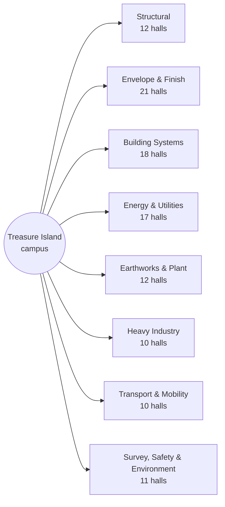

# The campus map

`web/trade_craft_map.html`, generated by `web/build_map.py` — every one of the
111 union halls on the Treasure Island campus, coloured by district,
with a generated floor plan for each hall (see [Interiors-Map](Interiors-Map.md)).

## What the map encodes

- **Hue carries the district; identity is carried by a unique three-letter
  code** on each hall marker. Colour cannot hold 111 categories — the
  hash-a-hue approach produced 94 distinct hues with three-way ties, so the
  encoding changed rather than the tolerance (spec §23.4).
- **Pipeline state** comes from the pack: each hall shows its module census
  across live / calibrating / schema-ok / draft, computed from the same
  position function the registry uses — the map holds no counts of its own.
- **The roster comes from the union registry** (`unions/registry/`); the map
  holds no hall list of its own, so it cannot drift from the taxonomy.

## Content graph



## Census by district

| District | Halls | Lessons | Core modules |
|---|---|---|---|
| Structural | 12 | 132,000 | 1,188,000 |
| Envelope & Finish | 21 | 231,000 | 2,079,000 |
| Building Systems | 18 | 198,000 | 1,782,000 |
| Energy & Utilities | 17 | 187,000 | 1,683,000 |
| Earthworks & Plant | 12 | 132,000 | 1,188,000 |
| Heavy Industry | 10 | 110,000 | 990,000 |
| Transport & Mobility | 10 | 110,000 | 990,000 |
| Survey, Safety & Environment | 11 | 121,000 | 1,089,000 |

Across the campus: 1,221,000 lessons, 10,989,000 core
modules, plus the 11,000-module shared cross-trade
library = 11,000,000.

## Rebuilding

```bash
python3 unions/build.py               # if the roster changed
python3 pack/build.py                 # if the skeleton changed
python3 stations/build.py             # if the station content changed
python3 web/build_map.py              # the campus plan
python3 web/build_interactive_map.py  # the interactive layered map
python3 web/build_3d.py               # the 3D hall environment
```

## The interactive layer

`web/trade_craft_interactive.html` (built by `web/build_interactive_map.py`)
puts four toggleable layers over the same registries: district hue, pipeline
state, module layers (each hall's census as a stacked bar), and training
stations. Clicking a hall opens its floor plan with the recovered stations
drawn inside the rooms their strands own, its skill lattice, and
machine-gradable scenario checks — the whole surface rendered in any of the
shipped locales, direction-aware.

## Upgrade candidates

Reviewed and held for future releases (see [`ROADMAP.md`](../ROADMAP.md)):

- **Localized chrome** — the map's labels and legend from the i18n catalogs,
  with RTL mirroring (v3.3).
- **Real geography** — the campus plan is a functional layout, not a survey;
  no address data has been collected for any hall, and each floor plan says
  so. A siting pass against real parcels is a v4.0-era decision.
- **Per-hall deep links** — hall markers linking to their wiki district page
  and, once authored, their curriculum.
- **VR walkthrough** — the §24 texture and environment packages make each
  hall's floor plan renderable as a sim environment (v4.0 pilot).

---

*Generated by `wiki/build_wiki.py` from the verified registries — edit the sources, not this page. Adaptive Stack v3.2 · pack 3.2.0.*
