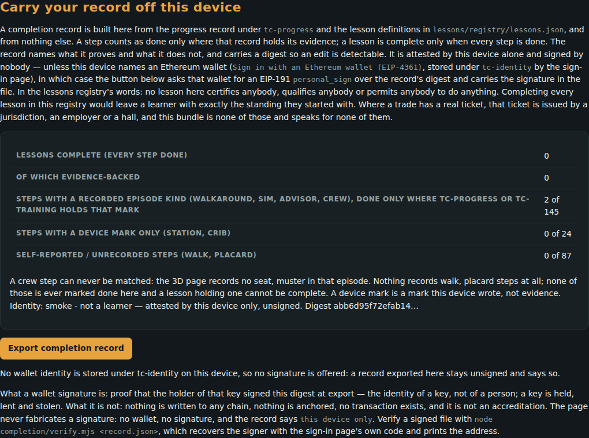

# The completion record

A completion record is a `tc-completion/1` file a learner exports from the
progress page: what they did in the walkable world, with the recorded
episodes behind it, in a form a union rep can check offline without trusting
the learner's device.

**The loop.** [Completion-Record](Completion-Record.md) (export your progress) -> [Verify-A-Record](Verify-A-Record.md) (a rep checks it) -> [Contribute](Contribute.md) (share the episodes behind it, if you choose). [Work-Sites](Work-Sites.md) -> [Verify-A-Record](Verify-A-Record.md) for a crew. [Sessions](Sessions.md) and [Compliance-Ledger](Compliance-Ledger.md) read the same files.

## The process, for a learner

1. **Train in the walkable world.** Pass a seat, clear a tool crib, mark a
   station, work a lesson's steps. The world keeps this in `tc-progress`, in the
   localStorage of the built page (web/build_3d.py) - on this device only.
2. **Open the progress page**, [`web/trade_craft_progress.html`](../web/trade_craft_progress.html), and go to
   *Carry your record off this device*.
3. **Press *Export completion record*.** The page writes one `tc-completion/1` file to your own
   downloads, with a SHA-256 digest over its canonical form. Nothing is sent.
4. **Optionally, *Sign this record with the connected wallet*.** This appears only with a connected wallet (see
   [Sign-In](Sign-In.md)); the wallet signs the record's digest. Unsigned, the
   record is attested by this device only.
5. **Hand the file to your rep.** They check it offline:
   [Verify-A-Record](Verify-A-Record.md).



*The progress page, at *Carry your record off this device*. The learner data in this capture is synthetic, injected by the smoke harness - not a learner's record.*

## What the verifier checks

`node completion/verify.mjs <record.json>` applies 15 rules: `record.fields` · `digest` · `identity.signature` · `ids.lesson` · `ids.hall` · `ids.step` · `ids.sim` · `ids.scenario` · `ids.station` · `ids.district` · `step.recording-evidence` · `step.episode-evidence` · `lesson.complete-all-steps` · `sim.threshold` · `ladder.prerequisite`.
Of the registry's 56 lessons, 33 can be
completed from recorded evidence and 23 cannot (a
crew step no single device can record).

## Check it offline

On the pack's own fixture record (SCRIPTED, labelled not a learner):

```text
$ node completion/verify.mjs completion/fixture/good.json
ok record.fields: checked 6, failing 0
ok digest: checked 2, failing 0
ok identity.signature: checked 1, failing 0
ok ids.lesson: checked 56, failing 0
ok ids.hall: checked 56, failing 0
ok ids.step: checked 512, failing 0
ok ids.sim: checked 4, failing 0
ok ids.scenario: checked 2, failing 0
ok ids.station: checked 1, failing 0
ok ids.district: checked 0, failing 0
ok step.recording-evidence: checked 145, failing 0
ok step.episode-evidence: checked 26, failing 0
ok lesson.complete-all-steps: checked 56, failing 0
ok sim.threshold: checked 2, failing 0
ok ladder.prerequisite: checked 40, failing 0
note sim.threshold: rigging-signals has no scalar threshold in sims.json; passed=true is taken from the record and not re-derived
note sim.threshold: load-chart has no scalar threshold in sims.json; passed=true is taken from the record and not re-derived
signature: unsigned: this device only
summary: 2 lessons complete, of which 0 fully evidence-backed (every step episode-backed); across them 6 episode-backed steps, 0 device-mark steps (station/crib: a device-local mark, not a recorded episode), 2 self-reported steps counted as done
this verifies integrity since export and resolution against the bundle; a wallet signature, if any, proves that the holder of a key signed this digest at export - a key, not a person; nothing is written to any chain, nothing is anchored, and this is no accreditation
```

Exit status **0**, captured when this page was built.

## The honest limits

Quoted from the registry at build time, never retyped:

`completion/registry/completion.json#honesty.does_not_prove`:

> - who the learner is: identity.claimed is typed by the person, attested by this device only, and nothing checks it - unless a wallet signed, in which case it is the identity of a key, not of a person; a stolen key signs just as well
> - anything on any blockchain: a wallet signature is computed in the browser and carried in the file; nothing is written to any chain, nothing is anchored, and no one can look it up
> - that the device was honest: a record can be written by hand and will verify if it is internally consistent
> - that a self-reported step (walk, placard) happened at all
> - a station or crib mark is a device-local mark, not a recorded episode
> - that the seat was passed under supervision, or that any score means anything outside this bundle
> - any accreditation, ticket, licence or credential; no hall, employer or authority has signed anything
> - any duration of training, and no price is claimed

`completion/registry/completion.json#honesty.digest`:

> a digest proves integrity since export, not identity

`completion/registry/completion.json#honesty.signature`:

> null unless a wallet signed: this bundle has no key of its own and no server, so an unsigned record is attested by this device only. A signed record carries an EIP-191 personal_sign signature by the connected wallet over this record's digest; it proves that the holder of that key signed this digest at export - the identity of a key, not of a person. A signature that does not recover to the address it claims, or that signs any other message, is refused as a forgery. Nothing is written to any chain and nothing is anchored.

`completion/registry/completion.json#honesty.accreditation`:

> nothing here is an accreditation

---

*Generated by `wiki/build_wiki.py` from the verified registries — edit the sources, not this page. Adaptive Stack v3.2 · pack 3.2.0.*
