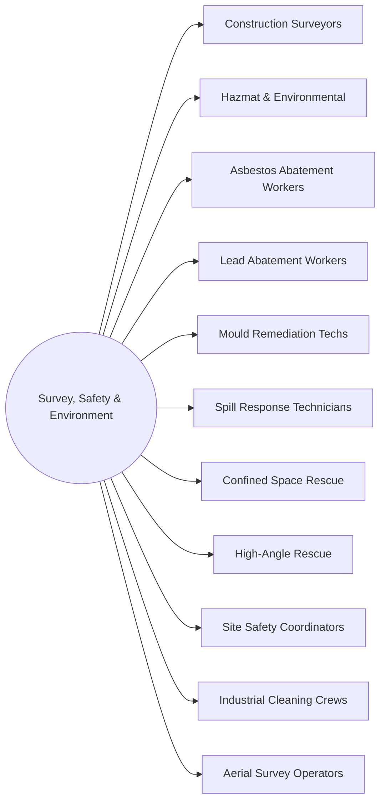

# District: Survey, Safety & Environment

*Where work is set out, made safe and made clean*

**11 halls** · 121,000 lessons ·
1,089,000 core modules. Part of the [campus map](Campus-Map.md).

## Content graph

## The halls

Pipeline column counts this hall's 100 levels by state
(live / calibrating / schema-ok / draft).

| Hall | Focus | Lessons | Modules | Levels by state |
|---|---|---|---|---|
| **Construction Surveyors** | Layout, control networks, GNSS and as-builts | 11,000 | 99,000 | 71 / 14 / 15 / 0 |
| **Hazmat & Environmental** | Containment, decon, monitoring and disposal | 11,000 | 99,000 | 71 / 14 / 15 / 0 |
| **Asbestos Abatement Workers** | Enclosures, negative air, wet removal and clearance | 11,000 | 99,000 | 23 / 22 / 26 / 29 |
| **Lead Abatement Workers** | Containment, HEPA, waste characterisation and clearance | 11,000 | 99,000 | 23 / 22 / 26 / 29 |
| **Mould Remediation Techs** | Moisture mapping, containment, drying and verification | 11,000 | 99,000 | 23 / 22 / 26 / 29 |
| **Spill Response Technicians** | Booming, recovery, decon and incident command | 11,000 | 99,000 | 23 / 22 / 26 / 29 |
| **Confined Space Rescue** | Atmospheric testing, retrieval, patient packaging | 11,000 | 99,000 | 23 / 22 / 26 / 29 |
| **High-Angle Rescue** | Rope systems, anchors, edge management and litter work | 11,000 | 99,000 | 23 / 22 / 26 / 29 |
| **Site Safety Coordinators** | Permits, JHAs, audits, incident investigation | 11,000 | 99,000 | 23 / 22 / 26 / 29 |
| **Industrial Cleaning Crews** | Hydroblasting, vacuum trucks, tank entry and decon | 11,000 | 99,000 | 23 / 22 / 26 / 29 |
| **Aerial Survey Operators** | Flight planning, photogrammetry, airspace and accuracy | 11,000 | 99,000 | 23 / 22 / 26 / 29 |

Every hall runs the same skeleton — 100 levels in ten tracks, 110 slots per
level, 9 variants per lesson — sequenced by the
[skill graph](Skill-Graph.md), with an interior generated from the same
strands ([interiors map](Interiors-Map.md)).

---

*Generated by `wiki/build_wiki.py` from the verified registries — edit the sources, not this page. Adaptive Stack v3.2 · pack 3.2.0.*
