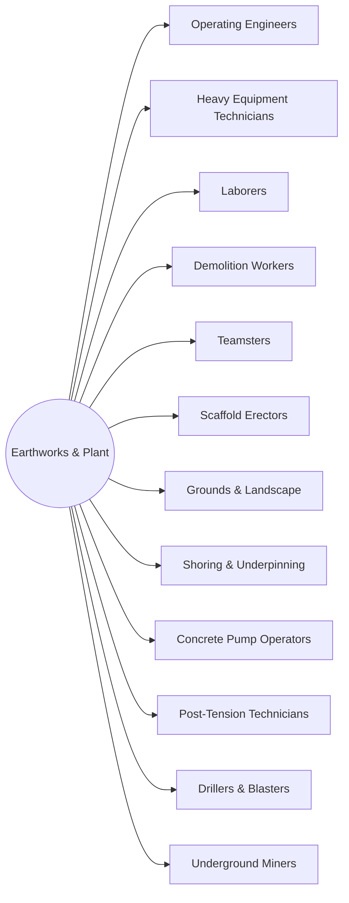

# District: Earthworks & Plant

*Ground, machines, access and haul* — trains at **Oakland Waterfront Campus**, Oakland, California.

**12 halls** · 132,000 lessons ·
1,188,000 core modules. Part of the [campus map](Campus-Map.md).

## Content graph

## The halls

Pipeline column counts this hall's 100 levels by state
(live / calibrating / schema-ok / draft).

| Hall | Focus | Lessons | Modules | Levels by state |
|---|---|---|---|---|
| **Operating Engineers** | Earthmoving, lifting and heavy plant operation | 11,000 | 99,000 | 89 / 6 / 5 / 0 |
| **Heavy Equipment Technicians** | Diagnostics, hydraulics, drivetrain and field service | 11,000 | 99,000 | 71 / 14 / 15 / 0 |
| **Laborers** | Site prep, materials, excavation support and cleanup | 11,000 | 99,000 | 89 / 6 / 5 / 0 |
| **Demolition Workers** | Selective demo, structural takedown and debris control | 11,000 | 99,000 | 71 / 14 / 15 / 0 |
| **Teamsters** | Haul, delivery, logistics and vehicle compliance | 11,000 | 99,000 | 89 / 6 / 5 / 0 |
| **Scaffold Erectors** | System scaffold, shoring, suspended access and tags | 11,000 | 99,000 | 71 / 14 / 15 / 0 |
| **Grounds & Landscape** | Mowing, trimming, irrigation, arbor and turf care | 11,000 | 99,000 | 71 / 14 / 15 / 0 |
| **Shoring & Underpinning** | Needle beams, jacking, monitoring and sequencing | 11,000 | 99,000 | 23 / 22 / 26 / 29 |
| **Concrete Pump Operators** | Boom setup, ground bearing, line safety and cleanout | 11,000 | 99,000 | 23 / 22 / 26 / 29 |
| **Post-Tension Technicians** | Tendon layout, stressing, elongation and grouting | 11,000 | 99,000 | 23 / 22 / 26 / 29 |
| **Drillers & Blasters** | Shot design, loading, initiation and vibration control | 11,000 | 99,000 | 45 / 22 / 18 / 15 |
| **Underground Miners** | Ground support, ventilation, haulage and rescue | 11,000 | 99,000 | 45 / 22 / 18 / 15 |

Every hall runs the same skeleton — 100 levels in ten tracks, 110 slots per
level, 9 variants per lesson — sequenced by the
[skill graph](Skill-Graph.md), with an interior generated from the same
strands ([interiors map](Interiors-Map.md)).

---

*Generated by `wiki/build_wiki.py` from the verified registries — edit the sources, not this page. Adaptive Stack v3.2 · pack 3.2.0.*
