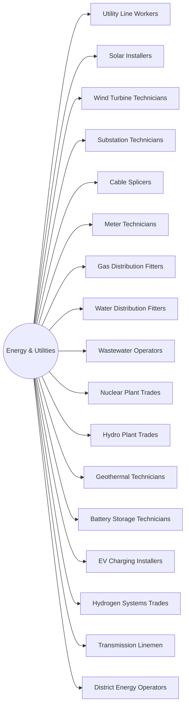

# District: Energy & Utilities

*Generation, distribution, water and storm work*

**17 halls** · 187,000 lessons ·
1,683,000 core modules. Part of the [campus map](Campus-Map.md).

## Content graph

## The halls

Pipeline column counts this hall's 100 levels by state
(live / calibrating / schema-ok / draft).

| Hall | Focus | Lessons | Modules | Levels by state |
|---|---|---|---|---|
| **Utility Line Workers** | Distribution, transmission, switching and storm work | 11,000 | 99,000 | 71 / 14 / 15 / 0 |
| **Solar Installers** | PV array, racking, inverters and interconnection | 11,000 | 99,000 | 71 / 14 / 15 / 0 |
| **Wind Turbine Technicians** | Nacelle systems, blades, climb rescue and torque | 11,000 | 99,000 | 71 / 14 / 15 / 0 |
| **Substation Technicians** | Relays, breakers, transformers and switching orders | 11,000 | 99,000 | 45 / 22 / 18 / 15 |
| **Cable Splicers** | MV/HV terminations, splices and cable fault work | 11,000 | 99,000 | 45 / 22 / 18 / 15 |
| **Meter Technicians** | Metering, CT/PT, revenue accuracy and sealing | 11,000 | 99,000 | 45 / 22 / 18 / 15 |
| **Gas Distribution Fitters** | Mains, services, fusion, purging and leak survey | 11,000 | 99,000 | 45 / 22 / 18 / 15 |
| **Water Distribution Fitters** | Mains, valves, hydrants, chlorination and tapping | 11,000 | 99,000 | 45 / 22 / 18 / 15 |
| **Wastewater Operators** | Treatment trains, blowers, sludge and permit limits | 11,000 | 99,000 | 45 / 22 / 18 / 15 |
| **Nuclear Plant Trades** | Rad-controlled work, ALARA, containment and outage | 11,000 | 99,000 | 45 / 22 / 18 / 15 |
| **Hydro Plant Trades** | Turbines, wickets, gates, penstocks and governors | 11,000 | 99,000 | 45 / 22 / 18 / 15 |
| **Geothermal Technicians** | Wellhead, brine handling, scaling and binary cycle | 11,000 | 99,000 | 45 / 22 / 18 / 15 |
| **Battery Storage Technicians** | Racks, BMS, thermal runaway response and commissioning | 11,000 | 99,000 | 45 / 22 / 18 / 15 |
| **EV Charging Installers** | Service upgrades, DCFC, networking and commissioning | 11,000 | 99,000 | 45 / 22 / 18 / 15 |
| **Hydrogen Systems Trades** | Electrolysers, compression, purity and leak detection | 11,000 | 99,000 | 45 / 22 / 18 / 15 |
| **Transmission Linemen** | EHV structures, conductor stringing and live-line work | 11,000 | 99,000 | 45 / 22 / 18 / 15 |
| **District Energy Operators** | Steam and chilled loops, vaults and metering | 11,000 | 99,000 | 45 / 22 / 18 / 15 |

Every hall runs the same skeleton — 100 levels in ten tracks, 110 slots per
level, 9 variants per lesson — sequenced by the
[skill graph](Skill-Graph.md), with an interior generated from the same
strands ([interiors map](Interiors-Map.md)).

---

*Generated by `wiki/build_wiki.py` from the verified registries — edit the sources, not this page. Adaptive Stack v3.2 · pack 3.2.0.*
