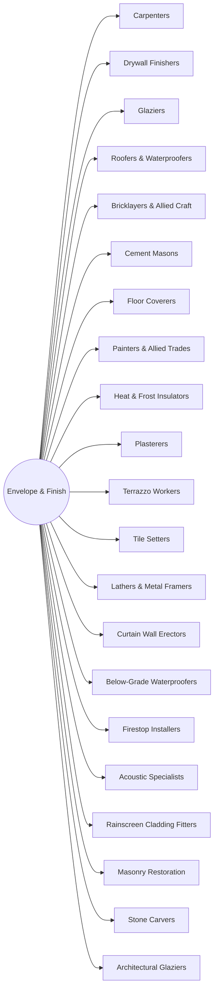

# District: Envelope & Finish

*Everything between the frame and the weather* — trains at **Treasure Island Campus**, San Francisco, California.

**21 halls** · 231,000 lessons ·
2,079,000 core modules. Part of the [campus map](Campus-Map.md).

## Content graph

## The halls

Pipeline column counts this hall's 100 levels by state
(live / calibrating / schema-ok / draft).

| Hall | Focus | Lessons | Modules | Levels by state |
|---|---|---|---|---|
| **Carpenters** | Framing, formwork, finish and layout | 11,000 | 99,000 | 89 / 6 / 5 / 0 |
| **Drywall Finishers** | Board, level of finish, texture and acoustic assemblies | 11,000 | 99,000 | 71 / 14 / 15 / 0 |
| **Glaziers** | Curtain wall, storefront, glazing and sealants | 11,000 | 99,000 | 89 / 6 / 5 / 0 |
| **Roofers & Waterproofers** | Low-slope, steep-slope, membranes and moisture control | 11,000 | 99,000 | 89 / 6 / 5 / 0 |
| **Bricklayers & Allied Craft** | Masonry, refractory, tile and stone | 11,000 | 99,000 | 89 / 6 / 5 / 0 |
| **Cement Masons** | Placement, finishing, curing and decorative concrete | 11,000 | 99,000 | 89 / 6 / 5 / 0 |
| **Floor Coverers** | Substrate prep, resilient, carpet, terrazzo and epoxy | 11,000 | 99,000 | 71 / 14 / 15 / 0 |
| **Painters & Allied Trades** | Coatings, containment, industrial and decorative finish | 11,000 | 99,000 | 89 / 6 / 5 / 0 |
| **Heat & Frost Insulators** | Mechanical insulation, abatement and firestopping | 11,000 | 99,000 | 89 / 6 / 5 / 0 |
| **Plasterers** | Three-coat, veneer, ornamental run and repair | 11,000 | 99,000 | 45 / 22 / 18 / 15 |
| **Terrazzo Workers** | Divider strips, pours, grinding and sealing | 11,000 | 99,000 | 45 / 22 / 18 / 15 |
| **Tile Setters** | Substrates, waterproofing, large format and grout | 11,000 | 99,000 | 45 / 22 / 18 / 15 |
| **Lathers & Metal Framers** | Metal stud, furring, ceiling grid and backing | 11,000 | 99,000 | 23 / 22 / 26 / 29 |
| **Curtain Wall Erectors** | Unitised panels, anchors, sequencing and water test | 11,000 | 99,000 | 23 / 22 / 26 / 29 |
| **Below-Grade Waterproofers** | Membranes, injection, drainage and blindside | 11,000 | 99,000 | 23 / 22 / 26 / 29 |
| **Firestop Installers** | Penetrations, joints, listed systems and inspection | 11,000 | 99,000 | 23 / 22 / 26 / 29 |
| **Acoustic Specialists** | Isolation, mass-loaded assemblies and STC testing | 11,000 | 99,000 | 23 / 22 / 26 / 29 |
| **Rainscreen Cladding Fitters** | Substructure, panels, cavity drainage and tolerance | 11,000 | 99,000 | 23 / 22 / 26 / 29 |
| **Masonry Restoration** | Repointing, consolidation, Dutchman and cleaning | 11,000 | 99,000 | 45 / 22 / 18 / 15 |
| **Stone Carvers** | Banker work, lettering, tracery and matching | 11,000 | 99,000 | 45 / 22 / 18 / 15 |
| **Architectural Glaziers** | Structural silicone, blast glazing and heritage sash | 11,000 | 99,000 | 23 / 22 / 26 / 29 |

Every hall runs the same skeleton — 100 levels in ten tracks, 110 slots per
level, 9 variants per lesson — sequenced by the
[skill graph](Skill-Graph.md), with an interior generated from the same
strands ([interiors map](Interiors-Map.md)).

---

*Generated by `wiki/build_wiki.py` from the verified registries — edit the sources, not this page. Adaptive Stack v3.2 · pack 3.2.0.*
