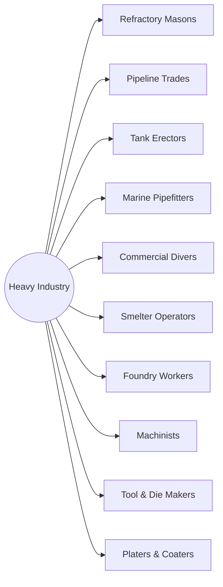

# District: Heavy Industry

*Process plant, marine, metal and machine shops*

**10 halls** · 110,000 lessons ·
990,000 core modules. Part of the [campus map](Campus-Map.md).

## Content graph

## The halls

Pipeline column counts this hall's 100 levels by state
(live / calibrating / schema-ok / draft).

| Hall | Focus | Lessons | Modules | Levels by state |
|---|---|---|---|---|
| **Refractory Masons** | Furnace linings, castables, gunning and dryout | 11,000 | 99,000 | 45 / 22 / 18 / 15 |
| **Pipeline Trades** | Mainline welding, coating, tie-ins and integrity digs | 11,000 | 99,000 | 45 / 22 / 18 / 15 |
| **Tank Erectors** | Field-erected storage, floating roofs and hydrotest | 11,000 | 99,000 | 45 / 22 / 18 / 15 |
| **Marine Pipefitters** | Shipboard systems, sea valves and pressure test | 11,000 | 99,000 | 45 / 22 / 18 / 15 |
| **Commercial Divers** | Underwater cutting, welding, inspection and lift bags | 11,000 | 99,000 | 45 / 22 / 18 / 15 |
| **Smelter Operators** | Furnace tapping, molten handling and pot lines | 11,000 | 99,000 | 45 / 22 / 18 / 15 |
| **Foundry Workers** | Moulding, pouring, shakeout and heat treatment | 11,000 | 99,000 | 45 / 22 / 18 / 15 |
| **Machinists** | Turning, milling, CNC setup, metrology and fits | 11,000 | 99,000 | 45 / 22 / 18 / 15 |
| **Tool & Die Makers** | Die build, jig and fixture, grinding and tryout | 11,000 | 99,000 | 45 / 22 / 18 / 15 |
| **Platers & Coaters** | Surface prep, electroplating, anodising and waste | 11,000 | 99,000 | 45 / 22 / 18 / 15 |

Every hall runs the same skeleton — 100 levels in ten tracks, 110 slots per
level, 9 variants per lesson — sequenced by the
[skill graph](Skill-Graph.md), with an interior generated from the same
strands ([interiors map](Interiors-Map.md)).

---

*Generated by `wiki/build_wiki.py` from the verified registries — edit the sources, not this page. Adaptive Stack v3.2 · pack 3.2.0.*
