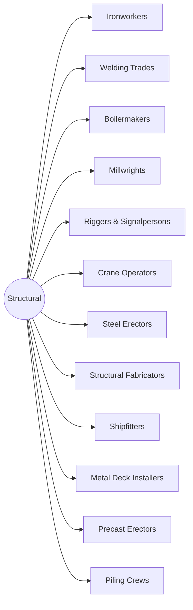

# District: Structural

*Steel, welds, lifts and the loads they carry*

**12 halls** · 132,000 lessons ·
1,188,000 core modules. Part of the [campus map](Campus-Map.md).

## Content graph

## The halls

Pipeline column counts this hall's 100 levels by state
(live / calibrating / schema-ok / draft).

| Hall | Focus | Lessons | Modules | Levels by state |
|---|---|---|---|---|
| **Ironworkers** | Structural steel, rebar, rigging and connecting | 11,000 | 99,000 | 89 / 6 / 5 / 0 |
| **Welding Trades** | SMAW, GMAW, GTAW, FCAW, procedure and qualification | 11,000 | 99,000 | 89 / 6 / 5 / 0 |
| **Boilermakers** | Pressure vessels, tanks, tubes and code welding | 11,000 | 99,000 | 89 / 6 / 5 / 0 |
| **Millwrights** | Precision alignment, machinery install and vibration | 11,000 | 99,000 | 89 / 6 / 5 / 0 |
| **Riggers & Signalpersons** | Load calculation, rigging hardware and signals | 11,000 | 99,000 | 71 / 14 / 15 / 0 |
| **Crane Operators** | Mobile, tower and overhead lifting operations | 11,000 | 99,000 | 71 / 14 / 15 / 0 |
| **Steel Erectors** | Detailing, plumbing up, bolting and connection safety | 11,000 | 99,000 | 23 / 22 / 26 / 29 |
| **Structural Fabricators** | Layout, cut, fit and weld-out in the shop | 11,000 | 99,000 | 45 / 22 / 18 / 15 |
| **Shipfitters** | Hull sections, tack and fit, alignment and launch | 11,000 | 99,000 | 45 / 22 / 18 / 15 |
| **Metal Deck Installers** | Layout, puddle welds, shear studs and edge form | 11,000 | 99,000 | 23 / 22 / 26 / 29 |
| **Precast Erectors** | Yard to crane, connections, grouting and tolerance | 11,000 | 99,000 | 23 / 22 / 26 / 29 |
| **Piling Crews** | Driven, bored, sheet piles, refusal and integrity | 11,000 | 99,000 | 23 / 22 / 26 / 29 |

Every hall runs the same skeleton — 100 levels in ten tracks, 110 slots per
level, 9 variants per lesson — sequenced by the
[skill graph](Skill-Graph.md), with an interior generated from the same
strands ([interiors map](Interiors-Map.md)).

---

*Generated by `wiki/build_wiki.py` from the verified registries — edit the sources, not this page. Adaptive Stack v3.2 · pack 3.2.0.*
