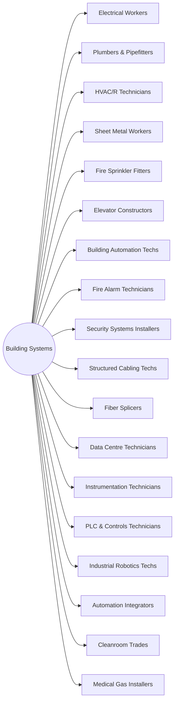

# District: Building Systems

*Power, process, air, controls and data* — trains at **Treasure Island Campus**, San Francisco, California.

**18 halls** · 198,000 lessons ·
1,782,000 core modules. Part of the [campus map](Campus-Map.md).

## Content graph

## The halls

Pipeline column counts this hall's 100 levels by state
(live / calibrating / schema-ok / draft).

| Hall | Focus | Lessons | Modules | Levels by state |
|---|---|---|---|---|
| **Electrical Workers** | Power, control, low-voltage and code compliance | 11,000 | 99,000 | 89 / 6 / 5 / 0 |
| **Plumbers & Pipefitters** | Process piping, drainage, medical gas and hydronics | 11,000 | 99,000 | 89 / 6 / 5 / 0 |
| **HVAC/R Technicians** | Refrigeration, air systems, controls and commissioning | 11,000 | 99,000 | 71 / 14 / 15 / 0 |
| **Sheet Metal Workers** | Duct fabrication, architectural metal and balancing | 11,000 | 99,000 | 89 / 6 / 5 / 0 |
| **Fire Sprinkler Fitters** | Hydraulics, hangers, heads, testing and inspection | 11,000 | 99,000 | 71 / 14 / 15 / 0 |
| **Elevator Constructors** | Traction and hydraulic install, controls and testing | 11,000 | 99,000 | 89 / 6 / 5 / 0 |
| **Building Automation Techs** | DDC, BACnet, sequences of operation and tuning | 11,000 | 99,000 | 23 / 22 / 26 / 29 |
| **Fire Alarm Technicians** | Initiating and notification circuits, cause and effect | 11,000 | 99,000 | 23 / 22 / 26 / 29 |
| **Security Systems Installers** | Access control, CCTV, intrusion and cabling standards | 11,000 | 99,000 | 23 / 22 / 26 / 29 |
| **Structured Cabling Techs** | Copper and fibre, testing, labelling and pathways | 11,000 | 99,000 | 23 / 22 / 26 / 29 |
| **Fiber Splicers** | Fusion splicing, OTDR, loss budgets and closures | 11,000 | 99,000 | 23 / 22 / 26 / 29 |
| **Data Centre Technicians** | White space, busway, CRAC/CRAH and change control | 11,000 | 99,000 | 23 / 22 / 26 / 29 |
| **Instrumentation Technicians** | Loop checks, calibration, transmitters and control valves | 11,000 | 99,000 | 23 / 22 / 26 / 29 |
| **PLC & Controls Technicians** | Ladder logic, I/O, safety relays and commissioning | 11,000 | 99,000 | 23 / 22 / 26 / 29 |
| **Industrial Robotics Techs** | Cells, teach pendants, safeguarding and payload | 11,000 | 99,000 | 23 / 22 / 26 / 29 |
| **Automation Integrators** | SCADA, historians, protocols and cutover planning | 11,000 | 99,000 | 23 / 22 / 26 / 29 |
| **Cleanroom Trades** | Classification, gowning, laminar flow and validation | 11,000 | 99,000 | 23 / 22 / 26 / 29 |
| **Medical Gas Installers** | Brazing, purity, zone valves and verification | 11,000 | 99,000 | 23 / 22 / 26 / 29 |

Every hall runs the same skeleton — 100 levels in ten tracks, 110 slots per
level, 9 variants per lesson — sequenced by the
[skill graph](Skill-Graph.md), with an interior generated from the same
strands ([interiors map](Interiors-Map.md)).

---

*Generated by `wiki/build_wiki.py` from the verified registries — edit the sources, not this page. Adaptive Stack v3.2 · pack 3.2.0.*
