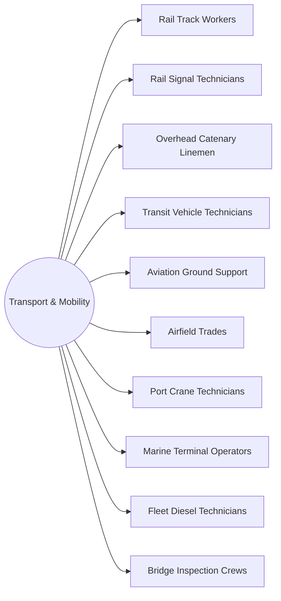

# District: Transport & Mobility

*Rail, air, port and fleet* — trains at **Oakland Waterfront Campus**, Oakland, California.

**10 halls** · 110,000 lessons ·
990,000 core modules. Part of the [campus map](Campus-Map.md).

## Content graph

## The halls

Pipeline column counts this hall's 100 levels by state
(live / calibrating / schema-ok / draft).

| Hall | Focus | Lessons | Modules | Levels by state |
|---|---|---|---|---|
| **Rail Track Workers** | Ballast, ties, rail laying, welds and geometry | 11,000 | 99,000 | 23 / 22 / 26 / 29 |
| **Rail Signal Technicians** | Interlockings, track circuits, crossings and testing | 11,000 | 99,000 | 23 / 22 / 26 / 29 |
| **Overhead Catenary Linemen** | Contact wire, tensioning, isolation and clearances | 11,000 | 99,000 | 23 / 22 / 26 / 29 |
| **Transit Vehicle Technicians** | Propulsion, brakes, doors and inspection cycles | 11,000 | 99,000 | 23 / 22 / 26 / 29 |
| **Aviation Ground Support** | GSE, ramp safety, de-icing and turnaround | 11,000 | 99,000 | 23 / 22 / 26 / 29 |
| **Airfield Trades** | Lighting, markings, pavement and airside escort | 11,000 | 99,000 | 23 / 22 / 26 / 29 |
| **Port Crane Technicians** | STS and RTG cranes, spreaders, ropes and drives | 11,000 | 99,000 | 23 / 22 / 26 / 29 |
| **Marine Terminal Operators** | Mooring, loading arms, spill response and manifests | 11,000 | 99,000 | 23 / 22 / 26 / 29 |
| **Fleet Diesel Technicians** | Aftertreatment, electrical, hydraulics and DOT checks | 11,000 | 99,000 | 23 / 22 / 26 / 29 |
| **Bridge Inspection Crews** | Access, NDT, fracture-critical members and reporting | 11,000 | 99,000 | 23 / 22 / 26 / 29 |

Every hall runs the same skeleton — 100 levels in ten tracks, 110 slots per
level, 9 variants per lesson — sequenced by the
[skill graph](Skill-Graph.md), with an interior generated from the same
strands ([interiors map](Interiors-Map.md)).

---

*Generated by `wiki/build_wiki.py` from the verified registries — edit the sources, not this page. Adaptive Stack v3.2 · pack 3.2.0.*
