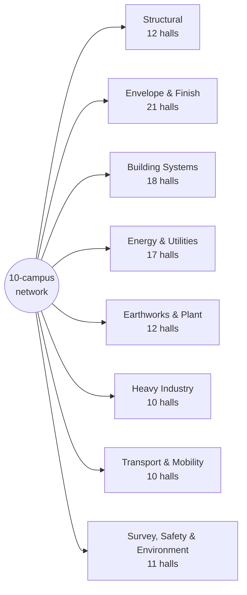

# SmartCiti.X : Trade Craft Academy — wiki

*powered by AGI Corp*

Gamified training to enhance robotic and human integrations: a network of
**111 union training halls** in **8 districts** across
**10 campuses** (3 district campuses and
7 regional hubs), addressing **11,000,000 modules**
generated from
25,875 authored skeleton objects.

## The maps

Every map is generated from the registries, and each has a page here with its
content graph and details:

| Map | What it shows | Page |
|---|---|---|
| **Interactive map** (`web/trade_craft_interactive.html`) | All 111 halls with toggleable layers — districts, pipeline, module layers, training stations — hall floor plans and quizzes, in every locale, searchable and deep-linkable | [Campus-Map](Campus-Map.md) |
| **3D environment** (`web/trade_craft_3d.html`) | The whole network in 3D — 10 campuses on one board, each campus a ringed district city of buildings, each building an enterable hall with rooms, fixtures, station beacons and first-person walk mode | [Campus-Map](Campus-Map.md) |
| Campus map (`web/trade_craft_map.html`) | All 111 halls in 8 districts, with pipeline state | [Campus-Map](Campus-Map.md) |
| Hall floor plans (inside the campus map) | A generated interior for every hall — 111 plans, 11 rooms each | [Interiors-Map](Interiors-Map.md) |
| Skill graph (`pack/registry/skills.json`) | 3,663 skills and the edges that sequence practice | [Skill-Graph](Skill-Graph.md) |
| Languages (`web/trade_craft_languages.html`) | The Academy overview in 8 languages | [Languages](Languages.md) |
| **Simulators** (inside the 3D environment) | 11 operable seats — schematic physics, deterministic rubrics, pre-shift walkarounds, bound to real skills in 45 halls — each with a scripted reference operator at 3 levels (no model, no network) | [Simulators](Simulators.md) |
| **Toolrooms** (inside the 3D + interactive maps) | 8 district tool cribs — 96 tools with the deterministic crib drill | [Toolrooms](Toolrooms.md) |
| **Advisors** (in the rooms and on the green) | 9 scripted guides answering 35 fixed questions — 21 of them read straight from the registry that holds the fact | [Advisors](Advisors.md) |
| **The world** (sky, weather, ground, animals) | 6 weather states over per-campus atmospheres, 22 generated ground surfaces and 101 animals — and not one texture file anywhere | [World](World.md) |
| **The signs** (every word in the 3D world) | 19 kinds over 15 shapes — shape carries the category, colour the provenance, type the rank, and every sign reacts to where you are looking | [Signs](Signs.md) |
| **Training data** (device-local, opt-out, exportable) | 4 episode kinds recorded from real interactions — sim outcomes, advisor exchanges, walkaround checks — plus SCRIPTED sim episodes the reference operator generates on request, shaped for the org's own `ml-agents` fork, never read by a grader | [Training-Data](Training-Data.md) |
| **Orbis synthetic-training prompts** (text only, no network) | a deterministic prompt for every one of the 111 union modules, built for a hosted video model this build never calls — a separate, clearly-labelled AI-SYNTHESIZED stream from the real episode log above | [Orbis-Synthetic-Training](Orbis-Synthetic-Training.md) |
| **The network roadmap** (10 built, 0 candidates) | the path from 10 built campuses to 10 walkable worlds — two honest provenance tiers, and the real checklist a candidate has to clear to become built | [Roadmap](Roadmap.md) |
| **Metaverse layer** (`meta/registry/metaverse.json`) | The interchange contract: 4 open standards claimed (gltf-2.0, webxr, geojson-wgs84, geopose-1.0), 6 honestly not, avatar and hall .glb export, learner-local import | [Metaverse-Layer](Metaverse-Layer.md) |
| **Spatial fabric** (`spatial/registry/`) | The Academy as a self-hosted OMBI-sense spatial fabric: 89 OGC GeoPose 1.0 poses (10 campuses, 69 anchors, 10 restoration sites; height and heading zero-with-UNKNOWN), a fabric manifest and a SOM-shaped scene graph with 66 external origins — GeoPose claimed, the OMBI shapes honestly not | [Spatial-Fabric](Spatial-Fabric.md) |
| **City records** (`parcels/registry/parcels.json`) | The source contract for the three campus regions' own parcel and building-footprint authorities (254,122 records published upstream), plus the public-domain federal orthoimagery both maps draw | [City-Records](City-Records.md) |
| **Network geomap** (`web/trade_craft_geomap.html`) | The geo registry on a real WGS84 map (MapLibre, no basemap tiles): campuses, 69 anchors (41 RECORDED, 28 AUTHORED), great-circle routes, city frames at their own provenance | [Campus-Map](Campus-Map.md) |
| **Bay Restoration** (`restoration/registry/restoration.json`) | 11 real, independently-run San Francisco Bay sites across two categories (9 habitat-restoration, 2 environmental-monitoring — Hunters Point Naval Shipyard, a real, litigated federal Superfund site, and Former Naval Station Treasure Island, a real Navy BRAC cleanup that is not NPL-listed, both pinned but never walkable) — 10 mapped, 8 walkable — bridged to 3 field-skill tracks bound to real skill_ids already in this bundle's graph — not a SmartCiti.X program | [Bay-Restoration](Bay-Restoration.md) |
| **The guide** (`guide/registry/guide.json`) | One control reachable from every view and over every panel: 11 places, 6 fixed questions each, 66 written answers and no free text — with two voice switches that are off until switched on, and WebXR hand gestures declared against a mocked session rather than proved on hardware | [Guide](Guide.md) |
| **The day cycle** (`sky/registry/sky.json`) | 14 solar phases at one real latitude, 10 of them solved by bisection from the elevation that defines them — the sun, the light and the stars move by the hour; the 56 gradient stops are declared and still unread | [Day-Cycle](Day-Cycle.md) |
| **The lessons** (`lessons/registry/lessons.json`) | 32 walkable lessons, 135 steps in 8 kinds, across all 11 skill strands and 27 of the 111 halls, ordered by a 16-edge acyclic ladder that locks nothing — and certifying nobody | [Lessons](Lessons.md) |
| **The building kit** (`kit/registry/kit.json`) | 18 exterior pieces in 15 families, median 34 triangles, arithmetic for 1,117 pieces at 8 draw calls on the Treasure Island Campus — declared against a measured reference, and not yet drawn by the page | [Building-Kit](Building-Kit.md) |
| **The room props** (`props/registry/props.json`) | 29 interior props over all 11 strands, 5,082 instances across 1,221 rooms, every hazard prop derived from that room's own protective-equipment record — a declaration the page does not read yet | [Room-Props](Room-Props.md) |
| **First responders** (`respond/registry/respond.json`) | 5 services, 30 role tiers, 62 competency domains and 25 scenario frames, cross-linked 152 times into 81 of the 111 trade halls — a scaffold, not a protocol: 0 of 117 items carry a practitioner sign-off and 0 of the 23 standards bodies had a document opened | [First-Responders](First-Responders.md) |
| **The emotional-intelligence layer** (`ei/registry/ei.json`) | 59 records binding 9 of the advisors to what they may do when a learner is struggling — 12 responses each with a stop condition, 11 red lines, a 5-rung ladder that names resource TYPES and no contact detail at all, and 0 of 59 records read by a clinician | [Emotional-Intelligence](Emotional-Intelligence.md) |

## The districts at a glance

## The campuses

The network trains in 10 planned locations — 3
district campuses and 7 regional hubs, named for real cities,
with no site surveyed and no address recorded:

| Campus | Where | Trains | Districts | Halls |
|---|---|---|---|---|
| **Treasure Island Campus** | San Francisco, California | The flagship: structure, systems and finish on the bay | Structural, Building Systems, Envelope & Finish | 51 |
| **Oakland Waterfront Campus** | Oakland, California | Port, plant and heavy industry on the working estuary | Heavy Industry, Transport & Mobility, Earthworks & Plant | 32 |
| **Crescent Works Campus** | New Orleans, Louisiana | Energy, water and environmental response on the Gulf | Energy & Utilities, Survey, Safety & Environment | 28 |
| **Bayou Energy Hub** | Houston, Texas | The network's first hub: no home district of its own, and a regional chapter seat for every one of the 111 trades |  | 0 |
| **Loop Rail Hub** | Chicago, Illinois | The network's second hub: no home district of its own, and a regional chapter seat for every one of the 111 trades |  | 0 |
| **Sound Aerospace Hub** | Seattle, Washington | The network's third hub: no home district of its own, and a regional chapter seat for every one of the 111 trades |  | 0 |
| **Three Rivers Steel Hub** | Pittsburgh, Pennsylvania | The network's fourth hub: no home district of its own, and a regional chapter seat for every one of the 111 trades |  | 0 |
| **Front Range Mining Hub** | Denver, Colorado | The network's fifth hub: no home district of its own, and a regional chapter seat for every one of the 111 trades |  | 0 |
| **Biscayne Coastal Hub** | Miami, Florida | The network's sixth hub: no home district of its own, and a regional chapter seat for every one of the 111 trades |  | 0 |
| **Motor City Hub** | Detroit, Michigan | The network's seventh and final hub: no home district of its own, and a regional chapter seat for every one of the 111 trades |  | 0 |

### Real geography

The geo registry anchors each campus to a real WGS84 coordinate — Oakland's
is RECORDED verbatim from the Locator.X city table (Apache-2.0), the others
are DERIVED place centroids, and every distance below is recomputed from
the coordinates by the suite rather than trusted. A coordinate anchors a
map; it does not claim a parcel.

| Route | Great-circle distance |
|---|---|
| San Francisco ↔ Oakland | 9.0 km |
| San Francisco ↔ New Orleans | 3,089.9 km |
| San Francisco ↔ Houston | 2,639.9 km |
| San Francisco ↔ Chicago | 2,979.0 km |
| San Francisco ↔ Seattle | 1,087.8 km |
| San Francisco ↔ Pittsburgh | 3,631.5 km |
| San Francisco ↔ Denver | 1,519.1 km |
| San Francisco ↔ Miami | 4,166.1 km |
| San Francisco ↔ Detroit | 3,352.9 km |
| Oakland ↔ New Orleans | 3,081.0 km |
| Oakland ↔ Houston | 2,631.0 km |
| Oakland ↔ Chicago | 2,971.5 km |
| Oakland ↔ Seattle | 1,089.9 km |
| Oakland ↔ Pittsburgh | 3,623.8 km |
| Oakland ↔ Denver | 1,511.1 km |
| Oakland ↔ Miami | 4,157.2 km |
| Oakland ↔ Detroit | 3,345.6 km |
| New Orleans ↔ Houston | 511.3 km |
| New Orleans ↔ Chicago | 1,344.2 km |
| New Orleans ↔ Seattle | 3,377.7 km |
| New Orleans ↔ Pittsburgh | 1,480.6 km |
| New Orleans ↔ Denver | 1,738.9 km |
| New Orleans ↔ Miami | 1,076.6 km |
| New Orleans ↔ Detroit | 1,512.9 km |
| Houston ↔ Chicago | 1,515.8 km |
| Houston ↔ Seattle | 3,040.5 km |
| Houston ↔ Pittsburgh | 1,829.9 km |
| Houston ↔ Denver | 1,413.6 km |
| Houston ↔ Miami | 1,556.8 km |
| Houston ↔ Detroit | 1,779.7 km |
| Chicago ↔ Seattle | 2,788.9 km |
| Chicago ↔ Pittsburgh | 658.5 km |
| Chicago ↔ Denver | 1,477.7 km |
| Chicago ↔ Miami | 1,917.3 km |
| Chicago ↔ Detroit | 381.5 km |
| Seattle ↔ Pittsburgh | 3,432.2 km |
| Seattle ↔ Denver | 1,640.7 km |
| Seattle ↔ Miami | 4,396.1 km |
| Seattle ↔ Detroit | 3,111.2 km |
| Pittsburgh ↔ Denver | 2,120.6 km |
| Pittsburgh ↔ Miami | 1,632.3 km |
| Pittsburgh ↔ Detroit | 330.0 km |
| Denver ↔ Miami | 2,776.5 km |
| Denver ↔ Detroit | 1,857.7 km |
| Miami ↔ Detroit | 1,860.8 km |

The registry also ships `geo/registry/campuses.geojson` — standard GeoJSON,
directly consumable by any Mapbox/MapLibre-compatible stack. The 3D network
view places its campus plates by these true bearings, with the real
kilometres on the route labels.

Around each campus sit **69 anchors** — 41 RECORDED, real
cities and institutions copied verbatim from Locator.X's committed tables
(the Bay Area city table and the New Orleans POI table, Apache-2.0) and
cross-checked against those files at build time, and 28 AUTHORED for
the hub campuses: real, named, widely-known institutions typed from
general knowledge, labelled as the weaker claim they are. The network
view marks each at its true bearing on the campus plate rim, real
kilometres on the label.

Every campus now carries a **RECORDED city frame** — the centre and view
bounds of Locator.X's own maps (the NOLA region record for New Orleans;
the Bay Area map's committed frame, shared by both Bay campuses),
cross-checked the same way — which is what lets each campus grow a
**walkable city layer** in 3D. New Orleans lays its seven institutions
at true east/north offsets (13 units per real kilometre) joined to the
ring road by avenues; Treasure Island sits as an **island in the Bay**,
its eight RECORDED cities reached by schematic ferry lines and the two
Bay Bridge spans at true bearings with distance log-eased the way the
network view does it (real kilometres stay on every label); Oakland
keeps its waterfront. The avenues, ferries, bridges and water are
SCHEMATIC, and the in-page labels say which is which — places RECORDED,
everything drawn between them schematic.

### The regional chapter network

Every hall keeps its **home campus** — where its district trains — and
holds a **regional chapter** at each of the other 9, so all
111 trades train in all 10 regions: **1110 chapter seats** in
total, and each campus plaza carries a Regional Chapter Hall listing the
60/79/83/111/111/111/111/111/111/111 unions it hosts
from elsewhere. This is the Academy's own regional structure across its
planned campuses, not a claim about any real union's locals or
jurisdictions — no local is named.

### The New Orleans Trades Edition

The Crescent Works campus and its city layer also ship as their own
artifact — the **SmartCiti.X New Orleans Trades Edition**, booting
straight into the walkable New Orleans map. On the Cognition.X platform
(this foundation's block-based curriculum system), the edition is
supplemented by the **SmartCiti.X : New Orleans Trades** community pack
alongside the Louisiana OS edition: five tracks — the port and its
cranes, safe ground below sea level, drainage and the storm, restoration
after the wind, and the craft pathway itself — authored from this
repository's registries (the simulators' control discipline, the surface
and conditions doctrine, the RECORDED geography), with transfer checks
phrased against the learner's own parish.

## The districts

| District | Tagline | Halls |
|---|---|---|
| [Structural](District-structural.md) | Steel, welds, lifts and the loads they carry | 12 |
| [Envelope & Finish](District-envelope.md) | Everything between the frame and the weather | 21 |
| [Building Systems](District-systems.md) | Power, process, air, controls and data | 18 |
| [Energy & Utilities](District-energy.md) | Generation, distribution, water and storm work | 17 |
| [Earthworks & Plant](District-earthworks.md) | Ground, machines, access and haul | 12 |
| [Heavy Industry](District-industry.md) | Process plant, marine, metal and machine shops | 10 |
| [Transport & Mobility](District-transport.md) | Rail, air, port and fleet | 10 |
| [Survey, Safety & Environment](District-control.md) | Where work is set out, made safe and made clean | 11 |

## Languages

العربية · Deutsch · English · Español · Français · हिन्दी · Português · 中文（简体） — see [Languages](Languages.md).

## Elsewhere in this repository

- [`ROADMAP.md`](../ROADMAP.md) — the phased plan from v3.2 forward
- [`SmartCitiX_TradeCraft_Academy_Spec.md`](../SmartCitiX_TradeCraft_Academy_Spec.md) — the ACP protocol suite, v3.2
- [Provenance](Provenance.md) — superseded data kept in `archive/`, and why
- [Flipped-Classroom](Flipped-Classroom.md) — the gamified school program:
  the four-stage flipped loop, grade bands, 4 proposed districts and live units
- [Upgrade-Candidates](Upgrade-Candidates.md) — what the sibling repositories
  offer the Academy, from a reviewed survey

## Honesty

This is a taxonomy of skilled trades, not a roster of chartered locals; no
union has reviewed it. Module counts are addressable module IDs generated
from an authored skeleton, not hand-written lessons. Lesson content is
unverified general practice pending authoring by journey-level practitioners.

---

*Generated by `wiki/build_wiki.py` from the verified registries — edit the sources, not this page. Adaptive Stack v3.2 · pack 3.2.0.*
