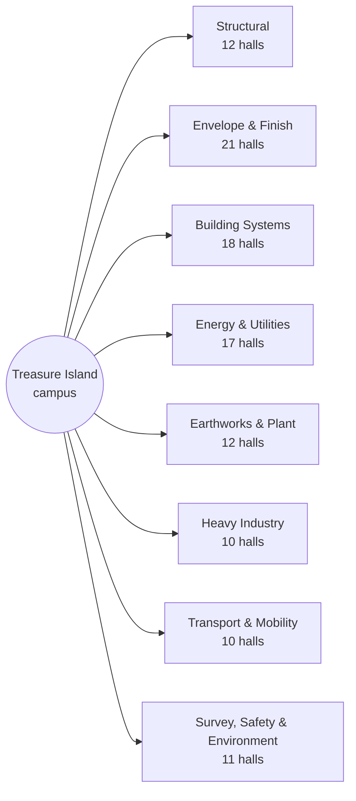

# SmartCiti.X : Trade Craft Academy — wiki

*powered by AGI Corp*

Gamified training to enhance robotic and human integrations: a network of
**111 union training halls** in **8 districts** on one
campus, addressing **11,000,000 modules** generated from
25,875 authored skeleton objects.

## The maps

Every map is generated from the registries, and each has a page here with its
content graph and details:

| Map | What it shows | Page |
|---|---|---|
| **Interactive map** (`web/trade_craft_interactive.html`) | All 111 halls with toggleable layers — districts, pipeline, module layers, training stations — hall floor plans and quizzes, in every locale, searchable and deep-linkable | [Campus-Map](Campus-Map.md) |
| **3D environment** (`web/trade_craft_3d.html`) | The whole network in 3D — three city campuses on one board, each campus a ringed district city of buildings, each building an enterable hall with rooms, fixtures, station beacons and first-person walk mode | [Campus-Map](Campus-Map.md) |
| Campus map (`web/trade_craft_map.html`) | All 111 halls in 8 districts, with pipeline state | [Campus-Map](Campus-Map.md) |
| Hall floor plans (inside the campus map) | A generated interior for every hall — 111 plans, 11 rooms each | [Interiors-Map](Interiors-Map.md) |
| Skill graph (`pack/registry/skills.json`) | 3,663 skills and the edges that sequence practice | [Skill-Graph](Skill-Graph.md) |
| Languages (`web/trade_craft_languages.html`) | The Academy overview in 8 languages | [Languages](Languages.md) |
| **Simulators** (inside the 3D environment) | 2 operable machines — schematic physics, deterministic rubrics, bound to real skills in 9 halls | [Simulators](Simulators.md) |

## The campus at a glance

## The campuses

The network trains in three planned locations — named for real cities, with
no site surveyed and no address recorded:

| Campus | Where | Trains | Districts | Halls |
|---|---|---|---|---|
| **Treasure Island Campus** | San Francisco, California | The flagship: structure, systems and finish on the bay | Structural, Building Systems, Envelope & Finish | 51 |
| **Oakland Waterfront Campus** | Oakland, California | Port, plant and heavy industry on the working estuary | Heavy Industry, Transport & Mobility, Earthworks & Plant | 32 |
| **Crescent Works Campus** | New Orleans, Louisiana | Energy, water and environmental response on the Gulf | Energy & Utilities, Survey, Safety & Environment | 28 |

### Real geography

The geo registry anchors each campus to a real WGS84 coordinate — Oakland's
is RECORDED verbatim from the Locator.X city table (Apache-2.0), the others
are DERIVED place centroids, and every distance below is recomputed from
the coordinates by the suite rather than trusted. A coordinate anchors a
map; it does not claim a parcel.

| Route | Great-circle distance |
|---|---|
| San Francisco ↔ Oakland | 9.0 km |
| San Francisco ↔ New Orleans | 3,089.9 km |
| Oakland ↔ New Orleans | 3,081.0 km |

The registry also ships `geo/registry/campuses.geojson` — standard GeoJSON,
directly consumable by any Mapbox/MapLibre-compatible stack. The 3D network
view places its campus plates by these true bearings, with the real
kilometres on the route labels.

## The districts

| District | Tagline | Halls |
|---|---|---|
| [Structural](District-structural.md) | Steel, welds, lifts and the loads they carry | 12 |
| [Envelope & Finish](District-envelope.md) | Everything between the frame and the weather | 21 |
| [Building Systems](District-systems.md) | Power, process, air, controls and data | 18 |
| [Energy & Utilities](District-energy.md) | Generation, distribution, water and storm work | 17 |
| [Earthworks & Plant](District-earthworks.md) | Ground, machines, access and haul | 12 |
| [Heavy Industry](District-industry.md) | Process plant, marine, metal and machine shops | 10 |
| [Transport & Mobility](District-transport.md) | Rail, air, port and fleet | 10 |
| [Survey, Safety & Environment](District-control.md) | Where work is set out, made safe and made clean | 11 |

## Languages

العربية · Deutsch · English · Español · Français · हिन्दी · Português · 中文（简体） — see [Languages](Languages.md).

## Elsewhere in this repository

- [`ROADMAP.md`](../ROADMAP.md) — the phased plan from v3.2 forward
- [`SmartCitiX_TradeCraft_Academy_Spec.md`](../SmartCitiX_TradeCraft_Academy_Spec.md) — the ACP protocol suite, v3.2
- [Provenance](Provenance.md) — superseded data kept in `archive/`, and why
- [Upgrade-Candidates](Upgrade-Candidates.md) — what the sibling repositories
  offer the Academy, from a reviewed survey

## Honesty

This is a taxonomy of skilled trades, not a roster of chartered locals; no
union has reviewed it. Module counts are addressable module IDs generated
from an authored skeleton, not hand-written lessons. Lesson content is
unverified general practice pending authoring by journey-level practitioners.

---

*Generated by `wiki/build_wiki.py` from the verified registries — edit the sources, not this page. Adaptive Stack v3.2 · pack 3.2.0.*
