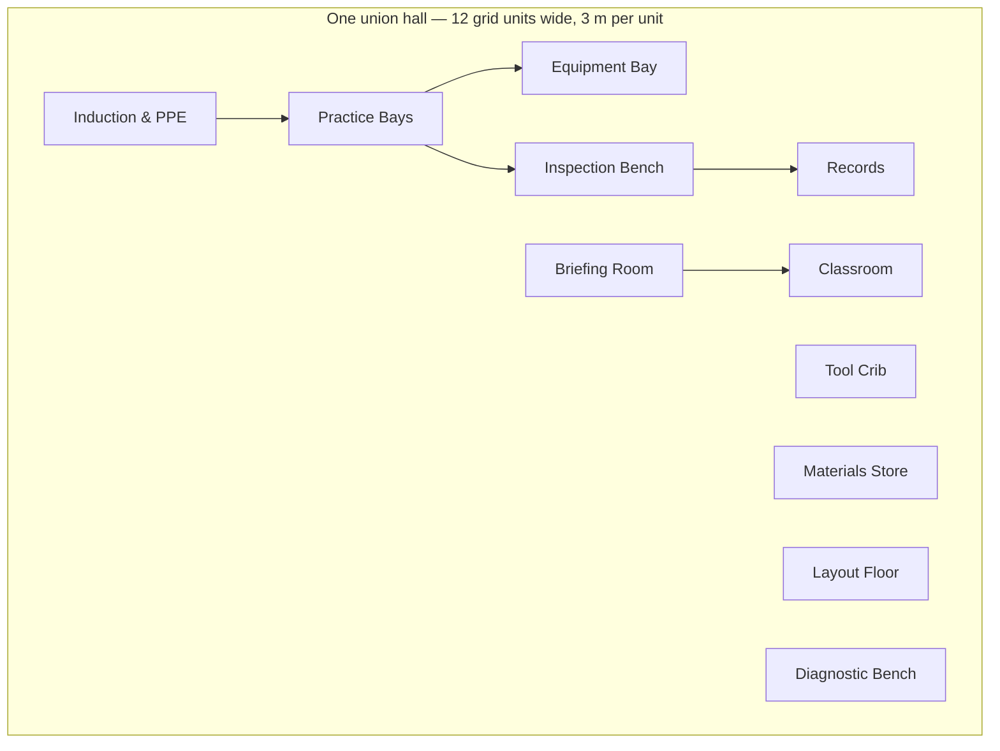

# The interiors map

Every hall on the campus map opens into a generated floor plan —
111 interiors, 1,221 rooms — built by
`web/interiors.py` and verified by `web/test_interiors.py` (no room leaves
its envelope, no rooms overlap, every label fits its room at measured
pixel widths — spec §23's rendering lesson).

## The room programme

A hall's rooms mirror the eleven skill strands: the floor the trade is
learned on is the same map as the graph it is sequenced by.

| Room | Grid size | Strand | Purpose |
|---|---|---|---|
| Induction & PPE | 3×2 | safety | Gowning, atmospheric checks, permit board |
| Practice Bays | 6×3 | procedure | The floor the trade is actually learned on |
| Equipment Bay | 5×3 | machines | Plant checked out to a training area |
| Tool Crib | 3×2 | tools | Issue, calibration and return |
| Materials Store | 3×2 | materials | Stock, offcuts and consumables |
| Layout Floor | 4×2 | layout | Setting out, control points, marking |
| Inspection Bench | 3×2 | inspection | Acceptance criteria and sign-off |
| Diagnostic Bench | 3×2 | troubleshooting | Fault-finding against live rigs |
| Briefing Room | 4×2 | coordination | Shift start, hand-offs, cross-trade |
| Records | 2×2 | documentation | Permits, certificates, as-builts |
| Classroom | 4×2 | leadership | Level tests and the instructor track |

## Content graph

*(Edges show the induction-to-certification flow, not adjacency; the plan
packs rooms per hall by its own focus line and fixtures.)*

## Fixtures and honesty

A fixture is placed only when the hall's own focus line names it — no hall
gets equipment it has no stated use for. Surfaces and room conditions come
from the §24 texture and environment packages: general good practice, not a
code reference, and each floor plan records that **no address data has been
collected** — the plan is a functional programme, not a building survey.

---

*Generated by `wiki/build_wiki.py` from the verified registries — edit the sources, not this page. Adaptive Stack v3.2 · pack 3.2.0.*
