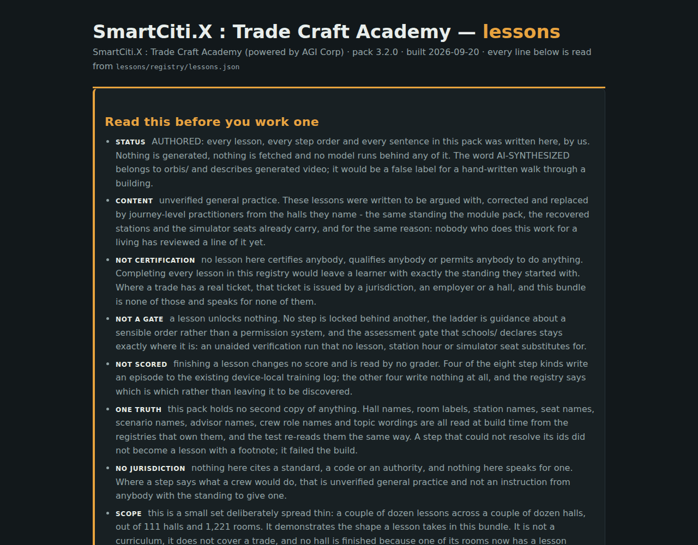

# The lessons page

`web/trade_craft_lessons.html`, built by `web/build_lessons.py`, opens
`lessons/registry/lessons.json`: **32 walkable lessons**,
**135 steps** across **8 step kinds**, standing in
32 rooms of 27 of the 111
halls. [Lessons](Lessons.md) describes the pack; this page is about the
surface that finally draws it.

The limits come first on that page, above the lessons, because that is where
the pack's own page contract puts them: the `limits` sentence renders with the lesson, not behind a disclosure control, and not only at the end. A learner who is told what a lesson does not mean only after finishing it has already formed the belief the sentence exists to prevent.

## What it draws

- **The limits first** — the pack's own honesty block, rendered before the
  first lesson rather than under it.
- **The 8 step kinds**, each with what it records or the
  registry's own reason for recording nothing.
- **The ladder as advice.** 16 prerequisite edges over
  32 lessons, rendered as named links with the edge reason shown
  and nothing disabled. Enforcement: none. The ladder is a sensible order, not a permission system: no lesson is locked behind another and the page contract forbids the page from locking one.
- **Every lesson in the registry's order**, with its hall linked through to
  the walkable world, its room, its `why`, its `limits` sentence and every one
  of its steps numbered — each step with the names it read and the file it
  read them from.

Every name on the page is read, never copied: the page must READ and never copy.
The registries it reads through the lesson pack:

- `agents/registry/advisors.json`
- `agents/registry/crews.json`
- `sims/registry/sims.json`
- `stations/registry/stations.json`
- `surfaces/registry/finishes.json`
- `tools/registry/toolcribs.json`
- `web/interiors.py`

## The 8 step kinds

65 of the 135 steps write an episode to the
device-local training log; the other 70 write nothing at all,
and each silent kind says why rather than leaving the blank to be discovered.

| Kind | What it is | Stage | Steps | Records | Reads |
|---|---|---|---|---|---|
| **walk** | walk to a room of this hall | class | 34 | records nothing — arriving somewhere is not an achievement, and a bundle that logged footsteps would be counting attendance while claiming to teach | `web/interiors.py` |
| **placard** | read the door placard of a room and take on what it requires | class | 15 | records nothing — the placard states the room condition record; reading a record changes nothing and is nobody's score | `surfaces/registry/finishes.json` |
| **station** | take a training station at its bench | class | 12 | records nothing — a station mark lands in the device-local progress record the halls already keep; the training log holds simulator, advisor, crew and walkaround episodes and this pack adds no fifth kind to it | `stations/registry/stations.json` |
| **crib** | run the district crib check at the pegboard | class | 9 | records nothing — the crib check is graded deterministically against the crib record and kept with the progress record, not as a training episode | `tools/registry/toolcribs.json` |
| **walkaround** | walk one pre-shift point of a seat and mark it | floor | 17 | writes a `walkaround` episode | `sims/registry/sims.json` |
| **sim** | run one seat on the scenario its campus owns | floor | 10 | writes a `sim` episode | `sims/registry/sims.json` |
| **advisor** | ask the advisor who stands in this room one of its fixed topics | class | 30 | writes an `advisor` episode | `agents/registry/advisors.json` |
| **crew** | ask one role of the standing crew one of its fixed topics while the seat runs | floor | 8 | writes a `crew` episode | `agents/registry/crews.json` |

The page itself records nothing of its own: nothing about opening, reading or abandoning a lesson is recorded. The only episodes that reach the training log are the four the step kinds already declare, written by the recorder that was already writing them. The step
checkboxes are a tally in the open tab — the built page contains no
`localStorage` call at all — so closing the tab loses the marks, which is the
correct behaviour for a mark that was never anybody's score.

## What closed in `rnd/`, and how

`rnd/registry/rnd.json` keeps a computed backlog of registries that are
declared and unbuilt. `lessons/registry/lessons.json` was on it for one
computed reason: no page generator under `web/` named the path, so nothing a
learner opens read it. The wiki described the pack; nothing drew it.

**Declared-and-unbuilt is now 6 entries, down from
7**, and the lessons registry is the entry that left.

It left the way that register says entries leave — by satisfying the condition
each entry carries in its own `drops_off_when` field: *a page generator under
`web/` opens this path*. `web/build_lessons.py` names
`lessons/registry/lessons.json` in its source, the scan that builds the
backlog found it there, and the entry was gone on the next build of `rnd/`.
**No honesty flag was deleted to close it.** In the register's own words:
a pack that gets wired up drops off declared_unbuilt on the next build of this file, because the entry is computed from whether a renderer names its registry path - not from a note here saying it is unbuilt.

The 6 registries still on that list are still on it, and this page
claims nothing about them.

## What a lesson is not

- **Not a certificate.** no lesson here certifies anybody, qualifies anybody or permits anybody to do anything. Completing every lesson in this registry would leave a learner with exactly the standing they started with. Where a trade has a real ticket, that ticket is issued by a jurisdiction, an employer or a hall, and this bundle is none of those and speaks for none of them.
- **Not a gate.** a lesson unlocks nothing. No step is locked behind another, the ladder is guidance about a sensible order rather than a permission system, and the assessment gate that schools/ declares stays exactly where it is: an unaided verification run that no lesson, station hour or simulator seat substitutes for.
- **Not scored.** finishing a lesson changes no score and is read by no grader. Four of the eight step kinds write an episode to the existing device-local training log; the other four write nothing at all, and the registry says which is which rather than leaving it to be discovered.
- **Not reviewed.** unverified general practice. These lessons were written to be argued with, corrected and replaced by journey-level practitioners from the halls they name - the same standing the module pack, the recovered stations and the simulator seats already carry, and for the same reason: nobody who does this work for a living has reviewed a line of it yet.
- **Not a curriculum.** this is a small set deliberately spread thin: a couple of dozen lessons across a couple of dozen halls, out of 111 halls and 1,221 rooms. It demonstrates the shape a lesson takes in this bundle. It is not a curriculum, it does not cover a trade, and no hall is finished because one of its rooms now has a lesson standing in it.
- **Provenance.** AUTHORED: every lesson, every step order and every sentence in this pack was written here, by us. Nothing is generated, nothing is fetched and no model runs behind any of it.

---

*Generated by `wiki/build_wiki.py` from the verified registries — edit the sources, not this page. Adaptive Stack v3.2 · pack 3.2.0.*
