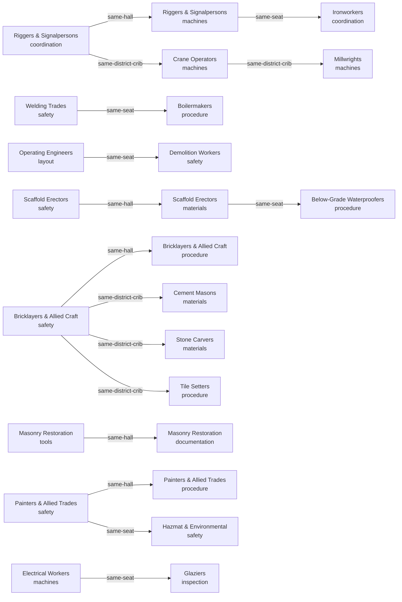

# The lessons

A reason to go to a particular room in a particular hall and do something there.
**32 lessons**, **135 steps** in 8 kinds,
standing in 32 rooms of 27 of the
111 halls — and not one of them certifies anybody.

## What a lesson does not mean

No lesson here certifies anybody, qualifies anybody or permits anybody to do anything. Completing every lesson in this registry would leave a learner with exactly the standing they started with. Where a trade has a real ticket, that ticket is issued by a jurisdiction, an employer or a hall, and this bundle is none of those and speaks for none of them.

A lesson unlocks nothing. No step is locked behind another, the ladder is guidance about a sensible order rather than a permission system, and the assessment gate that schools/ declares stays exactly where it is: an unaided verification run that no lesson, station hour or simulator seat substitutes for.

This is a small set deliberately spread thin: a couple of dozen lessons across a couple of dozen halls, out of 111 halls and 1,221 rooms. It demonstrates the shape a lesson takes in this bundle. It is not a curriculum, it does not cover a trade, and no hall is finished because one of its rooms now has a lesson standing in it.

## What a lesson is

AUTHORED: every lesson, every step order and every sentence in this pack was written here, by us. Nothing is generated, nothing is fetched and no model runs behind any of it.

This pack holds no second copy of anything. Hall names, room labels, station names, seat names, scenario names, advisor names, crew role names and topic wordings are all read at build time from the registries that own them, and the test re-reads them the same way. A step that could not resolve its ids did not become a lesson with a footnote; it failed the build.

The loop it plugs into is the one `schools/` already declares, at two of its
four stages: a lesson is the class and floor halves of the existing loop made walkable, in the order somebody chose. It is not a fifth stage, it does not replace the module pack at home, and it never touches the unaided gate.

## The 8 step kinds

| Kind | What it is | Stage | Records | Steps | Reads |
|---|---|---|---|---|---|
| **walk** | walk to a room of this hall | class | — | 34 | `web/interiors.py` |
| **placard** | read the door placard of a room and take on what it requires | class | — | 15 | `surfaces/registry/finishes.json` |
| **station** | take a training station at its bench | class | — | 12 | `stations/registry/stations.json` |
| **crib** | run the district crib check at the pegboard | class | — | 9 | `tools/registry/toolcribs.json` |
| **walkaround** | walk one pre-shift point of a seat and mark it | floor | `walkaround` | 17 | `sims/registry/sims.json` |
| **sim** | run one seat on the scenario its campus owns | floor | `sim` | 10 | `sims/registry/sims.json` |
| **advisor** | ask the advisor who stands in this room one of its fixed topics | class | `advisor` | 30 | `agents/registry/advisors.json` |
| **crew** | ask one role of the standing crew one of its fixed topics while the seat runs | floor | `crew` | 8 | `agents/registry/crews.json` |

65 of the 135 steps write an episode to the
device-local training log; the other 70 write nothing at all.
The recording ones use 4 episode kinds `training/`
already had and add 0 of their own. The 4
kinds that stay silent each say why:

- **walk** — arriving somewhere is not an achievement, and a bundle that logged footsteps would be counting attendance while claiming to teach
- **placard** — the placard states the room condition record; reading a record changes nothing and is nobody's score
- **station** — a station mark lands in the device-local progress record the halls already keep; the training log holds simulator, advisor, crew and walkaround episodes and this pack adds no fifth kind to it
- **crib** — the crib check is graded deterministically against the crib record and kept with the progress record, not as a training episode

Finishing a lesson changes no score and is read by no grader. Four of the eight step kinds write an episode to the existing device-local training log; the other four write nothing at all, and the registry says which is which rather than leaving it to be discovered.

## Spread thin on purpose

Breadth over the trades rather than depth in one: the ceiling is declared, computed and failed against, and all 11 strands must be stood in or the build stops.

All 11 of the 11 strands are stood in,
across 3 campuses and 27 halls, and no
hall holds more than 6.25% of the set against a
ceiling of 10%.

The steps reach 12 of 25 training stations,
10 of 11 seats, 10 of
33 scenarios, 17 of
55 pre-shift walkaround points,
18 advisor topics over 7 advisors,
8 crew roles over 6 crews and
5 district tool cribs. Every one of those resolves against the
registry that owns it, at build time, or the lesson does not exist.

## The ladder

16 edges over 32 lessons.
16 lessons need nothing before them, and the longest chain is
3 deep (16 at depth 1, 13 at depth 2, 3 at depth 3). The graph is acyclic and the build
checks that it is.

| Edge reason | What it means |
|---|---|
| `same-hall` | both lessons stand in the same hall, so the second is the next thing to do in a building you are already in |
| `same-seat` | both lessons run or walk the same simulator seat, so the first is seat familiarity the second assumes |
| `same-district-crib` | both halls draw from the same district tool crib, so the kit and the vocabulary carry across |

**Enforcement:** none. The ladder is a sensible order, not a permission system: no lesson is locked behind another and the page contract forbids the page from locking one.

## The 32 lessons, one by one

Each lesson carries its own limit sentence, and the page contract puts that
sentence beside the lesson rather than behind a disclosure control:
the `limits` sentence renders with the lesson, not behind a disclosure control, and not only at the end. A learner who is told what a lesson does not mean only after finishing it has already formed the belief the sentence exists to prevent.

| Lesson | Hall | Room | Strand | Tier | Steps | What finishing it does not mean |
|---|---|---|---|---|---|---|
| **Call the first lift before anybody touches the hook** | Riggers & Signalpersons | Briefing Room | coordination | fundamentals | 5 | Finishing this does not make you a signalperson and does not qualify you to direct a lift; it is one scripted exchange and one schematic seat, and no hall, employer or authority has signed anything on the strength of it. |
| **Carry a load that is not fighting you** | Riggers & Signalpersons | Equipment Bay | machines | applied | 5 | Finishing this is not crane seat time and counts toward no operator qualification; the physics here is schematic, the assessment gate still demands an unaided verification run, and nothing recorded here is read by a grader. |
| **Refuse the pick the chart refuses** | Crane Operators | Equipment Bay | machines | applied | 4 | Finishing this certifies nothing and permits nothing; a real chart belongs to a real machine in a real configuration, and this seat is a teaching aid that has never lifted anything. |
| **Say the plan out loud, then change it properly** | Ironworkers | Briefing Room | coordination | applied | 5 | Finishing this does not make you a lift director and is not a lift plan anybody can work to; it is a scripted exchange about how planning fails, not an authority to plan. |
| **Move something precise across a shop floor** | Millwrights | Equipment Bay | machines | applied | 4 | Finishing this is not overhead crane authorisation and no employer grants one from here; the seat is schematic, the loads are not real and no alignment has been proved by anything you did. |
| **Stand the watch that outlasts the arc** | Welding Trades | Induction & PPE | safety | applied | 5 | Finishing this is not a hot work permit, not fire watch training and not a welding qualification; it teaches the shape of the duty, and your jurisdiction owns the rules that make it binding. |
| **Put somebody inside a vessel and get them back out** | Boilermakers | Practice Bays | procedure | applied | 4 | Finishing this is not confined space entry training, not an entry permit and not a rescue qualification; it is a scripted exchange about roles, and nobody here may authorise an entry. |
| **Prove what is under the ground before the bucket moves** | Operating Engineers | Layout Floor | layout | applied | 5 | Finishing this is not excavator seat time, not a utility locating qualification and not competent person status; the ground here is schematic and no real service has ever been proved by it. |
| **Know where not to stand** | Demolition Workers | Induction & PPE | safety | applied | 4 | Finishing this is not demolition training and confers no authority over a structure; nothing here assesses a building, and no sequence you ran is a takedown plan. |
| **Believe the tag or believe nothing** | Scaffold Erectors | Induction & PPE | safety | applied | 4 | Finishing this is not competent person status and is not a scaffold inspection; a tag in this bundle is a teaching prop, and no structure anywhere has been released by it. |
| **Build the bay in the order that keeps you off the ground** | Scaffold Erectors | Materials Store | materials | applied | 5 | Finishing this erects nothing and inspects nothing; the bay is schematic, the sequence is unverified general practice, and no jurisdiction has reviewed a line of it. |
| **Give the water somewhere to go** | Below-Grade Waterproofers | Practice Bays | procedure | applied | 4 | Finishing this is not a waterproofing qualification and is not a warranty on any detail; it is unverified general practice and the manufacturer instruction for a real product always wins. |
| **Wear it for the last ten minutes too** | Bricklayers & Allied Craft | Induction & PPE | safety | fundamentals | 4 | Finishing this fits nothing to your face and qualifies nobody; a seal check in a browser is a reminder of a habit, not a fit test, and a real respirator programme is a different thing entirely. |
| **Pour a lift you cannot see inside** | Bricklayers & Allied Craft | Practice Bays | procedure | applied | 3 | Finishing this is not a masonry qualification and no wall has been built; the technique here is unverified general practice awaiting review by journey-level practitioners from this hall. |
| **Protect a pour from the day it was poured in** | Cement Masons | Materials Store | materials | applied | 6 | Finishing this places no concrete and tests no cylinder; nothing here is a mix design, a cure schedule or an approval to use one. |
| **Hang stone on something that will hold it** | Stone Carvers | Materials Store | materials | applied | 3 | Finishing this specifies no anchor and approves no substrate; an anchor on a real building is an engineered choice and nothing here may stand in for one. |
| **Fix the substrate you are about to hide** | Tile Setters | Practice Bays | procedure | fundamentals | 4 | Finishing this sets no tile and approves no substrate; the sequence is unverified general practice and the system manufacturer instruction governs a real installation. |
| **Frame it for whoever comes next** | Lathers & Metal Framers | Practice Bays | procedure | fundamentals | 4 | Finishing this frames nothing and is no structural approval; backing, spacing and fixings on a real job come from a drawing and an engineer, never from a lesson. |
| **Cut a joint without wrecking the brick** | Masonry Restoration | Tool Crib | tools | fundamentals | 4 | Finishing this repoints nothing and specifies no mortar; matching a historic mix is analysis work, and nothing here is that analysis or a substitute for it. |
| **Leave a record the next century can read** | Masonry Restoration | Records | documentation | applied | 3 | Finishing this documents no building and satisfies no preservation authority; the standards named on a real job come from that jurisdiction and this bundle speaks for none of them. |
| **Take the lining up to heat slowly enough** | Refractory Masons | Practice Bays | procedure | applied | 4 | Finishing this lines no furnace and is no dryout schedule; a real schedule belongs to the refractory supplier and the vessel, and nothing here replaces it. |
| **Catch what you wash off** | Painters & Allied Trades | Induction & PPE | safety | applied | 5 | Finishing this is no environmental permit and no containment design; what may be released, and where, is a jurisdiction matter and this bundle names no jurisdiction. |
| **Lay a coat that is actually there** | Painters & Allied Trades | Practice Bays | procedure | applied | 3 | Finishing this coats nothing and is no coating specification; film thickness, recoat windows and compatibility on a real job come from the product data sheet. |
| **Come out cleaner than what you washed** | Hazmat & Environmental | Induction & PPE | safety | applied | 5 | Finishing this is no abatement or decontamination qualification and clears no site; clearance is a measured, sampled process and nothing here samples anything. |
| **Clip in before the basket moves** | Electrical Workers | Equipment Bay | machines | applied | 4 | Finishing this is not aerial lift training and is no familiarisation on any machine; a real lift requires machine-specific training and this seat is schematic. |
| **Keep the boom out of the zone** | Glaziers | Inspection Bench | inspection | applied | 4 | Finishing this is no qualified person status and sets no approach distance; approach limits are set by the utility and the jurisdiction, and this bundle sets none. |
| **Make stopping the job an ordinary thing to do** | Site Safety Coordinators | Classroom | leadership | applied | 3 | Finishing this is no safety qualification and confers no authority on a site; the only authority a stop-work call has is the one the employer and the jurisdiction actually give it. |
| **Work from control, not from something near it** | Construction Surveyors | Layout Floor | layout | fundamentals | 5 | Finishing this establishes no control network and checks no instrument; a real network is observed, adjusted and recorded, and nothing here does any of those. |
| **Find the fault instead of replacing things** | Utility Line Workers | Diagnostic Bench | troubleshooting | applied | 5 | Finishing this diagnoses nothing and authorises no switching; live distribution work is governed by the utility own procedures and this bundle holds none of them. |
| **Prove the system does what the sequence says** | HVAC/R Technicians | Inspection Bench | inspection | applied | 4 | Finishing this commissions nothing and signs off nothing; a real commissioning record is witnessed and measured, and no measurement here left this browser. |
| **Keep the trace that proves the splice** | Fiber Splicers | Records | documentation | fundamentals | 4 | Finishing this splices nothing and certifies no link; a real loss budget is measured against a standard and this bundle names and speaks for no standard. |
| **Return it in the state you would want to find it** | Carpenters | Tool Crib | tools | fundamentals | 4 | Finishing this is no tool competency and is no inventory of any real toolroom; no manufacturer or brand is named here and none is endorsed. |

## What a lesson is not

- **Not a certificate.** no lesson here certifies anybody, qualifies anybody or permits anybody to do anything. Completing every lesson in this registry would leave a learner with exactly the standing they started with. Where a trade has a real ticket, that ticket is issued by a jurisdiction, an employer or a hall, and this bundle is none of those and speaks for none of them.
- **Not a gate.** a lesson unlocks nothing. No step is locked behind another, the ladder is guidance about a sensible order rather than a permission system, and the assessment gate that schools/ declares stays exactly where it is: an unaided verification run that no lesson, station hour or simulator seat substitutes for.
- **Not reviewed.** unverified general practice. These lessons were written to be argued with, corrected and replaced by journey-level practitioners from the halls they name - the same standing the module pack, the recovered stations and the simulator seats already carry, and for the same reason: nobody who does this work for a living has reviewed a line of it yet.
- **Not a code ruling.** nothing here cites a standard, a code or an authority, and nothing here speaks for one. Where a step says what a crew would do, that is unverified general practice and not an instruction from anybody with the standing to give one.
- **Not a curriculum.** this is a small set deliberately spread thin: a couple of dozen lessons across a couple of dozen halls, out of 111 halls and 1,221 rooms. It demonstrates the shape a lesson takes in this bundle. It is not a curriculum, it does not cover a trade, and no hall is finished because one of its rooms now has a lesson standing in it.

---

*Generated by `wiki/build_wiki.py` from the verified registries — edit the sources, not this page. Adaptive Stack v3.2 · pack 3.2.0.*
