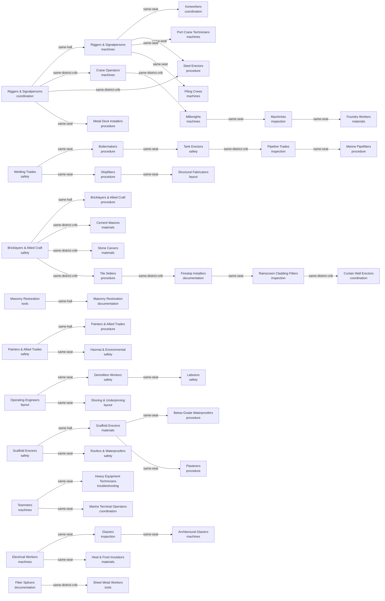

# The lessons

A reason to go to a particular room in a particular hall and do something there.
**116 lessons**, **476 steps** in 8 kinds,
standing in 116 rooms of 111 of the
111 halls — and not one of them certifies anybody.

## What a lesson does not mean

No lesson here certifies anybody, qualifies anybody or permits anybody to do anything. Completing every lesson in this registry would leave a learner with exactly the standing they started with. Where a trade has a real ticket, that ticket is issued by a jurisdiction, an employer or a hall, and this bundle is none of those and speaks for none of them.

A lesson unlocks nothing. No step is locked behind another, the ladder is guidance about a sensible order rather than a permission system, and the assessment gate that schools/ declares stays exactly where it is: an unaided verification run that no lesson, station hour or simulator seat substitutes for.

This is a set deliberately spread thin: 116 lessons across 111 of 111 halls, one in every one of the 45 halls a simulator seat is bound to and one composed first walk in every hall without a seat that the rule could walk honestly (0 refused), out of 1,221 rooms. It demonstrates the shape a lesson takes in this bundle. It is not a curriculum, it does not cover a trade, and no hall is finished because one of its rooms now has a lesson standing in it.

## What a lesson is

AUTHORED: every sentence in this pack was written here, by us. 56 lessons were written by hand, one hall at a time, step by step; the other 60 are composed by one rule in lessons/build.py from 6 arcs written here, one per room an advisor stands in, so their step order, title and why are marked DERIVED and carry authoring "rule" - the rule reads the hall name and focus from the roster and adds no fact of its own. Nothing is fetched and no model runs behind any of it.

This pack holds no second copy of anything. Hall names, room labels, station names, seat names, scenario names, advisor names, crew role names and topic wordings are all read at build time from the registries that own them, and the test re-reads them the same way. A step that could not resolve its ids did not become a lesson with a footnote; it failed the build.

The loop it plugs into is the one `schools/` already declares, at two of its
four stages: a lesson is the class and floor halves of the existing loop made walkable, in the order somebody chose. It is not a fifth stage, it does not replace the module pack at home, and it never touches the unaided gate.

## The 8 step kinds

| Kind | What it is | Stage | Records | Steps | Reads |
|---|---|---|---|---|---|
| **walk** | walk to a room of this hall | class | — | 118 | `web/interiors.py` |
| **placard** | read the door placard of a room and take on what it requires | class | — | 69 | `surfaces/registry/finishes.json` |
| **station** | take a training station at its bench | class | — | 12 | `stations/registry/stations.json` |
| **crib** | run the district crib check at the pegboard | class | — | 22 | `tools/registry/toolcribs.json` |
| **walkaround** | walk one pre-shift point of a seat and mark it | floor | `walkaround` | 42 | `sims/registry/sims.json` |
| **sim** | run one seat on the scenario its campus owns | floor | `sim` | 31 | `sims/registry/sims.json` |
| **advisor** | ask the advisor who stands in this room one of its fixed topics | class | `advisor` | 159 | `agents/registry/advisors.json` |
| **crew** | ask one role of the standing crew one of its fixed topics while the seat runs | floor | `crew` | 23 | `agents/registry/crews.json` |

255 of the 476 steps write an episode to the
device-local training log; the other 221 write nothing at all.
The recording ones use 4 episode kinds `training/`
already had and add 0 of their own. The 4
kinds that stay silent each say why:

- **walk** — arriving somewhere is not an achievement, and a bundle that logged footsteps would be counting attendance while claiming to teach
- **placard** — the placard states the room condition record; reading a record changes nothing and is nobody's score
- **station** — a station mark lands in the device-local progress record the halls already keep; the training log holds simulator, advisor, crew and walkaround episodes and this pack adds no fifth kind to it
- **crib** — the crib check is graded deterministically against the crib record and kept with the progress record, not as a training episode

Finishing a lesson changes no score and is read by no grader. Four of the eight step kinds write an episode to the existing device-local training log; the other four write nothing at all, and the registry says which is which rather than leaving it to be discovered.

## Spread thin on purpose

Breadth over the trades rather than depth in one: the ceiling is declared, computed and failed against, and all 11 strands must be stood in or the build stops.

All 11 of the 11 strands are stood in,
across 3 campuses and 111 halls, and no
hall holds more than 1.72% of the set against a
ceiling of 10%.

The steps reach 12 of 25 training stations,
11 of 11 seats, 16 of
33 scenarios, 34 of
55 pre-shift walkaround points,
21 advisor topics over 8 advisors,
19 crew roles over 6 crews and
7 district tool cribs. Every one of those resolves against the
registry that owns it, at build time, or the lesson does not exist.

## The ladder

40 edges over 116 lessons.
77 lessons need nothing before them, and the longest chain is
5 deep (77 at depth 1, 21 at depth 2, 12 at depth 3, 3 at depth 4, 3 at depth 5). The graph is acyclic and the build
checks that it is.

```mermaid
flowchart LR
  riggers_first_card["Riggers & Signalpersons<br/>coordination"] -->|same-hall| riggers_carry_under_control["Riggers & Signalpersons<br/>machines"]
  riggers_first_card["Riggers & Signalpersons<br/>coordination"] -->|same-district-crib| crane_ops_read_the_chart["Crane Operators<br/>machines"]
  riggers_carry_under_control["Riggers & Signalpersons<br/>machines"] -->|same-seat| ironworkers_plan_out_loud["Ironworkers<br/>coordination"]
  crane_ops_read_the_chart["Crane Operators<br/>machines"] -->|same-district-crib| millwrights_shop_move["Millwrights<br/>machines"]
  welders_the_watch["Welding Trades<br/>safety"] -->|same-seat| boilermakers_get_them_out["Boilermakers<br/>procedure"]
  operating_eng_locate_first["Operating Engineers<br/>layout"] -->|same-seat| demolition_stand_back["Demolition Workers<br/>safety"]
  scaffold_read_the_tag["Scaffold Erectors<br/>safety"] -->|same-hall| scaffold_build_in_order["Scaffold Erectors<br/>materials"]
  scaffold_build_in_order["Scaffold Erectors<br/>materials"] -->|same-seat| waterproofers_flash_it_right["Below-Grade Waterproofers<br/>procedure"]
  bricklayers_gear_that_stays_on["Bricklayers & Allied Craft<br/>safety"] -->|same-hall| bricklayers_grout_the_lift["Bricklayers & Allied Craft<br/>procedure"]
  bricklayers_gear_that_stays_on["Bricklayers & Allied Craft<br/>safety"] -->|same-district-crib| cement_masons_mind_the_weather["Cement Masons<br/>materials"]
  bricklayers_gear_that_stays_on["Bricklayers & Allied Craft<br/>safety"] -->|same-district-crib| stone_carvers_hang_it_safely["Stone Carvers<br/>materials"]
  bricklayers_gear_that_stays_on["Bricklayers & Allied Craft<br/>safety"] -->|same-district-crib| tilesetters_start_underneath["Tile Setters<br/>procedure"]
  restore_point_the_joint["Masonry Restoration<br/>tools"] -->|same-hall| restore_write_it_down["Masonry Restoration<br/>documentation"]
  painters_contain_it["Painters & Allied Trades<br/>safety"] -->|same-hall| painters_lay_the_coat["Painters & Allied Trades<br/>procedure"]
  painters_contain_it["Painters & Allied Trades<br/>safety"] -->|same-seat| hazmat_wash_and_decon["Hazmat & Environmental<br/>safety"]
  electricians_clip_in_first["Electrical Workers<br/>machines"] -->|same-seat| glaziers_watch_the_line["Glaziers<br/>inspection"]
  riggers_first_card["Riggers & Signalpersons<br/>coordination"] -->|same-district-crib| steel_erectors_land_it_on_the_bolts["Steel Erectors<br/>procedure"]
  riggers_carry_under_control["Riggers & Signalpersons<br/>machines"] -->|same-seat| steel_erectors_land_it_on_the_bolts["Steel Erectors<br/>procedure"]
  riggers_carry_under_control["Riggers & Signalpersons<br/>machines"] -->|same-seat| port_crane_read_the_rope["Port Crane Technicians<br/>machines"]
  riggers_first_card["Riggers & Signalpersons<br/>coordination"] -->|same-seat| decking_walk_the_path_first["Metal Deck Installers<br/>procedure"]
  boilermakers_get_them_out["Boilermakers<br/>procedure"] -->|same-seat| tank_erectors_isolate_before_testing["Tank Erectors<br/>safety"]
  riggers_carry_under_control["Riggers & Signalpersons<br/>machines"] -->|same-seat| piling_stand_the_rig_on_something["Piling Crews<br/>machines"]
  operating_eng_locate_first["Operating Engineers<br/>layout"] -->|same-seat| shoring_read_the_ground_again["Shoring & Underpinning<br/>layout"]
  demolition_stand_back["Demolition Workers<br/>safety"] -->|same-seat| laborers_stand_where_the_cab_can_see["Laborers<br/>safety"]
  teamsters_check_the_truck_before_the_load["Teamsters<br/>machines"] -->|same-seat| heavy_equip_listen_to_the_dash["Heavy Equipment Technicians<br/>troubleshooting"]
  teamsters_check_the_truck_before_the_load["Teamsters<br/>machines"] -->|same-seat| marine_terminal_brief_the_lane["Marine Terminal Operators<br/>coordination"]
  welders_the_watch["Welding Trades<br/>safety"] -->|same-seat| shipfitters_say_what_you_cannot_see["Shipfitters<br/>procedure"]
  shipfitters_say_what_you_cannot_see["Shipfitters<br/>procedure"] -->|same-seat| fabricators_lay_it_out_then_prove_it["Structural Fabricators<br/>layout"]
  tank_erectors_isolate_before_testing["Tank Erectors<br/>safety"] -->|same-district-crib| pipeline_close_the_permit_properly["Pipeline Trades<br/>inspection"]
  pipeline_close_the_permit_properly["Pipeline Trades<br/>inspection"] -->|same-seat| marine_pipe_know_when_to_come_out["Marine Pipefitters<br/>procedure"]
  scaffold_read_the_tag["Scaffold Erectors<br/>safety"] -->|same-seat| roofers_mind_the_edge_and_the_skylight["Roofers & Waterproofers<br/>safety"]
  electricians_clip_in_first["Electrical Workers<br/>machines"] -->|same-seat| insulators_stay_inside_the_rails["Heat & Frost Insulators<br/>materials"]
  scaffold_build_in_order["Scaffold Erectors<br/>materials"] -->|same-seat| plasterers_pin_every_brace["Plasterers<br/>procedure"]
  tilesetters_start_underneath["Tile Setters<br/>procedure"] -->|same-district-crib| firestop_write_down_what_you_sealed["Firestop Installers<br/>documentation"]
  firestop_write_down_what_you_sealed["Firestop Installers<br/>documentation"] -->|same-seat| cladding_check_the_plank_you_stand_on["Rainscreen Cladding Fitters<br/>inspection"]
  cladding_check_the_plank_you_stand_on["Rainscreen Cladding Fitters<br/>inspection"] -->|same-district-crib| curtainwall_fuss_about_the_sills["Curtain Wall Erectors<br/>coordination"]
  glaziers_watch_the_line["Glaziers<br/>inspection"] -->|same-seat| window_glazing_let_the_ground_judge_it["Architectural Glaziers<br/>machines"]
  fiber_splicers_keep_the_trace["Fiber Splicers<br/>documentation"] -->|same-district-crib| sheetmetal_name_the_kit_before_you_climb["Sheet Metal Workers<br/>tools"]
  millwrights_shop_move["Millwrights<br/>machines"] -->|same-seat| machinists_move_the_job_without_marking_it["Machinists<br/>inspection"]
  machinists_move_the_job_without_marking_it["Machinists<br/>inspection"] -->|same-seat| foundry_clear_the_runway_first["Foundry Workers<br/>materials"]
```

| Edge reason | What it means |
|---|---|
| `same-hall` | both lessons stand in the same hall, so the second is the next thing to do in a building you are already in |
| `same-seat` | both lessons run or walk the same simulator seat, so the first is seat familiarity the second assumes |
| `same-district-crib` | both halls draw from the same district tool crib, so the kit and the vocabulary carry across |

**Enforcement:** none. The ladder is a sensible order, not a permission system: no lesson is locked behind another and the page contract forbids the page from locking one.

## The 116 lessons, one by one

Each lesson carries its own limit sentence, and the page contract puts that
sentence beside the lesson rather than behind a disclosure control:
the `limits` sentence renders with the lesson, not behind a disclosure control, and not only at the end. A learner who is told what a lesson does not mean only after finishing it has already formed the belief the sentence exists to prevent.

| Lesson | Hall | Room | Strand | Tier | Steps | What finishing it does not mean |
|---|---|---|---|---|---|---|
| **Call the first lift before anybody touches the hook** | Riggers & Signalpersons | Briefing Room | coordination | fundamentals | 4 | Finishing this does not make you a signalperson and does not qualify you to direct a lift; it is one scripted exchange and one schematic seat, and no hall, employer or authority has signed anything on the strength of it. |
| **Carry a load that is not fighting you** | Riggers & Signalpersons | Equipment Bay | machines | applied | 5 | Finishing this is not crane seat time and counts toward no operator qualification; the physics here is schematic, the assessment gate still demands an unaided verification run, and nothing recorded here is read by a grader. |
| **Refuse the pick the chart refuses** | Crane Operators | Equipment Bay | machines | applied | 4 | Finishing this certifies nothing and permits nothing; a real chart belongs to a real machine in a real configuration, and this seat is a teaching aid that has never lifted anything. |
| **Say the plan out loud, then change it properly** | Ironworkers | Briefing Room | coordination | applied | 4 | Finishing this does not make you a lift director and is not a lift plan anybody can work to; it is a scripted exchange about how planning fails, not an authority to plan. |
| **Move something precise across a shop floor** | Millwrights | Equipment Bay | machines | applied | 5 | Finishing this is not overhead crane authorisation and no employer grants one from here; the seat is schematic, the loads are not real and no alignment has been proved by anything you did. |
| **Stand the watch that outlasts the arc** | Welding Trades | Induction & PPE | safety | applied | 5 | Finishing this is not a hot work permit, not fire watch training and not a welding qualification; it teaches the shape of the duty, and your jurisdiction owns the rules that make it binding. |
| **Put somebody inside a vessel and get them back out** | Boilermakers | Practice Bays | procedure | applied | 5 | Finishing this is not confined space entry training, not an entry permit and not a rescue qualification; it is a scripted exchange about roles, and nobody here may authorise an entry. |
| **Prove what is under the ground before the bucket moves** | Operating Engineers | Layout Floor | layout | applied | 5 | Finishing this is not excavator seat time, not a utility locating qualification and not competent person status; the ground here is schematic and no real service has ever been proved by it. |
| **Know where not to stand** | Demolition Workers | Induction & PPE | safety | applied | 4 | Finishing this is not demolition training and confers no authority over a structure; nothing here assesses a building, and no sequence you ran is a takedown plan. |
| **Believe the tag or believe nothing** | Scaffold Erectors | Induction & PPE | safety | applied | 5 | Finishing this is not competent person status and is not a scaffold inspection; a tag in this bundle is a teaching prop, and no structure anywhere has been released by it. |
| **Build the bay in the order that keeps you off the ground** | Scaffold Erectors | Materials Store | materials | applied | 5 | Finishing this erects nothing and inspects nothing; the bay is schematic, the sequence is unverified general practice, and no jurisdiction has reviewed a line of it. |
| **Give the water somewhere to go** | Below-Grade Waterproofers | Practice Bays | procedure | applied | 4 | Finishing this is not a waterproofing qualification and is not a warranty on any detail; it is unverified general practice and the manufacturer instruction for a real product always wins. |
| **Wear it for the last ten minutes too** | Bricklayers & Allied Craft | Induction & PPE | safety | fundamentals | 4 | Finishing this fits nothing to your face and qualifies nobody; a seal check in a browser is a reminder of a habit, not a fit test, and a real respirator programme is a different thing entirely. |
| **Pour a lift you cannot see inside** | Bricklayers & Allied Craft | Practice Bays | procedure | applied | 4 | Finishing this is not a masonry qualification and no wall has been built; the technique here is unverified general practice awaiting review by journey-level practitioners from this hall. |
| **Protect a pour from the day it was poured in** | Cement Masons | Materials Store | materials | applied | 6 | Finishing this places no concrete and tests no cylinder; nothing here is a mix design, a cure schedule or an approval to use one. |
| **Hang stone on something that will hold it** | Stone Carvers | Materials Store | materials | applied | 3 | Finishing this specifies no anchor and approves no substrate; an anchor on a real building is an engineered choice and nothing here may stand in for one. |
| **Fix the substrate you are about to hide** | Tile Setters | Practice Bays | procedure | fundamentals | 4 | Finishing this sets no tile and approves no substrate; the sequence is unverified general practice and the system manufacturer instruction governs a real installation. |
| **Frame it for whoever comes next** | Lathers & Metal Framers | Practice Bays | procedure | fundamentals | 4 | Finishing this frames nothing and is no structural approval; backing, spacing and fixings on a real job come from a drawing and an engineer, never from a lesson. |
| **Cut a joint without wrecking the brick** | Masonry Restoration | Tool Crib | tools | fundamentals | 4 | Finishing this repoints nothing and specifies no mortar; matching a historic mix is analysis work, and nothing here is that analysis or a substitute for it. |
| **Leave a record the next century can read** | Masonry Restoration | Records | documentation | applied | 3 | Finishing this documents no building and satisfies no preservation authority; the standards named on a real job come from that jurisdiction and this bundle speaks for none of them. |
| **Take the lining up to heat slowly enough** | Refractory Masons | Practice Bays | procedure | applied | 5 | Finishing this lines no furnace and is no dryout schedule; a real schedule belongs to the refractory supplier and the vessel, and nothing here replaces it. |
| **Catch what you wash off** | Painters & Allied Trades | Induction & PPE | safety | applied | 5 | Finishing this is no environmental permit and no containment design; what may be released, and where, is a jurisdiction matter and this bundle names no jurisdiction. |
| **Lay a coat that is actually there** | Painters & Allied Trades | Practice Bays | procedure | applied | 4 | Finishing this coats nothing and is no coating specification; film thickness, recoat windows and compatibility on a real job come from the product data sheet. |
| **Come out cleaner than what you washed** | Hazmat & Environmental | Induction & PPE | safety | applied | 5 | Finishing this is no abatement or decontamination qualification and clears no site; clearance is a measured, sampled process and nothing here samples anything. |
| **Clip in before the basket moves** | Electrical Workers | Equipment Bay | machines | applied | 4 | Finishing this is not aerial lift training and is no familiarisation on any machine; a real lift requires machine-specific training and this seat is schematic. |
| **Keep the boom out of the zone** | Glaziers | Inspection Bench | inspection | applied | 4 | Finishing this is no qualified person status and sets no approach distance; approach limits are set by the utility and the jurisdiction, and this bundle sets none. |
| **Make stopping the job an ordinary thing to do** | Site Safety Coordinators | Classroom | leadership | applied | 3 | Finishing this is no safety qualification and confers no authority on a site; the only authority a stop-work call has is the one the employer and the jurisdiction actually give it. |
| **Work from control, not from something near it** | Construction Surveyors | Layout Floor | layout | fundamentals | 5 | Finishing this establishes no control network and checks no instrument; a real network is observed, adjusted and recorded, and nothing here does any of those. |
| **Find the fault instead of replacing things** | Utility Line Workers | Diagnostic Bench | troubleshooting | applied | 5 | Finishing this diagnoses nothing and authorises no switching; live distribution work is governed by the utility own procedures and this bundle holds none of them. |
| **Prove the system does what the sequence says** | HVAC/R Technicians | Inspection Bench | inspection | applied | 4 | Finishing this commissions nothing and signs off nothing; a real commissioning record is witnessed and measured, and no measurement here left this browser. |
| **Keep the trace that proves the splice** | Fiber Splicers | Records | documentation | fundamentals | 3 | Finishing this splices nothing and certifies no link; a real loss budget is measured against a standard and this bundle names and speaks for no standard. |
| **Return it in the state you would want to find it** | Carpenters | Tool Crib | tools | fundamentals | 4 | Finishing this is no tool competency and is no inventory of any real toolroom; no manufacturer or brand is named here and none is endorsed. |
| **Land the piece where the bolts can go in** | Steel Erectors | Practice Bays | procedure | applied | 5 | Finishing this is not connection training, not a rigging qualification and not a lift plan; the steel here is schematic, no bolt has been torqued, and no employer or hall has signed anything on the strength of it. |
| **Read the rope before the box goes up** | Port Crane Technicians | Equipment Bay | machines | applied | 5 | Finishing this is not crane technician standing and not a rope inspection anybody may act on; the machine here is schematic, the wire is drawn rather than run, and nothing recorded is read by any authority. |
| **Walk where the bundle will fly before it flies** | Metal Deck Installers | Practice Bays | procedure | applied | 5 | Finishing this is not signalperson standing and lifts no bundle; the floor is schematic, the call is scripted, and no hall, employer or authority has reviewed or signed a line of it. |
| **Isolate the shell before anybody tests the air** | Tank Erectors | Induction & PPE | safety | applied | 6 | Finishing this is not confined space entry training, not a hot work permit and not a welding qualification; nobody here may authorise an entry, and the shell you worked on has never held anything. |
| **Stand the rig on ground that will hold it** | Piling Crews | Equipment Bay | machines | applied | 5 | Finishing this is not rig operator standing and no ground has been assessed; the bearing here is schematic, the lift is a teaching aid, and no plan you ran is a lift plan anybody may work to. |
| **Read the ground again after the rain** | Shoring & Underpinning | Layout Floor | layout | applied | 5 | Finishing this is not competent person standing and is not a soil classification; the cut is schematic, the ground here has never held water, and no jurisdiction has reviewed a line of it. |
| **Stand where the cab can see you** | Laborers | Induction & PPE | safety | applied | 5 | Finishing this is not ground worker training and grants no authority near plant; the machine here is schematic, no spoil has moved, and the habit it teaches is unverified general practice awaiting the hall. |
| **Check the truck before you check the load** | Teamsters | Equipment Bay | machines | applied | 5 | Finishing this is not forklift operator training and is not a licence to drive one; the yard is schematic, the loads weigh nothing, and no employer or jurisdiction issues anything on the strength of it. |
| **Listen to the dash before you replace anything** | Heavy Equipment Technicians | Diagnostic Bench | troubleshooting | applied | 4 | Finishing this is not a technician qualification and diagnoses no real machine; the readouts here are schematic, the fault is scripted, and nothing you concluded has been checked by anybody who repairs plant. |
| **Brief the lane before the first box moves** | Marine Terminal Operators | Briefing Room | coordination | applied | 4 | Finishing this is not terminal operator standing and is not a traffic plan; the lane is schematic, the vehicles are drawn, and no port, employer or authority has reviewed a line of it. |
| **Say what you cannot see from the hood** | Shipfitters | Practice Bays | procedure | applied | 5 | Finishing this is not a welding qualification and not fit-up training; the seam is schematic, no hull has been tacked, and the practice here is unverified general practice awaiting journey-level review. |
| **Lay it out, then prove the line before you cut** | Structural Fabricators | Layout Floor | layout | applied | 5 | Finishing this is not a fabrication qualification and cuts nothing; the layout is schematic, the seam is a teaching aid, and no shop or inspector has accepted anything on the strength of it. |
| **Close the permit the way it was opened** | Pipeline Trades | Inspection Bench | inspection | applied | 5 | Finishing this is not a hot work permit, not pipeline welder standing and not a coating or integrity qualification; the permit here is a teaching prop, and your jurisdiction owns the rules that make one binding. |
| **Know when to come out of the compartment** | Marine Pipefitters | Practice Bays | procedure | applied | 5 | Finishing this is not confined space entry training, not a welding qualification and not an entry permit; the compartment is schematic, and nobody here may authorise anybody to enter a real one. |
| **Mind the edge, and the skylight nobody mentioned** | Roofers & Waterproofers | Induction & PPE | safety | applied | 6 | Finishing this is not fall protection training, not competent person standing and not a roof inspection; the bay is schematic, no membrane has been laid, and no authority has reviewed a line of it. |
| **Stay inside the rails while you reach** | Heat & Frost Insulators | Materials Store | materials | applied | 6 | Finishing this is not aerial lift operator training and no lift has been inspected; the basket is schematic, the material here weighs nothing, and no employer or jurisdiction issues anything from it. |
| **Pin every brace before the first hawk goes up** | Plasterers | Practice Bays | procedure | applied | 5 | Finishing this is not scaffold erector standing and not a plastering qualification; the bay is schematic, no coat has been applied, and the sequence here is unverified general practice awaiting the hall. |
| **Write down what you sealed and with what** | Firestop Installers | Records | documentation | fundamentals | 4 | Finishing this is not a firestop qualification and no listed system has been installed; the record here is a teaching prop, and no inspector or authority has accepted anything on the strength of it. |
| **Check the plank you are about to stand on** | Rainscreen Cladding Fitters | Inspection Bench | inspection | applied | 4 | Finishing this is not a cladding qualification and not a scaffold inspection; the bay is schematic, no panel has been hung, and the acceptance criteria here are unverified general practice. |
| **Make the fuss about the sills early** | Curtain Wall Erectors | Briefing Room | coordination | applied | 5 | Finishing this is not curtain wall erector standing and not a sequencing plan; the bay is schematic, no anchor has been set, and no employer or hall has reviewed or signed any of it. |
| **Let the ground judge the clearance, not the basket** | Architectural Glaziers | Equipment Bay | machines | applied | 4 | Finishing this is not aerial lift operator training and no clearance has been measured; the machine here is schematic, the lines are drawn, and nothing recorded is read by any employer or authority. |
| **Name the kit before you take it up** | Sheet Metal Workers | Tool Crib | tools | fundamentals | 5 | Finishing this is not a sheet metal qualification and issues nothing real; the crib is a teaching prop, the basket is schematic, and no employer or hall has signed anything on the strength of it. |
| **Move the job across the shop without marking it** | Machinists | Inspection Bench | inspection | applied | 4 | Finishing this is not overhead crane authorisation and no fit has been measured; the load here is schematic, the tolerances are drawn, and no shop or inspector has accepted anything from it. |
| **Clear the runway before the ladle moves** | Foundry Workers | Materials Store | materials | applied | 6 | Finishing this is not overhead crane authorisation and not foundry floor standing; nothing here is molten, the frame weighs nothing, and no employer or jurisdiction issues anything on the strength of it. |
| **Plumbers & Pipefitters: find out what the room is held to** | Plumbers & Pipefitters | Induction & PPE | safety | fundamentals | 4 | Finishing this is not safety training, not an induction and not a permit to enter any real workspace; it is a walk through a schematic room and two scripted answers, and no hall, employer or authority has signed anything on the strength of it. |
| **Elevator Constructors: know the kit before you touch it** | Elevator Constructors | Tool Crib | tools | fundamentals | 4 | Finishing this is not tool training and permits you to use nothing; the check is scored against a record, not against your hands, and no employer or hall accepts it as evidence of anything. |
| **Drywall Finishers: trust a line only as far as it is proved** | Drywall Finishers | Layout Floor | layout | fundamentals | 4 | Finishing this is not setting-out training and qualifies nobody to mark anything; the floor here is schematic, no real reference has been proved by it, and nobody who does this work has reviewed these lines yet. |
| **Floor Coverers: ask what a pass would actually mean** | Floor Coverers | Inspection Bench | inspection | fundamentals | 4 | Finishing this is not an inspection and not an acceptance of anybody's work; nothing here is a sign-off, no grader reads it, and the halls this trade belongs to have not reviewed a line of it. |
| **Grounds & Landscape: hand the shift over properly** | Grounds & Landscape | Briefing Room | coordination | fundamentals | 3 | Finishing this is not supervisor training and gives nobody the standing to run a crew; it is one scripted exchange in a schematic room, and no hall or employer has reviewed it. |
| **Solar Installers: find out where the record goes** | Solar Installers | Records | documentation | fundamentals | 3 | Finishing this is not permit or records training and issues no document of any kind; your progress stays on this device, nothing here certifies anybody, and no hall has reviewed a word of it. |
| **Wind Turbine Technicians: find out what the room is held to** | Wind Turbine Technicians | Induction & PPE | safety | fundamentals | 4 | Finishing this is not safety training, not an induction and not a permit to enter any real workspace; it is a walk through a schematic room and two scripted answers, and no hall, employer or authority has signed anything on the strength of it. |
| **Fire Sprinkler Fitters: know the kit before you touch it** | Fire Sprinkler Fitters | Tool Crib | tools | fundamentals | 4 | Finishing this is not tool training and permits you to use nothing; the check is scored against a record, not against your hands, and no employer or hall accepts it as evidence of anything. |
| **Commercial Divers: trust a line only as far as it is proved** | Commercial Divers | Layout Floor | layout | fundamentals | 4 | Finishing this is not setting-out training and qualifies nobody to mark anything; the floor here is schematic, no real reference has been proved by it, and nobody who does this work has reviewed these lines yet. |
| **Drillers & Blasters: ask what a pass would actually mean** | Drillers & Blasters | Inspection Bench | inspection | fundamentals | 4 | Finishing this is not an inspection and not an acceptance of anybody's work; nothing here is a sign-off, no grader reads it, and the halls this trade belongs to have not reviewed a line of it. |
| **Underground Miners: hand the shift over properly** | Underground Miners | Briefing Room | coordination | fundamentals | 3 | Finishing this is not supervisor training and gives nobody the standing to run a crew; it is one scripted exchange in a schematic room, and no hall or employer has reviewed it. |
| **Smelter Operators: find out where the record goes** | Smelter Operators | Records | documentation | fundamentals | 3 | Finishing this is not permit or records training and issues no document of any kind; your progress stays on this device, nothing here certifies anybody, and no hall has reviewed a word of it. |
| **Tool & Die Makers: find out what the room is held to** | Tool & Die Makers | Induction & PPE | safety | fundamentals | 4 | Finishing this is not safety training, not an induction and not a permit to enter any real workspace; it is a walk through a schematic room and two scripted answers, and no hall, employer or authority has signed anything on the strength of it. |
| **Platers & Coaters: know the kit before you touch it** | Platers & Coaters | Tool Crib | tools | fundamentals | 4 | Finishing this is not tool training and permits you to use nothing; the check is scored against a record, not against your hands, and no employer or hall accepts it as evidence of anything. |
| **Substation Technicians: trust a line only as far as it is proved** | Substation Technicians | Layout Floor | layout | fundamentals | 4 | Finishing this is not setting-out training and qualifies nobody to mark anything; the floor here is schematic, no real reference has been proved by it, and nobody who does this work has reviewed these lines yet. |
| **Cable Splicers: ask what a pass would actually mean** | Cable Splicers | Inspection Bench | inspection | fundamentals | 4 | Finishing this is not an inspection and not an acceptance of anybody's work; nothing here is a sign-off, no grader reads it, and the halls this trade belongs to have not reviewed a line of it. |
| **Meter Technicians: hand the shift over properly** | Meter Technicians | Briefing Room | coordination | fundamentals | 3 | Finishing this is not supervisor training and gives nobody the standing to run a crew; it is one scripted exchange in a schematic room, and no hall or employer has reviewed it. |
| **Gas Distribution Fitters: find out where the record goes** | Gas Distribution Fitters | Records | documentation | fundamentals | 3 | Finishing this is not permit or records training and issues no document of any kind; your progress stays on this device, nothing here certifies anybody, and no hall has reviewed a word of it. |
| **Water Distribution Fitters: find out what the room is held to** | Water Distribution Fitters | Induction & PPE | safety | fundamentals | 4 | Finishing this is not safety training, not an induction and not a permit to enter any real workspace; it is a walk through a schematic room and two scripted answers, and no hall, employer or authority has signed anything on the strength of it. |
| **Wastewater Operators: know the kit before you touch it** | Wastewater Operators | Tool Crib | tools | fundamentals | 4 | Finishing this is not tool training and permits you to use nothing; the check is scored against a record, not against your hands, and no employer or hall accepts it as evidence of anything. |
| **Nuclear Plant Trades: trust a line only as far as it is proved** | Nuclear Plant Trades | Layout Floor | layout | fundamentals | 4 | Finishing this is not setting-out training and qualifies nobody to mark anything; the floor here is schematic, no real reference has been proved by it, and nobody who does this work has reviewed these lines yet. |
| **Hydro Plant Trades: ask what a pass would actually mean** | Hydro Plant Trades | Inspection Bench | inspection | fundamentals | 4 | Finishing this is not an inspection and not an acceptance of anybody's work; nothing here is a sign-off, no grader reads it, and the halls this trade belongs to have not reviewed a line of it. |
| **Geothermal Technicians: hand the shift over properly** | Geothermal Technicians | Briefing Room | coordination | fundamentals | 3 | Finishing this is not supervisor training and gives nobody the standing to run a crew; it is one scripted exchange in a schematic room, and no hall or employer has reviewed it. |
| **Battery Storage Technicians: find out where the record goes** | Battery Storage Technicians | Records | documentation | fundamentals | 3 | Finishing this is not permit or records training and issues no document of any kind; your progress stays on this device, nothing here certifies anybody, and no hall has reviewed a word of it. |
| **EV Charging Installers: find out what the room is held to** | EV Charging Installers | Induction & PPE | safety | fundamentals | 4 | Finishing this is not safety training, not an induction and not a permit to enter any real workspace; it is a walk through a schematic room and two scripted answers, and no hall, employer or authority has signed anything on the strength of it. |
| **Hydrogen Systems Trades: know the kit before you touch it** | Hydrogen Systems Trades | Tool Crib | tools | fundamentals | 4 | Finishing this is not tool training and permits you to use nothing; the check is scored against a record, not against your hands, and no employer or hall accepts it as evidence of anything. |
| **Transmission Linemen: trust a line only as far as it is proved** | Transmission Linemen | Layout Floor | layout | fundamentals | 4 | Finishing this is not setting-out training and qualifies nobody to mark anything; the floor here is schematic, no real reference has been proved by it, and nobody who does this work has reviewed these lines yet. |
| **District Energy Operators: ask what a pass would actually mean** | District Energy Operators | Inspection Bench | inspection | fundamentals | 4 | Finishing this is not an inspection and not an acceptance of anybody's work; nothing here is a sign-off, no grader reads it, and the halls this trade belongs to have not reviewed a line of it. |
| **Terrazzo Workers: hand the shift over properly** | Terrazzo Workers | Briefing Room | coordination | fundamentals | 3 | Finishing this is not supervisor training and gives nobody the standing to run a crew; it is one scripted exchange in a schematic room, and no hall or employer has reviewed it. |
| **Acoustic Specialists: find out where the record goes** | Acoustic Specialists | Records | documentation | fundamentals | 3 | Finishing this is not permit or records training and issues no document of any kind; your progress stays on this device, nothing here certifies anybody, and no hall has reviewed a word of it. |
| **Concrete Pump Operators: find out what the room is held to** | Concrete Pump Operators | Induction & PPE | safety | fundamentals | 4 | Finishing this is not safety training, not an induction and not a permit to enter any real workspace; it is a walk through a schematic room and two scripted answers, and no hall, employer or authority has signed anything on the strength of it. |
| **Post-Tension Technicians: know the kit before you touch it** | Post-Tension Technicians | Tool Crib | tools | fundamentals | 4 | Finishing this is not tool training and permits you to use nothing; the check is scored against a record, not against your hands, and no employer or hall accepts it as evidence of anything. |
| **Precast Erectors: trust a line only as far as it is proved** | Precast Erectors | Layout Floor | layout | fundamentals | 4 | Finishing this is not setting-out training and qualifies nobody to mark anything; the floor here is schematic, no real reference has been proved by it, and nobody who does this work has reviewed these lines yet. |
| **Building Automation Techs: ask what a pass would actually mean** | Building Automation Techs | Inspection Bench | inspection | fundamentals | 4 | Finishing this is not an inspection and not an acceptance of anybody's work; nothing here is a sign-off, no grader reads it, and the halls this trade belongs to have not reviewed a line of it. |
| **Fire Alarm Technicians: hand the shift over properly** | Fire Alarm Technicians | Briefing Room | coordination | fundamentals | 3 | Finishing this is not supervisor training and gives nobody the standing to run a crew; it is one scripted exchange in a schematic room, and no hall or employer has reviewed it. |
| **Security Systems Installers: find out where the record goes** | Security Systems Installers | Records | documentation | fundamentals | 3 | Finishing this is not permit or records training and issues no document of any kind; your progress stays on this device, nothing here certifies anybody, and no hall has reviewed a word of it. |
| **Structured Cabling Techs: find out what the room is held to** | Structured Cabling Techs | Induction & PPE | safety | fundamentals | 4 | Finishing this is not safety training, not an induction and not a permit to enter any real workspace; it is a walk through a schematic room and two scripted answers, and no hall, employer or authority has signed anything on the strength of it. |
| **Data Centre Technicians: know the kit before you touch it** | Data Centre Technicians | Tool Crib | tools | fundamentals | 4 | Finishing this is not tool training and permits you to use nothing; the check is scored against a record, not against your hands, and no employer or hall accepts it as evidence of anything. |
| **Instrumentation Technicians: trust a line only as far as it is proved** | Instrumentation Technicians | Layout Floor | layout | fundamentals | 4 | Finishing this is not setting-out training and qualifies nobody to mark anything; the floor here is schematic, no real reference has been proved by it, and nobody who does this work has reviewed these lines yet. |
| **PLC & Controls Technicians: ask what a pass would actually mean** | PLC & Controls Technicians | Inspection Bench | inspection | fundamentals | 4 | Finishing this is not an inspection and not an acceptance of anybody's work; nothing here is a sign-off, no grader reads it, and the halls this trade belongs to have not reviewed a line of it. |
| **Industrial Robotics Techs: hand the shift over properly** | Industrial Robotics Techs | Briefing Room | coordination | fundamentals | 3 | Finishing this is not supervisor training and gives nobody the standing to run a crew; it is one scripted exchange in a schematic room, and no hall or employer has reviewed it. |
| **Automation Integrators: find out where the record goes** | Automation Integrators | Records | documentation | fundamentals | 3 | Finishing this is not permit or records training and issues no document of any kind; your progress stays on this device, nothing here certifies anybody, and no hall has reviewed a word of it. |
| **Cleanroom Trades: find out what the room is held to** | Cleanroom Trades | Induction & PPE | safety | fundamentals | 4 | Finishing this is not safety training, not an induction and not a permit to enter any real workspace; it is a walk through a schematic room and two scripted answers, and no hall, employer or authority has signed anything on the strength of it. |
| **Medical Gas Installers: know the kit before you touch it** | Medical Gas Installers | Tool Crib | tools | fundamentals | 4 | Finishing this is not tool training and permits you to use nothing; the check is scored against a record, not against your hands, and no employer or hall accepts it as evidence of anything. |
| **Rail Track Workers: trust a line only as far as it is proved** | Rail Track Workers | Layout Floor | layout | fundamentals | 4 | Finishing this is not setting-out training and qualifies nobody to mark anything; the floor here is schematic, no real reference has been proved by it, and nobody who does this work has reviewed these lines yet. |
| **Rail Signal Technicians: ask what a pass would actually mean** | Rail Signal Technicians | Inspection Bench | inspection | fundamentals | 4 | Finishing this is not an inspection and not an acceptance of anybody's work; nothing here is a sign-off, no grader reads it, and the halls this trade belongs to have not reviewed a line of it. |
| **Overhead Catenary Linemen: hand the shift over properly** | Overhead Catenary Linemen | Briefing Room | coordination | fundamentals | 3 | Finishing this is not supervisor training and gives nobody the standing to run a crew; it is one scripted exchange in a schematic room, and no hall or employer has reviewed it. |
| **Transit Vehicle Technicians: find out where the record goes** | Transit Vehicle Technicians | Records | documentation | fundamentals | 3 | Finishing this is not permit or records training and issues no document of any kind; your progress stays on this device, nothing here certifies anybody, and no hall has reviewed a word of it. |
| **Aviation Ground Support: find out what the room is held to** | Aviation Ground Support | Induction & PPE | safety | fundamentals | 4 | Finishing this is not safety training, not an induction and not a permit to enter any real workspace; it is a walk through a schematic room and two scripted answers, and no hall, employer or authority has signed anything on the strength of it. |
| **Airfield Trades: know the kit before you touch it** | Airfield Trades | Tool Crib | tools | fundamentals | 4 | Finishing this is not tool training and permits you to use nothing; the check is scored against a record, not against your hands, and no employer or hall accepts it as evidence of anything. |
| **Fleet Diesel Technicians: trust a line only as far as it is proved** | Fleet Diesel Technicians | Layout Floor | layout | fundamentals | 4 | Finishing this is not setting-out training and qualifies nobody to mark anything; the floor here is schematic, no real reference has been proved by it, and nobody who does this work has reviewed these lines yet. |
| **Bridge Inspection Crews: ask what a pass would actually mean** | Bridge Inspection Crews | Inspection Bench | inspection | fundamentals | 4 | Finishing this is not an inspection and not an acceptance of anybody's work; nothing here is a sign-off, no grader reads it, and the halls this trade belongs to have not reviewed a line of it. |
| **Asbestos Abatement Workers: hand the shift over properly** | Asbestos Abatement Workers | Briefing Room | coordination | fundamentals | 3 | Finishing this is not supervisor training and gives nobody the standing to run a crew; it is one scripted exchange in a schematic room, and no hall or employer has reviewed it. |
| **Lead Abatement Workers: find out where the record goes** | Lead Abatement Workers | Records | documentation | fundamentals | 3 | Finishing this is not permit or records training and issues no document of any kind; your progress stays on this device, nothing here certifies anybody, and no hall has reviewed a word of it. |
| **Mould Remediation Techs: find out what the room is held to** | Mould Remediation Techs | Induction & PPE | safety | fundamentals | 4 | Finishing this is not safety training, not an induction and not a permit to enter any real workspace; it is a walk through a schematic room and two scripted answers, and no hall, employer or authority has signed anything on the strength of it. |
| **Spill Response Technicians: know the kit before you touch it** | Spill Response Technicians | Tool Crib | tools | fundamentals | 4 | Finishing this is not tool training and permits you to use nothing; the check is scored against a record, not against your hands, and no employer or hall accepts it as evidence of anything. |
| **Confined Space Rescue: trust a line only as far as it is proved** | Confined Space Rescue | Layout Floor | layout | fundamentals | 4 | Finishing this is not setting-out training and qualifies nobody to mark anything; the floor here is schematic, no real reference has been proved by it, and nobody who does this work has reviewed these lines yet. |
| **High-Angle Rescue: ask what a pass would actually mean** | High-Angle Rescue | Inspection Bench | inspection | fundamentals | 4 | Finishing this is not an inspection and not an acceptance of anybody's work; nothing here is a sign-off, no grader reads it, and the halls this trade belongs to have not reviewed a line of it. |
| **Industrial Cleaning Crews: hand the shift over properly** | Industrial Cleaning Crews | Briefing Room | coordination | fundamentals | 3 | Finishing this is not supervisor training and gives nobody the standing to run a crew; it is one scripted exchange in a schematic room, and no hall or employer has reviewed it. |
| **Aerial Survey Operators: find out where the record goes** | Aerial Survey Operators | Records | documentation | fundamentals | 3 | Finishing this is not permit or records training and issues no document of any kind; your progress stays on this device, nothing here certifies anybody, and no hall has reviewed a word of it. |

## What a lesson is not

- **Not a certificate.** no lesson here certifies anybody, qualifies anybody or permits anybody to do anything. Completing every lesson in this registry would leave a learner with exactly the standing they started with. Where a trade has a real ticket, that ticket is issued by a jurisdiction, an employer or a hall, and this bundle is none of those and speaks for none of them.
- **Not a gate.** a lesson unlocks nothing. No step is locked behind another, the ladder is guidance about a sensible order rather than a permission system, and the assessment gate that schools/ declares stays exactly where it is: an unaided verification run that no lesson, station hour or simulator seat substitutes for.
- **Not reviewed.** unverified general practice. These lessons were written to be argued with, corrected and replaced by journey-level practitioners from the halls they name - the same standing the module pack, the recovered stations and the simulator seats already carry, and for the same reason: nobody who does this work for a living has reviewed a line of it yet.
- **Not a code ruling.** nothing here cites a standard, a code or an authority, and nothing here speaks for one. Where a step says what a crew would do, that is unverified general practice and not an instruction from anybody with the standing to give one.
- **Not a curriculum.** this is a set deliberately spread thin: 116 lessons across 111 of 111 halls, one in every one of the 45 halls a simulator seat is bound to and one composed first walk in every hall without a seat that the rule could walk honestly (0 refused), out of 1,221 rooms. It demonstrates the shape a lesson takes in this bundle. It is not a curriculum, it does not cover a trade, and no hall is finished because one of its rooms now has a lesson standing in it.

---

*Generated by `wiki/build_wiki.py` from the verified registries — edit the sources, not this page. Adaptive Stack v3.2 · pack 3.2.0.*
