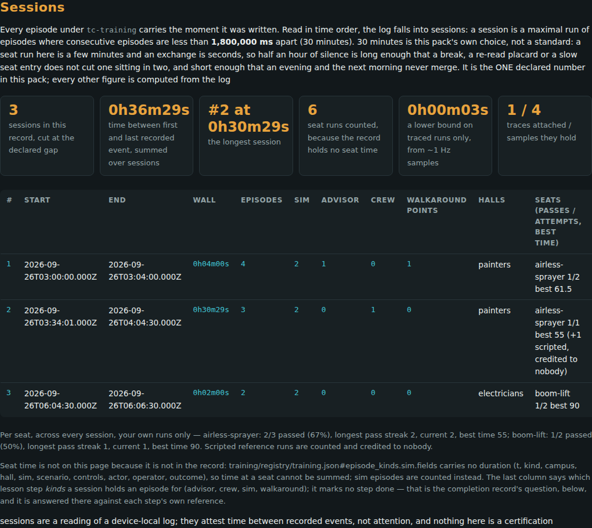

# Sessions

A session is a stretch of training read back from the device's own episode
log. In the registry's words: a SESSION is a maximal run of episodes in time order where every consecutive pair is separated by less than gap.ms, with
`gap.ms` = 1,800,000 - the one number this pack declares.

**The loop.** [Completion-Record](Completion-Record.md) (export your progress) -> [Verify-A-Record](Verify-A-Record.md) (a rep checks it) -> [Contribute](Contribute.md) (share the episodes behind it, if you choose). [Work-Sites](Work-Sites.md) -> [Verify-A-Record](Verify-A-Record.md) for a crew. [Sessions](Sessions.md) and [Compliance-Ledger](Compliance-Ledger.md) read the same files.

## The process, for a learner

1. **Train.** Every recorded episode lands in `tc-training`,
   localStorage of the built 3D page.
2. **Open [`web/trade_craft_progress.html`](../web/trade_craft_progress.html)** and go to *Sessions*: the log split into
   sessions, each with its seats, attempts, passes and the step kinds it could
   have advanced.
3. **Export the log**, or a contribution package built from it
   ([Contribute](Contribute.md)).
4. **Anyone can recompute the table offline** (below): a claimed session
   table or rollup that the log does not reproduce fails by name. See
   [Verify-A-Record](Verify-A-Record.md).



*The progress page, at *Sessions*. The learner data in this capture is synthetic, injected by the smoke harness - not a learner's record.*

## Check it offline

On the pack's own fixture log (*fixture - not a learner*):

```text
$ node sessions/verify.mjs sessions/fixture/log.json
input: training export labelled "fixture - not a learner"; gap 1800000 ms (30 minutes is this pack's own choice, not a standard: a seat run here is a few minutes and an exchange is seconds, so half an hour of silence is long enough that a break, a re-read placard or a slow seat entry does not cut one sitting in two, and short enough that an evening and the next morning never merge. It is the ONE declared number in this pack; every other figure is computed from the log)
ok input.shape: checked 2, failing 0
ok episode.t: checked 9, failing 0
ok episode.kind: checked 15, failing 0
ok episode.outcome: checked 74, failing 0
ok sessions.gap: checked 1, failing 0
ok sessions.claimed: checked 1, failing 0
ok rollups.claimed: checked 1, failing 0
session  start                     end                       wall       eps  sim  adv  crew  walk  seats                          traces  could-advance
      1  2026-09-26T03:00:00.000Z  2026-09-26T03:04:00.000Z   0h04m00s    4    2    1     0     1  airless-sprayer 1/2 best 61.5       1  walkaround,sim,advisor
      2  2026-09-26T03:34:01.000Z  2026-09-26T04:04:30.000Z   0h30m29s    3    2    0     1     0  airless-sprayer 1/1 best 55 (+1 scripted)      0  sim,crew
      3  2026-09-26T06:04:30.000Z  2026-09-26T06:06:30.000Z   0h02m00s    2    2    0     0     0  boom-lift 1/2 best 90               0  sim
rollups: 3 session(s), 9 episode(s), total wall 0h36m29s, longest session #2 at 0h30m29s, 1 trace(s) holding 4 sample(s)
seat time: not recordable - a sim episode carries no duration, so 6 sim episode(s) are counted instead; traced span 0h00m03s is a lower bound from ~1 Hz samples where a trace is attached; scripted sim time 6s is steps x dt of headless reference runs, not the learner's
seat airless-sprayer: 2/3 passed (67%), longest pass streak 2, current 2, best time 55
seat boom-lift: 1/2 passed (50%), longest pass streak 1, current 1, best time 90
sessions are a reading of a device-local log; they attest time between recorded events, not attention, and nothing here is a certification
```

Exit status **0**, captured when this page was built.

## The honest limits

Quoted from the registry at build time, never retyped:

`sessions/registry/sessions.json#honesty.reading`:

> a session is a reading of a device-local log: it attests time between recorded events on one browser, not attention, not presence at the keys, and nothing here is a certification

`sessions/registry/sessions.json#honesty.not_recorded`:

> a browser left open records nothing and a recorder switched off records nothing, so an idle session and an absent one look the same here: absent

`sessions/registry/sessions.json#honesty.seat_time`:

> training/registry/training.json#episode_kinds.sim.fields carries no duration (t, kind, campus, hall, sim, scenario, controls, actor, operator, outcome), so time at a seat cannot be summed; sim episodes are counted instead

`sessions/registry/sessions.json#honesty.no_step_done`:

> could_advance names step KINDS a session holds an episode for; whether any lesson step is done is completion/'s question and is decided there against the step's own reference

`sessions/registry/sessions.json#honesty.scripted`:

> a run whose actor is not human is counted as scripted_runs and credited to no seat, no pass and no streak: a SCRIPTED episode - actor scripted-reference - is a demonstration of a hand-written, deterministic control policy on a schematic single-machine simulator: driven from the seat's own gauges, no model behind it, no network reached, replayable from its own (level, seed, scenario) handle. Not a learned policy, not real equipment, and not a claim about any physical robot; not AI-SYNTHESIZED either, the word orbis/ keeps for generated video. It is kept through the same path, the same toggle and the same cap as a human episode, and it never credits the learner's own progress record.

`sessions/registry/sessions.json#honesty.device_local`:

> recorded to this browser's own storage, exactly like the progress record, and never uploaded automatically. Export and clear are both one click, both the learner's own.

`sessions/registry/sessions.json#honesty.schematic`:

> every episode comes from SCHEMATIC physics and deterministic rubrics, not a real robot or a real machine: useful for exercising a training pipeline's plumbing and export format, not for training a controller that will run on real equipment.

`sessions/registry/sessions.json#honesty.gap`:

> 30 minutes is this pack's own choice, not a standard: a seat run here is a few minutes and an exchange is seconds, so half an hour of silence is long enough that a break, a re-read placard or a slow seat entry does not cut one sitting in two, and short enough that an evening and the next morning never merge. It is the ONE declared number in this pack; every other figure is computed from the log

`sessions/registry/sessions.json#honesty.order`:

> episodes are sorted by t (stable on recorded order) before splitting: the page appends in time order and its rolling cap drops only the oldest, so a log out of order was edited by hand and is sorted rather than trusted

`sessions/registry/sessions.json#honesty.fixture`:

> the fixture is SCRIPTED and labelled fixture - not a learner

---

*Generated by `wiki/build_wiki.py` from the verified registries — edit the sources, not this page. Adaptive Stack v3.2 · pack 3.2.0.*
