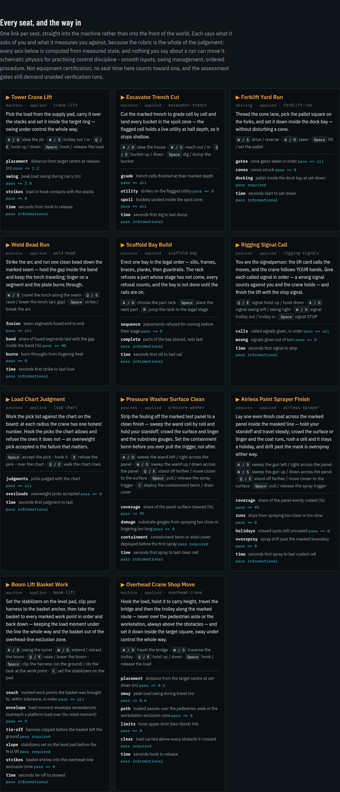

# The simulator index

The front door (`index.html`, built by `web/build_home.py`) carries **one
entry per seat**: 11 rows, each naming what the machine asks of you and
what it measures you against, each linking straight into that machine rather
than into the front of the world. The link is
`web/trade_craft_3d.html?sim=<slug>`, and the slug is the key the registry
files the seat under — so the index cannot offer a name the walkable world
would refuse.

Nothing on that index is typed: the 11 names, 42 control rows
and 46 rubric axes below are read out of
`sims/registry/sims.json` by the page generator and by this page, from the
same fields. The seats themselves — physics, scoring, the scripted reference
operator — are described on [Simulators](Simulators.md); this page is about
the way in.

## The 11 seats and their links

| Seat | `?sim=` | Kind · skill | Controls | Rubric axes | Halls |
|---|---|---|---|---|---|
| [**Tower Crane Lift**](../web/trade_craft_3d.html?sim=crane-lift) | `crane-lift` | machine · `machines.applied` | 4 | 4 | 8 |
| [**Excavator Trench Cut**](../web/trade_craft_3d.html?sim=excavator-trench) | `excavator-trench` | machine · `machines.applied` | 4 | 4 | 4 |
| [**Forklift Yard Run**](../web/trade_craft_3d.html?sim=forklift-run) | `forklift-run` | driving · `machines.applied` | 3 | 4 | 5 |
| [**Weld Bead Run**](../web/trade_craft_3d.html?sim=weld-bead) | `weld-bead` | process · `machines.applied` | 3 | 4 | 7 |
| [**Scaffold Bay Build**](../web/trade_craft_3d.html?sim=scaffold-bay) | `scaffold-bay` | process · `machines.applied` | 3 | 3 | 19 |
| [**Rigging Signal Call**](../web/trade_craft_3d.html?sim=rigging-signals) | `rigging-signals` | process · `machines.applied` | 4 | 3 | 9 |
| [**Load Chart Judgment**](../web/trade_craft_3d.html?sim=load-chart) | `load-chart` | process · `machines.applied` | 3 | 3 | 7 |
| [**Pressure Washer Surface Clean**](../web/trade_craft_3d.html?sim=pressure-washer) | `pressure-washer` | process · `machines.applied` | 5 | 4 | 3 |
| [**Airless Paint Sprayer Finish**](../web/trade_craft_3d.html?sim=airless-sprayer) | `airless-sprayer` | process · `machines.applied` | 4 | 5 | 2 |
| [**Boom Lift Basket Work**](../web/trade_craft_3d.html?sim=boom-lift) | `boom-lift` | machine · `machines.applied` | 5 | 6 | 8 |
| [**Overhead Crane Shop Move**](../web/trade_craft_3d.html?sim=overhead-crane) | `overhead-crane` | machine · `machines.applied` | 4 | 6 | 7 |

Between them the seats bind 45 halls, each through a
real skill id in [the skill graph](Skill-Graph.md).

## How `?sim=` is validated

The walkable world reads the parameter and checks it against the registry it
was shipped — `Object.keys(D.sims.sims)` — exactly the way `?hall=` is checked
against the hall roster, and for the same reason: a URL is typed by hand and a
typo must not be guessed at.

- **A known slug opens that seat.** The world stands up first — region, campus
  or hall — and the seat opens one microtask later, through the same
  `startSim()` the hall's own seat chooser calls. If the hall the URL left
  behind does not teach that seat, the page walks to the first hall the
  registry says does, so the run is recorded against a hall that teaches it.
- **An unknown slug opens NO seat.** There is no default seat and no nearest
  match: the world stands up as it otherwise would and nothing is entered.
  Observed live against the running app: `?sim=not-a-seat` left the region
  view standing with no seat open and no page error.

A default would be a policy decision, and the policy for an unreadable link is
to open nothing.

## The known limitation: the link does not survive a reload

`syncURL()` — the function that keeps the address bar agreeing with the view —
has cases for the region, campus and hall views and **no `sim` case**. It runs
when the deep link walks to the hall that teaches the seat, so the address bar
is rewritten to `?hall=<slug>&lang=<locale>` the moment the seat opens, and the
seat name is gone from the URL.

Observed live: opening `?sim=crane-lift` left the address bar reading
`?hall=crane-ops&lang=en`. **Reload that page, or copy the URL out of the bar
after the seat opened, and you land in the Crane Operators hall — not in the
seat.** The deep link works once, from the index or from anywhere it is
written down; it does not round-trip through the address bar, and a learner
who bookmarks what the bar shows has bookmarked the hall.

The link in the index is unaffected, because the index writes the `?sim=` form
itself. Nothing about this is recorded as fixed anywhere; it is recorded here
as the limit it is.

## The seats, as the index states them

### Tower Crane Lift

[`web/trade_craft_3d.html?sim=crane-lift`](../web/trade_craft_3d.html?sim=crane-lift) —
machine, 8 halls, entered against
`machines.applied`.

Pick the load from the supply pad, carry it over the stacks and set it inside the target ring — swing under control the whole way.

**Controls.** `A / D` slew the jib · `W / S` trolley out / in · `Q / E` hoist up / down · `Space` hook / release the load

| Rubric axis | Measured | Pass |
|---|---|---|
| placement | distance from target centre at release (m) | `<= 1.2` |
| swing | peak load swing during carry (m) | `<= 2.0` |
| strikes | load or hook contacts with the stacks | `== 0` |
| time | seconds from hook to release | `informational` |
### Excavator Trench Cut

[`web/trade_craft_3d.html?sim=excavator-trench`](../web/trade_craft_3d.html?sim=excavator-trench) —
machine, 4 halls, entered against
`machines.applied`.

Cut the marked trench to grade cell by cell and land every bucket in the spoil zone — the flagged cell holds a live utility at half depth, so it stops shallow.

**Controls.** `A / D` slew the house · `W / S` reach out / in · `Q / E` bucket up / down · `Space` dig / dump the bucket

| Rubric axis | Measured | Pass |
|---|---|---|
| grade | trench cells finished at their marked depth | `== all` |
| utility | strikes on the flagged utility | `== 0` |
| spoil | buckets landed inside the spoil zone | `== all` |
| time | seconds first dig to last dump | `informational` |
### Forklift Yard Run

[`web/trade_craft_3d.html?sim=forklift-run`](../web/trade_craft_3d.html?sim=forklift-run) —
driving, 5 halls, entered against
`machines.applied`.

Thread the cone lane, pick the pallet square on the forks, and set it down inside the dock bay — without disturbing a cone.

**Controls.** `W / S` drive / reverse · `A / D` steer · `Space` lift / set the pallet

| Rubric axis | Measured | Pass |
|---|---|---|
| gates | cone gates taken in order | `== all` |
| cones | cones struck | `== 0` |
| docking | pallet inside the dock bay at set-down | `required` |
| time | seconds start to set-down | `informational` |
### Weld Bead Run

[`web/trade_craft_3d.html?sim=weld-bead`](../web/trade_craft_3d.html?sim=weld-bead) —
process, 7 halls, entered against
`machines.applied`.

Strike the arc and run one clean bead down the marked seam — hold the gap inside the band and keep the torch travelling; linger on a segment and the plate burns through.

**Controls.** `W / S` travel the torch along the seam · `Q / E` raise / lower the torch (arc gap) · `Space` strike / break the arc

| Rubric axis | Measured | Pass |
|---|---|---|
| fusion | seam segments fused end to end | `== all` |
| band | share of fused segments laid with the gap inside the band (%) | `>= 90` |
| burns | burn-throughs from lingering heat | `== 0` |
| time | seconds first strike to last fuse | `informational` |
### Scaffold Bay Build

[`web/trade_craft_3d.html?sim=scaffold-bay`](../web/trade_craft_3d.html?sim=scaffold-bay) —
process, 19 halls, entered against
`machines.applied`.

Erect one bay in the legal order — sills, frames, braces, planks, then guardrails. The rack refuses a part whose stage has not come, every refusal counts, and the bay is not done until the rails are on.

**Controls.** `A / D` choose the part rack · `Space` place the next part · `R` jump the rack to the legal stage

| Rubric axis | Measured | Pass |
|---|---|---|
| sequence | placements refused for coming before their stage | `== 0` |
| complete | parts of the bay placed, rails last | `informational` |
| time | seconds first sill to last rail | `informational` |
### Rigging Signal Call

[`web/trade_craft_3d.html?sim=rigging-signals`](../web/trade_craft_3d.html?sim=rigging-signals) —
process, 9 halls, entered against
`machines.applied`.

You are the signalperson: the lift card calls the moves, and the crane follows YOUR hands. Give each called signal in order — a wrong signal counts against you and the crane holds — and finish the lift with the stop signal.

**Controls.** `Q / E` signal hoist up / hoist down · `A / D` signal swing left / swing right · `W / S` signal trolley out / trolley in · `Space` signal STOP

| Rubric axis | Measured | Pass |
|---|---|---|
| calls | called signals given, in order | `== all` |
| wrong | signals given out of turn | `== 0` |
| time | seconds first signal to stop | `informational` |
### Load Chart Judgment

[`web/trade_craft_3d.html?sim=load-chart`](../web/trade_craft_3d.html?sim=load-chart) —
process, 7 halls, entered against
`machines.applied`.

Work the pick list against the chart on the board: at each radius the crane has one honest number. Hook the picks the chart allows and refuse the ones it does not — an overweight pick accepted is the failure that matters.

**Controls.** `Space` accept the pick - hook it · `X` refuse the pick - over the chart · `Q / E` walk the chart rows

| Rubric axis | Measured | Pass |
|---|---|---|
| judgments | picks judged with the chart | `== all` |
| overloads | overweight picks accepted | `== 0` |
| time | seconds first judgment to last | `informational` |
### Pressure Washer Surface Clean

[`web/trade_craft_3d.html?sim=pressure-washer`](../web/trade_craft_3d.html?sim=pressure-washer) —
process, 3 halls, entered against
`machines.applied`.

Strip the fouling off the marked test panel to a clean finish — sweep the wand cell by cell and hold your standoff; crowd the surface and linger and the substrate gouges. Set the containment berm before you ever pull the trigger, not after.

**Controls.** `A / D` sweep the wand left / right across the panel · `W / S` sweep the wand up / down across the panel · `Q / E` stand off farther / move closer to the surface · `Space` pull / release the spray trigger · `C` deploy the containment berm / drain cover

| Rubric axis | Measured | Pass |
|---|---|---|
| coverage | share of the panel surface cleaned (%) | `>= 95` |
| damage | substrate gouges from spraying too close or lingering too long | `== 0` |
| containment | containment berm or drain cover deployed before the first spray | `required` |
| time | seconds first spray to last clean cell | `informational` |
### Airless Paint Sprayer Finish

[`web/trade_craft_3d.html?sim=airless-sprayer`](../web/trade_craft_3d.html?sim=airless-sprayer) —
process, 2 halls, entered against
`machines.applied`.

Lay one even finish coat across the marked panel inside the masked line — hold your standoff and travel steady; crowd the surface or linger and the coat runs, rush a cell and it stays a holiday, and drift past the mask is overspray either way.

**Controls.** `A / D` sweep the gun left / right across the panel · `W / S` sweep the gun up / down across the panel · `Q / E` stand off farther / move closer to the surface · `Space` pull / release the spray trigger

| Rubric axis | Measured | Pass |
|---|---|---|
| coverage | share of the panel evenly coated (%) | `>= 95` |
| runs | drips from spraying too close or too slow | `== 0` |
| holidays | missed spots left uncoated | `== 0` |
| overspray | spray drift past the masked boundary | `== 0` |
| time | seconds first spray to last coated cell | `informational` |
### Boom Lift Basket Work

[`web/trade_craft_3d.html?sim=boom-lift`](../web/trade_craft_3d.html?sim=boom-lift) —
machine, 8 halls, entered against
`machines.applied`.

Set the stabilizers on the level pad, clip your harness to the basket anchor, then take the basket to every marked work point in order and back down — keeping the load moment under the line the whole way and the basket out of the overhead-line exclusion zone.

**Controls.** `A / D` swing the turret · `W / S` extend / retract the boom · `Q / E` raise / lower the boom · `Space` clip the harness (on the ground) / do the task at the work point · `C` set the stabilizers on the pad

| Rubric axis | Measured | Pass |
|---|---|---|
| reach | marked work points the basket was brought to, within tolerance, in order | `== all` |
| envelope | load-moment envelope exceedances (outreach x platform load over the rated moment) | `== 0` |
| tie-off | harness clipped before the basket left the ground | `required` |
| slope | stabilizers set on the level pad before the first lift | `required` |
| strikes | basket entries into the overhead-line exclusion zone | `== 0` |
| time | seconds tie-off to stowed | `informational` |
### Overhead Crane Shop Move

[`web/trade_craft_3d.html?sim=overhead-crane`](../web/trade_craft_3d.html?sim=overhead-crane) —
machine, 7 halls, entered against
`machines.applied`.

Hook the load, hoist it to carry height, travel the bridge and then the trolley along the marked route — never over the pedestrian aisle or the workstation, always above the obstacles — and set it down inside the target square, sway under control the whole way.

**Controls.** `A / D` travel the bridge · `W / S` traverse the trolley · `Q / E` hoist up / down · `Space` hook / release the load

| Rubric axis | Measured | Pass |
|---|---|---|
| placement | distance from the target centre at set-down (m) | `<= 0.5` |
| sway | peak load swing during travel (m) | `<= 0.6` |
| path | loaded passes over the pedestrian aisle or the workstation exclusion zone | `== 0` |
| limits | hoist upper-limit (two-block) hits | `== 0` |
| clear | load carried above every obstacle it crossed | `required` |
| time | seconds hook to release | `informational` |

## What a seat run is not

schematic physics for practising control discipline - smooth inputs, swing management, ordered procedure. Not equipment certification; no seat time here counts toward one, and the assessment gates still demand unaided verification runs.

**And the walkaround:** a habit-builder, not a gate: no seat is locked behind the walkaround, completing it changes no score, and it is not an equipment inspection record. Each point also names what a crew would do when the check fails, which is the half of the habit worth having; that is unverified general practice, not a release anybody can sign from here and not a permission this seat grants.

---

*Generated by `wiki/build_wiki.py` from the verified registries — edit the sources, not this page. Adaptive Stack v3.2 · pack 3.2.0.*
