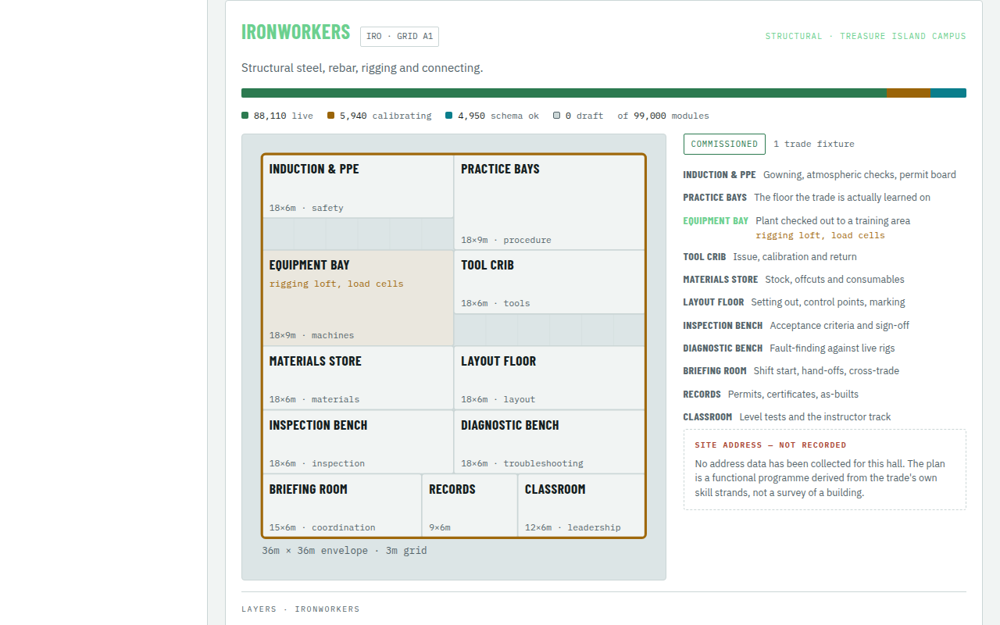
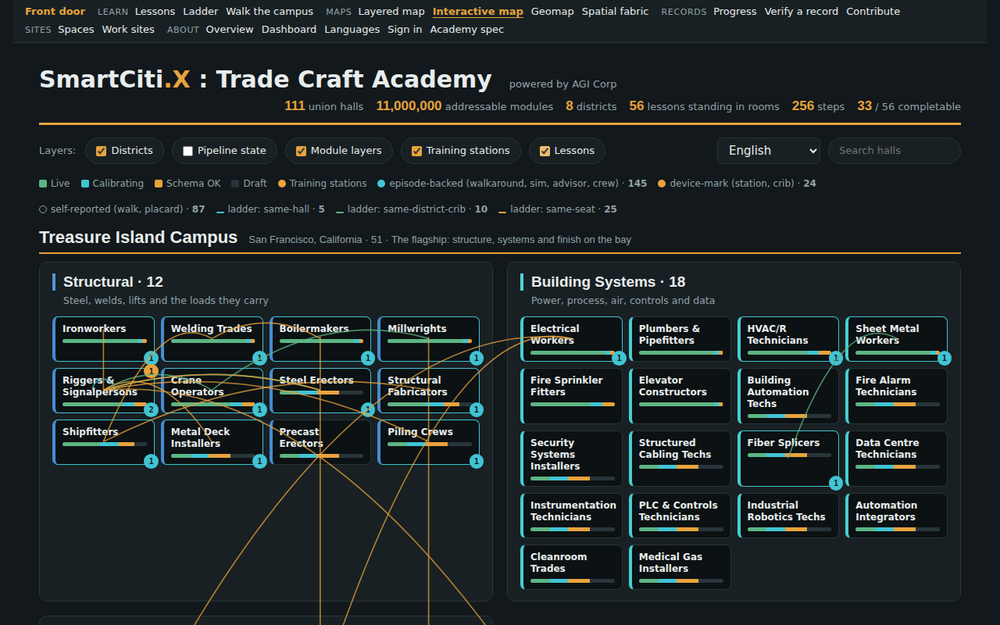
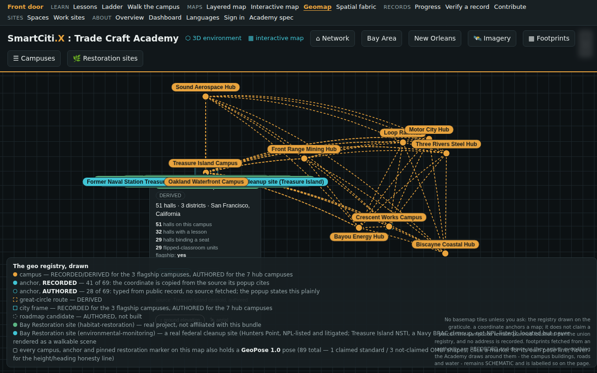
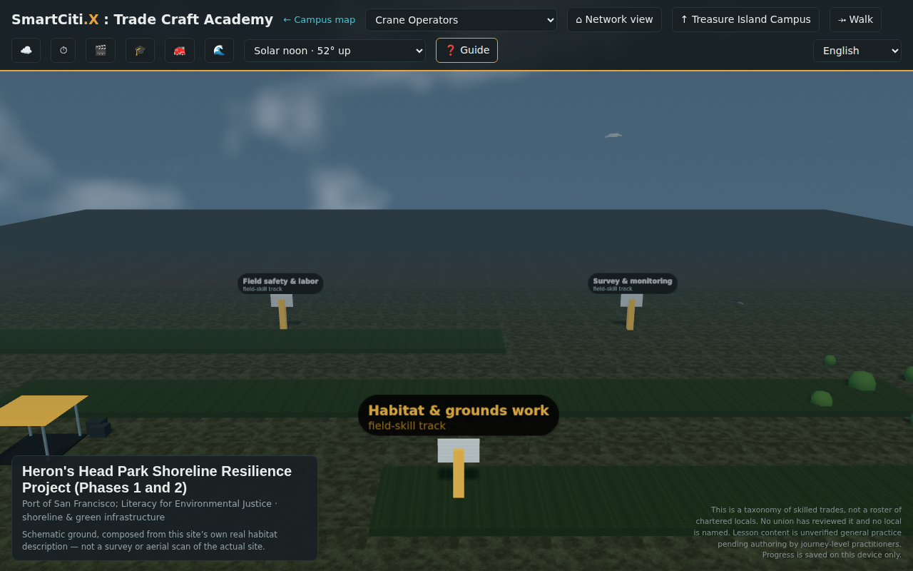
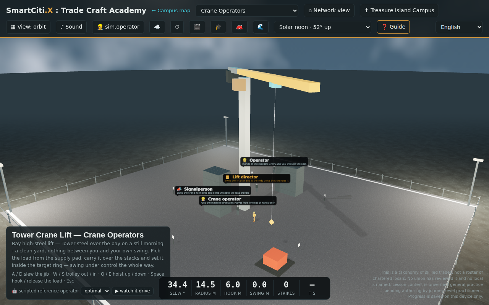

# Getting around the site

The front door, `index.html`, is the one place every surface is linked from:
15 cards, each saying what the surface is and what it does not
claim, read off the built page when this wiki was built.

## The process, for a first visit

1. **Open `index.html`.** The course at the top is the way in if you do not
   know where to start.
2. **Pick a card.** Each links one surface; the table below says which wiki
   page describes it.
3. **Walk the world** from the lead card: region, campus, hall, seat.
   A seat can be opened directly - see [Simulator-Index](Simulator-Index.md).
4. **Take your record with you** when you are done:
   [Completion-Record](Completion-Record.md), then
   [Verify-A-Record](Verify-A-Record.md) and, if you choose,
   [Contribute](Contribute.md).

*The front door, `index.html`: the cards a visitor starts from.*

## The front door's cards

| # | Card | Opens | Wiki page |
|---|---|---|---|
| 1 | **The union training ladder** | [`web/trade_craft_ladder.html`](../web/trade_craft_ladder.html) | [Skill-Graph](Skill-Graph.md) |
| 2 | **The walkable lessons** | [`web/trade_craft_lessons.html`](../web/trade_craft_lessons.html) | [Lessons-Page](Lessons-Page.md) |
| 3 | **Sign in, and what a bundle with no server cannot do** | [`web/trade_craft_signin.html`](../web/trade_craft_signin.html) | [Sign-In](Sign-In.md) |
| 4 | **The walkable world** | [`web/trade_craft_3d.html`](../web/trade_craft_3d.html) | [Simulators](Simulators.md) |
| 5 | **The interactive campus map** | [`web/trade_craft_interactive.html`](../web/trade_craft_interactive.html) | [Campus-Map](Campus-Map.md) |
| 6 | **The network geomap** | [`web/trade_craft_geomap.html`](../web/trade_craft_geomap.html) | [Campus-Map](Campus-Map.md) |
| 7 | **The network dashboard** | [`web/trade_craft_dashboard.html`](../web/trade_craft_dashboard.html) | - |
| 8 | **The adaptive console** | [`console/trade_craft_console.html`](../console/trade_craft_console.html) | - |
| 9 | **The programme** | [`web/trade_craft_landing.html`](../web/trade_craft_landing.html) | - |
| 10 | **The campus plan** | [`web/trade_craft_map.html`](../web/trade_craft_map.html) | [Interiors-Map](Interiors-Map.md) |
| 11 | **Languages** | [`web/trade_craft_languages.html`](../web/trade_craft_languages.html) | [Languages](Languages.md) |
| 12 | **The protocol specification** | [`web/smartcitix_trade_craft_academy.html`](../web/smartcitix_trade_craft_academy.html) | - |
| 13 | **The floor plans** | [`web/trade_craft_spaces.html`](../web/trade_craft_spaces.html) | [Custom-Spaces](Custom-Spaces.md) |
| 14 | **The page that builds a contribution** | [`web/trade_craft_contribute.html`](../web/trade_craft_contribute.html) | [Contribute](Contribute.md) |
| 15 | **The site plans** | [`web/trade_craft_worksites.html`](../web/trade_craft_worksites.html) | [Work-Sites](Work-Sites.md) |

## A tour of the surfaces

*The layered campus map, with a hall opened on its training panel.*

*The interactive map, with the lessons layer on.*

*The network geomap, with a pin opened on what it holds.*

*The walkable world, at a Bay Restoration site.*

*The walkable world, in a training seat.*

## Check it offline

Navigation is not a record: there is no verifier for it, and this page does
not invent one. The cards above are read from the built `index.html`, so
this page goes stale when the front door changes.

## The honest limits

Quoted from the registry at build time, never retyped:

`contrib/registry/contrib.json#honesty.nothing_sent`:

> nothing is sent anywhere by this bundle: no platform is integrated, no destination is validated, no upload exists. The contribute page writes a file to the learner's own downloads and stops.

`worksites/registry/worksites.json#honesty.no_multi_user`:

> no two learners have ever been on a site together here: this bundle has no multi-user session, no shared world state and no server. A crew completion is N separate records, each made alone on its own device, read side by side

`spaces/registry/spaces.json#honesty.status`:

> declared, not yet walkable: an AUTHORED proposal composed from this bundle's own assets; nothing here is built into the 3D world, no dimension is a measurement of a real venue, and no duration, price or accreditation is stated

---

*Generated by `wiki/build_wiki.py` from the verified registries — edit the sources, not this page. Adaptive Stack v3.2 · pack 3.2.0.*
