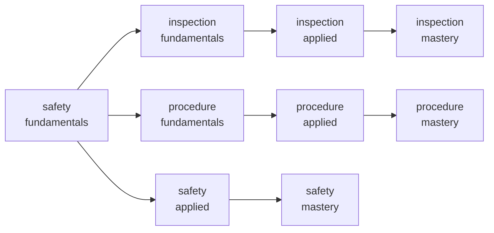

# The skill graph

`pack/registry/skills.json` — **3,663 skills**: every hall carries
the same lattice of 11 strands × 3 tiers
(fundamentals → applied → mastery), and the sequencer (ACP-15) walks this
graph rather than a fixed syllabus. Curriculum simulation showed the graph
sequencer is the only strategy that certifies anyone, and roughly doubles
durable ability against blocked practice.

## Edge census

| Edge type | Count | Meaning |
|---|---|---|
| `requires` | 3,552 | hard prerequisite — the gate will not open without it |
| `supports` | 666 | transfer — practising one strengthens the other |
| `interferes` | 333 | negative transfer — interleaving these thrashes |

## Content graph — one hall's excerpt

The Welding Trades hall's safety / procedure / inspection lattice, drawn
from the registry (tiers gate upward; safety fundamentals gates everything):

## The strands

`coordination` · `documentation` · `inspection` · `layout` · `leadership` · `machines` · `materials` · `procedure` · `safety` · `tools` · `troubleshooting`

Every strand appears in every hall; the room programme of the
[interiors map](Interiors-Map.md) mirrors these same eleven strands.

---

*Generated by `wiki/build_wiki.py` from the verified registries — edit the sources, not this page. Adaptive Stack v3.2 · pack 3.2.0.*
