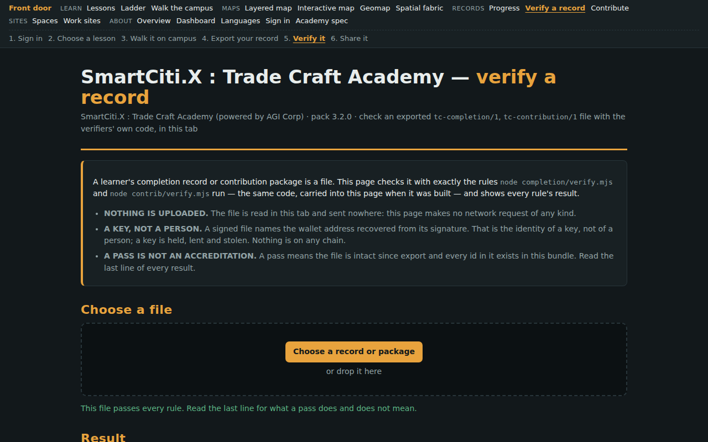

# Verifying a record

A union rep checks a learner's exported record on their own machine, offline,
with the verifier this bundle ships beside the registries the record names -
no server, no account, and no trust in the learner's device.

**The loop.** [Completion-Record](Completion-Record.md) (export your progress) -> [Verify-A-Record](Verify-A-Record.md) (a rep checks it) -> [Contribute](Contribute.md) (share the episodes behind it, if you choose). [Work-Sites](Work-Sites.md) -> [Verify-A-Record](Verify-A-Record.md) for a crew. [Sessions](Sessions.md) and [Compliance-Ledger](Compliance-Ledger.md) read the same files.

The same checks run in the browser on [`web/trade_craft_verify.html`](../web/trade_craft_verify.html) (*SmartCiti.X : Trade Craft Academy — verify a record*): give it the file and read what it reports. The commands below are the reference, and they need no page.



*The verify page. The learner data in this capture is synthetic, injected by the smoke harness - not a learner's record.*

## The process, for a union rep

1. **Get the file from the learner** - a `tc-completion/1`
   record ([Completion-Record](Completion-Record.md)), a
   `tc-contribution/1` package ([Contribute](Contribute.md)), or one
   of each from every member of a crew ([Work-Sites](Work-Sites.md)).
2. **Use this bundle at the pack version the record names.** The ids resolve
   against these registries; a different pack version is a different check.
3. **Run the verifier for that file** (the table below), from the bundle's
   root, with `node`. Nothing is fetched.
4. **Read every line.** Each rule prints `ok` or `FAIL` at the start of its
   line; any `FAIL` exits 1. A signed record prints the address the signature
   recovers to - a key, not a person.
5. **Read the last line.** It is the registry's own statement of what the
   check does not prove, printed by the verifier itself.

## Which verifier, for which file

Each command below was run on the pack's own fixture when this page was built;
the exit status and last line are what it printed.

| File | Command | Exit | Last line | Page |
|---|---|---|---|---|
| tc-completion/1 | `node completion/verify.mjs completion/fixture/good.json` | 0 | this verifies integrity since export and resolution against the bundle; a wallet signature, if any, proves that the holder of a key signed this digest at export - a key, not a person; nothing is written to any chain, nothing is anchored, and this is no accreditation | [Completion-Record](Completion-Record.md) |
| tc-contribution/1 | `node contrib/verify.mjs contrib/fixture/good.json` | 0 | a contribution proves what a device recorded and, if signed, which key vouched for it - not who, and not that any agent or robot learned from it; nothing is sent anywhere by this bundle | [Contribute](Contribute.md) |
| tc-completion/1, against the ledger | `node compliance/verify.mjs completion/fixture/good.json` | 0 | this report is against the bundle's own rules, not any jurisdiction's; a signed record attests a key, not a person; nothing here is a certification or an inspection | [Compliance-Ledger](Compliance-Ledger.md) |
| a training log or tc-contribution/1 | `node sessions/verify.mjs sessions/fixture/log.json` | 0 | sessions are a reading of a device-local log; they attest time between recorded events, not attention, and nothing here is a certification | [Sessions](Sessions.md) |
| N members' records, one site | `node worksites/verify.mjs ti-tower-steel-pick worksites/fixture/good/*.json` | 0 | a crew completion proves that N records, each internally consistent, together cover the roles and the order; not that these people stood on one site at one time; nothing here is a certification | [Work-Sites](Work-Sites.md) |

## A record that passes

```text
$ node completion/verify.mjs completion/fixture/good.json
ok record.fields: checked 6, failing 0
ok digest: checked 2, failing 0
ok identity.signature: checked 1, failing 0
ok ids.lesson: checked 139, failing 0
ok ids.hall: checked 139, failing 0
ok ids.step: checked 1136, failing 0
ok ids.sim: checked 4, failing 0
ok ids.scenario: checked 2, failing 0
ok ids.station: checked 1, failing 0
ok ids.district: checked 0, failing 0
ok step.recording-evidence: checked 301, failing 0
ok step.episode-evidence: checked 26, failing 0
ok lesson.complete-all-steps: checked 139, failing 0
ok sim.threshold: checked 2, failing 0
ok ladder.prerequisite: checked 40, failing 0
note sim.threshold: rigging-signals has no scalar threshold in sims.json; passed=true is taken from the record and not re-derived
note sim.threshold: load-chart has no scalar threshold in sims.json; passed=true is taken from the record and not re-derived
signature: unsigned: this device only
summary: 2 lessons complete, of which 0 fully evidence-backed (every step episode-backed); across them 6 episode-backed steps, 0 device-mark steps (station/crib: a device-local mark, not a recorded episode), 2 self-reported steps counted as done
this verifies integrity since export and resolution against the bundle; a wallet signature, if any, proves that the holder of a key signed this digest at export - a key, not a person; nothing is written to any chain, nothing is anchored, and this is no accreditation
```

Exit status **0**, captured when this page was built.

## A record that does not

The pack's first declared mutant, `completion/fixture/mutant-bad-digest.json`, must fail
`digest` by name:

```text
$ node completion/verify.mjs completion/fixture/mutant-bad-digest.json
ok record.fields: checked 6, failing 0
FAIL digest: checked 2, failing 1
     digest does not recompute over the canonical record
ok identity.signature: checked 1, failing 0
ok ids.lesson: checked 139, failing 0
ok ids.hall: checked 139, failing 0
ok ids.step: checked 1136, failing 0
ok ids.sim: checked 4, failing 0
ok ids.scenario: checked 2, failing 0
ok ids.station: checked 1, failing 0
ok ids.district: checked 0, failing 0
ok step.recording-evidence: checked 301, failing 0
ok step.episode-evidence: checked 26, failing 0
ok lesson.complete-all-steps: checked 139, failing 0
ok sim.threshold: checked 2, failing 0
ok ladder.prerequisite: checked 40, failing 0
note sim.threshold: rigging-signals has no scalar threshold in sims.json; passed=true is taken from the record and not re-derived
note sim.threshold: load-chart has no scalar threshold in sims.json; passed=true is taken from the record and not re-derived
signature: unsigned: this device only
summary: 2 lessons complete, of which 0 fully evidence-backed (every step episode-backed); across them 6 episode-backed steps, 0 device-mark steps (station/crib: a device-local mark, not a recorded episode), 2 self-reported steps counted as done
this verifies integrity since export and resolution against the bundle; a wallet signature, if any, proves that the holder of a key signed this digest at export - a key, not a person; nothing is written to any chain, nothing is anchored, and this is no accreditation
```

Exit status **1**, captured when this page was built.

## The honest limits

Quoted from the registry at build time, never retyped:

`completion/registry/completion.json#honesty.digest`:

> a digest proves integrity since export, not identity

`completion/registry/completion.json#honesty.accreditation`:

> nothing here is an accreditation

`contrib/registry/contrib.json#honesty.does_not_prove`:

> - who the contributor is: contributor.claimed is a label this device stored, attested by this device only, and nothing checks it - unless a wallet signed, in which case it is the identity of a key, not of a person; a stolen key signs just as well
> - that any agent or robot learned from this package: exporting this file trains nothing by itself: no agent exists in this bundle and none is claimed to, until one is actually trained against this data outside it
> - that the package reached anyone: nothing in this bundle sends it anywhere; the learner keeps the file and hands it over, or does not
> - anything on any blockchain: a wallet signature is computed in the browser and carried in the file; nothing is written to any chain, nothing is anchored, and no one can look it up
> - that the device was honest: a package can be written by hand and will verify if it is internally consistent
> - that the gauges inside a trace sample mean anything: training/ describes them as display-shaped scalars and short labels and enumerates none, so the verifier holds a trace to its count and sample keys only
> - that an advisor, crew role, topic or walkaround point an episode names exists: only seats, scenarios, halls and campuses are resolved
> - that the episodes came from real equipment: every episode comes from SCHEMATIC physics and deterministic rubrics, not a real robot or a real machine: useful for exercising a training pipeline's plumbing and export format, not for training a controller that will run on real equipment.

`worksites/registry/worksites.json#honesty.not_a_certification`:

> a crew completion proves that N records, each internally consistent, together cover the roles and the order; not that these people stood on one site at one time; nothing here is a certification

`sessions/registry/sessions.json#honesty.reading`:

> a session is a reading of a device-local log: it attests time between recorded events on one browser, not attention, not presence at the keys, and nothing here is a certification

---

*Generated by `wiki/build_wiki.py` from the verified registries — edit the sources, not this page. Adaptive Stack v3.2 · pack 3.2.0.*
